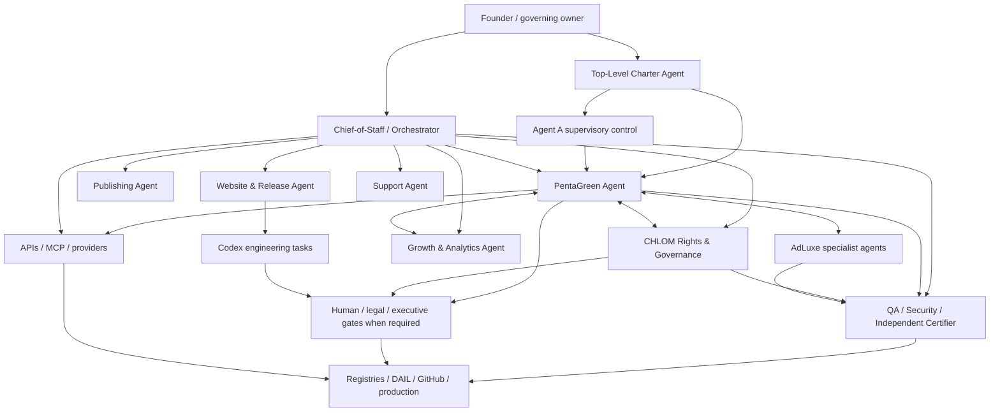

{/* pentadocs:audience-orientation:v2 */}

<Note>
  **Audience:** operators and administrators (`operator`).

  **This page:** Automation Command Structure — The CrownThrive operating hierarchy connecting founder authority, the orchestrator, specialist agents, Codex, MCP tools, GitHub, approvals, and production.

  **Documentation state:** `unresolved` for page type `workflow`. Documentation state is editorial posture only; it does not certify runtime, deployment, legal, rights, financial, provider, production, release, security, or operational status.

  **Unresolved reason:** no explicit page-level editorial acceptance state was declared in the migrated source.

  **Evidence needed:** an accepted governing source or accountable-owner attestation.

  **Review role:** PentaDocs governance.

  **Review trigger:** next material edit or source reconciliation.

  **Related guidance:** [Documentation source governance](/standards/documentation-source-of-truth-and-autonomous-governance) and [Institutional record standard](/standards/record-and-format-standard).
</Note>

{/* /pentadocs:audience-orientation:v2 */}

## Automation command structure

CrownThrive automation is a controlled operating team, not an unrestricted autonomous system.



PentaGreen is a **cross-cutting mandatory economic authority**, not merely another peer specialist. It is supervised by the Top-Level Charter Agent and Agent A, consumes independent CHLOM/legal/security/economic/AdLuxe verdicts, and may execute inside a signed predelegated envelope before ex-post reconciliation. No subordinate platform, agent, connector, storefront or advertising provider may bypass its commerce activation contract.

## Founder and governing owner

The founder retains authority over:

- mission and strategic priorities
- irreversible business decisions
- high-risk rights decisions
- material public claims
- live pricing thresholds
- high-value financial actions
- final publishing and protected-identity decisions
- changes to super-admin, security, or production-control authority

## Chief-of-Staff / Orchestrator

The orchestrator receives objectives and converts them into governed work.

Responsibilities:

- clarify the desired outcome
- inspect current system and registry state
- decompose work into tasks
- assign specialist ownership
- identify dependencies and approval gates
- prevent duplicate work
- maintain workflow and correlation IDs
- track progress, failure, escalation, and completion
- prepare founder decision briefs
- close the loop across affected systems

The orchestrator does not independently grant rights, publish protected material, spend unrestricted funds, or bypass approval gates.

## Top-Level Charter Agent and Agent A

The **Top-Level Charter Agent** interprets the current signed institutional charter, resolves policy-version questions, and ensures subordinate workflows are evaluated against the correct authority bundle. It cannot silently amend the charter it interprets.

**Agent A** is the independent supervisory-control and drift-detection layer for PentaGreen. It may veto, hold, quarantine, or require re-certification when authority, policy, credentials, economic state, provider mappings, rights, evidence, or reconciliation drift outside accepted bounds. Agent A is not a second commerce executor; it remains sufficiently independent to detect failures in PentaGreen's reasoning, provider actions, or subordinate agents.

The constitutional supervisory identity is `ct.agent.agent-a-supervisor`. The former Phase 2.99 hourly-relay label **Agent A Orchestrator** is historical-only scheduling context under `RETIRED_SCHEDULING_SCAFFOLDING`; it has no current clock, dispatch, voting, quorum, or supervisory authority. It must not inherit the constitutional supervisor's powers. See [Legacy A/B/C/D/S Scheduler Scaffolding Archive](/knowledge/legacy-abcds-scheduler-scaffolding-archive).

## PentaGreen Agent

[PentaGreen™](/commerce/pentagreen) is CrownThrive's mandatory commerce and economic-activation control plane. It owns the institutional asset/product/SKU/offer/price/license/channel/payment/entitlement/fulfillment/advertising/settlement/reconciliation lifecycle and the ECAC activation contract.

The Steward may execute reversible or compensatable financial and e-commerce actions inside a signed authority envelope without waiting for synchronous founder intervention. It must then perform provider readback, independent reconciliation, and evidence recording. When the result fails policy or reconciliation, it corrects, rolls back, compensates, pauses, or escalates under the applicable runbook.

PentaGreen also operates the commercial/economic layer of AdLuxe Network, AdLuxe Studio, and AdLuxe Places while AdLuxe specialist agents retain campaign, creative, inventory, delivery, and measurement responsibilities.

No product, SKU, price, storefront activation, campaign-backed offer, standard license, subscription, refund, commission, royalty, settlement, or other money-moving commercial object may be treated as institutionally active merely because a provider accepted it. Certified activation resolves through `ECAC | HOLD | DENY`.

## Specialist agents

Specialists own defined domains and return structured outputs to the orchestrator.

They may:

- research
- retrieve governed records
- classify
- draft
- reconcile
- validate
- test
- prepare changes
- recommend decisions
- execute low-risk approved actions

They must escalate when the task exceeds their permissions or evidence.

## Codex engineering layer

Codex performs repository-level engineering work:

- inspect code and configuration
- reproduce defects
- create isolated branches
- implement scoped changes
- run tests and linters
- prepare pull requests
- document risks and migrations
- support deployment and rollback verification

Codex follows repository `AGENTS.md`, task-specific instructions, branch protections, testing requirements, and approval rules.

Codex is not the legal, rights, finance, or publishing authority.

## MCP and connected tools

MCP tools connect agents to systems such as:

- GitHub
- Mintlify
- Stripe
- CrownThrive IO
- cloud storage and deployment
- analytics
- support systems
- calendars and communications
- media and publishing systems

Tool access should be scoped by role and task. A connected tool does not grant unlimited authority to every agent.

## Human, legal and executive approval layer

PentaGreen does **not** require synchronous human approval for every commercial decision. Reversible or compensatable actions that fall completely inside its signed, current authority envelope may execute autonomously and reconcile after the fact.

Human, legal, executive, or other designated higher authority remains mandatory where the charter or applicable law assigns that authority, including actions outside the envelope, constitutional changes, root financial-control changes, ownership transfers, material exclusivity, high-consequence legal obligations, or other nondelegable/irreversible decisions.

Every approval or predelegation record should identify the subject, version, scope, amount/risk limits, effective period, evidence, approver/authority, conditions, rollback/compensation model, and downstream systems.

## GitHub and change control

GitHub becomes the controlled engineering work queue and change record.

Recommended flow:

```text
Objective
→ governed issue
→ assigned Codex or specialist task
→ isolated branch
→ tests and evidence
→ pull request
→ QA/security review
→ human approval
→ deployment
→ smoke tests
→ Mintlify changelog
```

## Operational evidence

Every automated workflow should preserve:

- task and workflow IDs
- agent and tool actions
- inputs and classifications
- decisions and approvals
- generated or changed artifacts
- test evidence
- failures and retries
- production result
- rollback or correction state

## Stop conditions

An agent or workflow must stop and escalate when:

- required source or rights records are missing
- a protected identity or child-related issue appears
- a live price, refund, payout, or financial transfer exceeds authority
- production credentials or security controls would change
- a destructive migration is proposed
- public claims cannot be verified
- the requested action conflicts with policy, canon, contract, or platform state
- a tool returns ambiguous or partial success

<Info>
  The automation team increases execution capacity while preserving CrownThrive's constitutional governing authority. PentaGreen may execute delegated economic actions inside a signed authority envelope, but rights, audit, security, supervision, and nondelegable or irreversible authority remain governed by the applicable charter and law.
</Info>