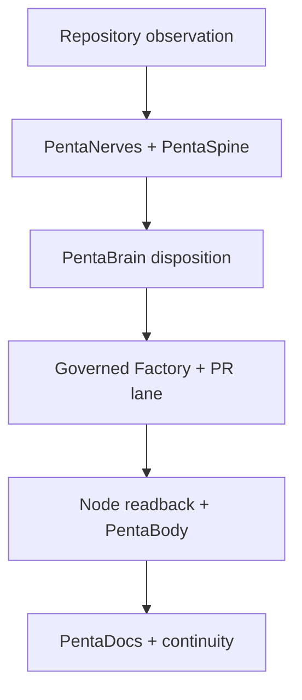

{/* pentadocs:audience-orientation:v2 */}
<Note>
  **Audience:** operators and administrators (`operator`).

  **This page:** Repository Convergence Control Plane — Public-safe operating contract for aligning CrownThrive repositories to the canonical OS contract without collapsing repository boundaries or manufacturing authority.

  **Documentation state:** `unresolved` for page type `workflow`. Documentation state is editorial posture only; it does not certify runtime, deployment, legal, rights, financial, provider, production, release, security, or operational status.

  **Unresolved reason:** no explicit page-level editorial acceptance state was declared in the migrated source.

  **Evidence needed:** an accepted governing source or accountable-owner attestation.

  **Review role:** PentaDocs governance.

  **Review trigger:** next material edit or source reconciliation.

  **Related guidance:** [Documentation source governance](/standards/documentation-source-of-truth-and-autonomous-governance) and [Institutional record standard](/standards/record-and-format-standard).
</Note>
{/* /pentadocs:audience-orientation:v2 */}

## Repository Convergence Control Plane

The **Repository Convergence Control Plane** coordinates CrownThrive's repository family around the canonical public-safe CrownThrive OS contract. Its job is to detect drift, prepare bounded updates, route changes through each repository's own review and certification path, preserve evidence, and project a sanitized whole-system state.

**Control-plane ID:** `ct.penta.repository-convergence`
**Canonical authority repository:** `crownthrive1/CrownThrive-Support`
**Current source state:** deterministic convergence, adversarial integrity checks, read-only cold selection, and local sealed emergency evidence are implemented and controlled-tested on the candidate revision
**Live cross-repository Actions credential binding:** `HOLD` pending exact provider readback
**Live Command Center deployment:** `HOLD` pending deployment and readback
**Infrastructure failover certification:** `HOLD` pending live recovery, cutover, and failback evidence

<Warning>
  Repository convergence does not mean copying the CrownThrive-Support tree into every repository. Each repository retains its own source-of-truth scope, visibility, data classification, release line, authority boundary, and review controls.
</Warning>

## What “caught up” means

A repository is caught up only when evidence supports all applicable conditions:

1. its stable repository identity and institutional role resolve in the governed family registry;
2. it consumes the current required OS, governance, interoperability, and documentation contract versions for its scope;
3. its local node contract and required workflows validate on the exact candidate revision;
4. material differences are reconciled through a reviewed repository-native change rather than an uncontrolled overwrite;
5. provider or runtime effects receive their own authorization, execution receipt, and readback;
6. documentation impact is recorded as `docs_updated`, `docs_no_change`, or `docs_delta_opened`; and
7. rollback, correction, and continuity evidence remain available.

An identical Git commit across repositories is neither required nor normally meaningful. Contract alignment and exact node readback are the convergence test.

## Brain, body, and repository loop

- **PentaNerves** receives sanitized repository, workflow, dependency, capacity, and continuity signals.
- **PentaSpine** preserves ordered event lineage in an fsync JSONL hash chain and rejects corrupted restart replay. External replication and deployed storage custody remain separately governed.
- **PentaBrain** classifies evidence-backed drift and produces a bounded disposition. It does not approve its own recommendation.
- **PentaFactory, PentaBuild, PentaPR, PentaMerge, and PentaCertify** prepare, review, test, and certify repository-native candidates within their independent authority.
- **PentaBody** composes a sanitized current-state projection for authorized operator surfaces.
- **PentaDocs and PentaGeneration** preserve public-safe meaning, version lineage, recovery context, and handoff state.

## Three information directions

| Direction | Purpose | Required boundary |
| --- | --- | --- |
| Upward / afferent | Repository and provider observations flow toward PentaNerves, PentaSpine, PentaBrain, and PentaBody. | Observations are evidence, not authority; private payloads and credentials remain outside public projections. |
| Downward / efferent | An independently authorized disposition flows through PentaRoute, PentaFactory, and the target repository's pull-request lane. | No direct-main overwrite, self-certification, or child self-activation. |
| Lateral / peer | Repositories exchange versioned contracts, attestations, compatibility results, and readback receipts through PentaFederation and PentaInterOps. | Peer reachability never creates provider-write, rights, economic, merge, or D3 authority. |

Every direction carries stable identities, contract versions, trace/correlation references, idempotency where applicable, evidence classification, and an explicit verification strategy.

## Public and restricted state

PentaDocs may project public repository roles, public contract versions, sanitized health classes, aggregate counts, evidence age, and HOLD reasons. It must not publish private repository coordinates, private Git heads, credentials, raw provider payloads, restricted source paths, or silent emergency-route details.

Exact private node observations and emergency recovery bindings belong in restricted OS-bound evidence. A public statement that a restricted route is governed or held is not a disclosure of that route.

## Execution boundary

The current branch implements deterministic discovery, comparison, candidate-only build drift, independently verified read-only cold selection, local sealed emergency evidence, serialization, and sanitized projection behavior. It may not claim live cross-repository execution until the exact GitHub Actions identity and credential binding runs against each authorized node and the resulting provider state is read back.

Unknown nodes, stale observations, missing node contracts, contradictory authority, failed validation, absent rollback, or missing provider evidence remain `HOLD`.

## Related controls

- [Penta Family — Production Control Plane](/automation/penta-family)
- [Penta Family Interoperability Fabric](/automation/penta-interoperability-fabric)
- [Repository Family and Federation](/technology/repository-family-and-federation)
- [Repository Resilience and Failover](/technology/repository-resilience-and-failover)
- [Repository Convergence, Failover, and Recovery Runbook](/runbooks/repository-convergence-failover-and-recovery)
- [Documentation Source-of-Truth and Autonomous Governance](/standards/documentation-source-of-truth-and-autonomous-governance)
