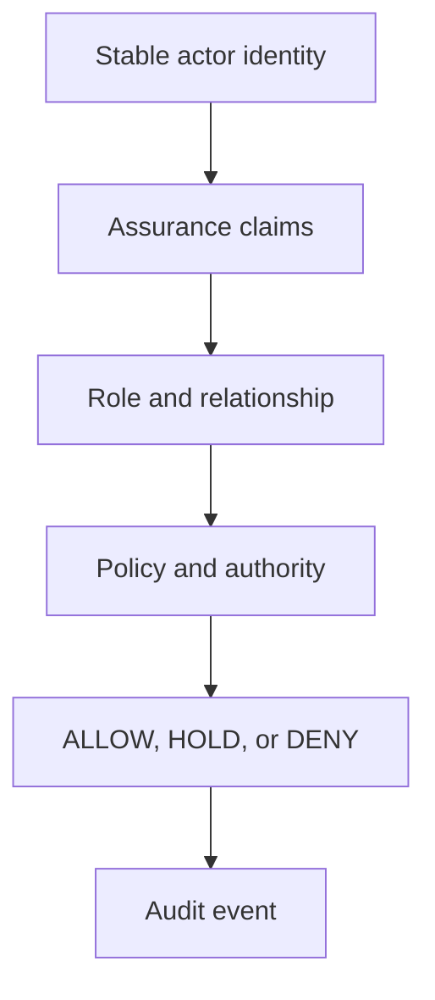

{/* pentadocs:audience-orientation:v2 */}
<Info>
  **Audience:** identity engineers, authorization developers, service/agent architects, and trust reviewers. Use this contract with [CrownThrive ID](/technology/crownthrive-id) and the [SSO/identity bridge](/developers/sso-identity-bridge).

  **This page:** CHLOM Identity &amp; Trust Reconciliation Contract — The public-safe substantive successor for recovered CHLOM identity and trust material, defining stable actor identity, assurance, authority separation, correction, and fail-closed machine boundaries.

  **Documentation state:** `unresolved` for page type `reference`. Documentation state is editorial posture only; it does not certify runtime, deployment, legal, rights, financial, provider, production, release, security, or operational status.

  **Unresolved reason:** no explicit page-level editorial acceptance state was declared in the migrated source.

  **Evidence needed:** an accepted governing source or accountable-owner attestation.

  **Review role:** PentaDocs governance.

  **Review trigger:** next material edit or source reconciliation.
</Info>
{/* /pentadocs:audience-orientation:v2 */}

## CHLOM Identity & Trust Reconciliation Contract

This contract is the current public-safe substantive successor for recovered CHLOM identity/trust material whose historical bodies are missing or not authoritative for current operating state. It does **not** reproduce those missing bodies. It reconciles their institutional meaning into the current identity, registry, evidence, and execution model.

The core rule is simple: **identity is evidence about an actor; identity is not self-executing authority**.

<Warning>
  **Reconciliation contract, not an identity-provider quickstart.** This page does not publish an issuer, client-registration flow, token endpoint, signing keys, claims schema, credential-verification API, assurance algorithm, production federation, or permission grant.
</Warning>

## Integrate the trust boundary

<Steps>
  <Step title="Resolve the stable actor">
    Map provider-native subjects, emails, usernames, CRM/payment/community IDs, and service accounts to a durable actor only through a governed account-link or registry record.
  </Step>
  <Step title="Evaluate assurance separately">
    Obtain only the minimum approved verification claims and state required for the bounded action; keep supporting evidence private by default.
  </Step>
  <Step title="Resolve role, relationship, and authority">
    Determine the applicable organization, role/capability, delegated scope/expiry, policy, consent, eligibility, evidence, and phase/environment gates.
  </Step>
  <Step title="Return ALLOW, HOLD, or DENY">
    Execute only the bounded operation allowed by the current authority record. A successful login or valid token remains necessary but insufficient.
  </Step>
  <Step title="Record and reconcile">
    Emit the audit event and preserve correction/account-link lineage. Conflicting or stale evidence creates a hold rather than a guessed identity or privilege.
  </Step>
</Steps>

## Stable actor identity

CrownThrive systems need durable references for people, organizations, creators, partners, staff, service accounts, agents, and other governed actors. The intended canonical layer is [CrownThrive ID](/technology/crownthrive-id). Provider-native IDs, email addresses, usernames, CRM contacts, payment-customer IDs, community member IDs, and directory profile IDs are aliases or source evidence unless a governed record explicitly promotes them.

Stable actor references should survive provider migration, account merge, username change, role change, application replacement, and domain changes. Historical records should continue to point to the actor identity that was valid when the event occurred.

## Assurance and verification

An identity record may carry assurance state such as verified, partially verified, unverified, suspended, merged, or recovery-pending. Verification evidence remains private by default. Public or downstream systems receive only the minimum approved claims needed for a bounded action.

The [Rights Ledger and Evidence Model](/chlom/rights-ledger-and-evidence) governs how supporting evidence is referenced without exposing restricted source material. The [Restricted Source Register](/knowledge/restricted-source-register) and [Security & Privacy Continuity](/technology/security-privacy-continuity) govern sensitive identity artifacts, credentials, recovery factors, private documents, and other restricted material.

## Identity, role, and authority are separate

A successful login or verified identity must not independently create institutional permission. The machine relationship is:

The [CHLOM Registry Model](/chlom/registry-model) supplies stable machine-readable object relationships. An actor can exist in the registry without being permitted to approve a license, move money, write to a provider, activate a product, grant rights, change governance, or perform another high-risk action.

## Consent and eligibility

Consent, eligibility, membership, credential, program participation, and role assignment should be explicit state rather than inferred from a profile existing. Each state needs an authority basis, lifecycle, effective time, correction path, and scope.

Examples of distinctions that must remain machine-visible:

- account existence ≠ membership eligibility;
- membership ≠ staff or administrative authority;
- certificate ≠ professional license;
- affiliate or ambassador role ≠ corporate authority;
- identity verification ≠ payment or payout entitlement;
- creator attribution ≠ rights ownership;
- authenticated service account ≠ unrestricted provider-write authority.

## Reconciliation and correction

Identity/trust records can conflict across legacy systems. When they do, apply [Source Reconciliation and Authority](/chlom/source-reconciliation): preserve the competing source claims, determine their authority and freshness, record the current governing interpretation or explicit HOLD, and preserve correction lineage.

A correction should identify the original assertion, corrected actor or claim, source basis, reviewer or governed decision, effective time, and affected downstream objects. Silent replacement is prohibited because identity corrections can affect permissions, entitlements, evidence, audit history, and attribution.

## Machine trust boundary

Agents and APIs should consume explicit, minimal claims rather than scrape human-facing profiles for implied authority. A machine consumer should be able to determine:

- which stable actor is involved;
- which assurance state applies;
- which role/capability record is in force;
- which authority record governs the action;
- which evidence references support that authority;
- what scope, expiry, or restriction applies;
- whether the result is ALLOW, HOLD, or DENY;
- where the resulting audit event is recorded.

| Required input | Fail-closed question |
| --- | --- |
| Stable actor | Is the actor/link canonical, current, and non-conflicting? |
| Assurance | Does the verified claim meet this action's exact requirement and effective time? |
| Role/relationship | Is the role valid for this organization, resource, purpose, and environment? |
| Authority | Which policy, delegation, approval, or rights record permits the action? |
| Scope and restrictions | What operation, resource, data, duration, and conditions are allowed? |
| Decision | Is the result explicitly ALLOW, HOLD, or DENY? |
| Evidence/audit | Which public-safe references support and record the decision? |

## Phase 3 boundary

This substantive contract makes identity/trust meaning machine-addressable, but it does not certify full production federation or unlock broad execution. The [Phase 3 Readiness Gate](/technology/phase-3-readiness-gate) independently tests stable schemas, actor identity, authorization, rollback, provider boundaries, evidence, and operational controls.

Until that hard exit passes, identity/trust reconciliation can support controlled-test documentation qualification and parent review while D3 authority, provider writes, money movement, rights activation, production activation, and terminal article disposition remain fail-closed.

## Reconstruction status

This page is a **current substantive successor**, not a recovered historical original. Legacy identity/trust titles mapped here keep their stable article identities and source history. Candidate `merged_successor` dispositions remain pending governed parent certification; this page does not self-accept them.

## Errors, privacy, and support boundary

No protocol error codes or retry behavior are defined here. Unknown actor links, issuer/claim state, consent, eligibility, suspension, recovery, role, delegation, evidence, or authority must fail closed. Do not match actors by email alone, reveal private verification artifacts, silently merge accounts, widen a claim during fallback, or treat a provider session as cross-platform authority.

Use the [security and privacy continuity standard](/technology/security-privacy-continuity) for protected identity material and the [support request workflow](/workflows/support-request) when account-link, correction, consent, recovery, or authority evidence conflicts.
