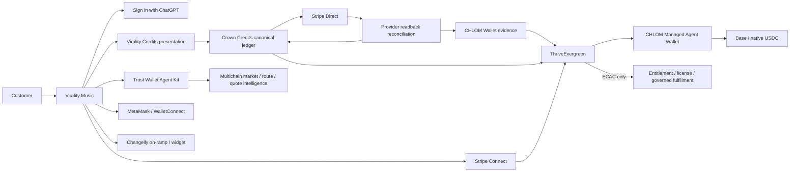

{/* pentadocs:audience-orientation:v2 */}
<Warning>
  **Audience:** governance reviewers and researchers (`historical`).

  **This page:** Production Hybrid Commerce Convergence — 2026-08-23 — Production architecture and machine-readback status for Virality Music, Crown Credits, Stripe, Stripe Connect, CHLOM Wallet, Trust Wallet Agent Kit, the managed Agent Wallet, Changelly, and ThriveEvergreen.

  **Documentation state:** `historical` for page type `historical_record`. Documentation state is editorial posture only; it does not certify runtime, deployment, legal, rights, financial, provider, production, release, security, or operational status. This page is dated context, not current operating authority.

  **Related guidance:** [Current operational state](/start-here/current-operational-state) and [Source authority hierarchy](/knowledge/source-authority-hierarchy).
</Warning>
{/* /pentadocs:audience-orientation:v2 */}

## Production hybrid-commerce convergence

This record captures the public-safe production architecture established beginning August 23, 2026 for CrownThrive's hybrid commerce system, with Virality Music as the first integrated production surface. It is a living current-state record: later certified production changes supersede earlier capability snapshots while the historical evidence remains preserved in changelogs and certification records.

Production state is recorded per capability. A component can be deployed and production-safe while a specific provider capability remains pending. Provider configuration, provider success, or a public product card does not manufacture CrownThrive economic authority.

## Current state

| Component | Institutional state | Effective capability |
| --- | --- | --- |
| Virality Music public surface | **ACTIVE / healthy / read verified** | Existing public catalog and authenticated checkout route preserved. Native Sites source mutation remains separately gated. |
| Virality hybrid-commerce control | **ACTIVE / production** | Public-safe manifest, rail status, denomination conversion, and governed remote-runtime binding. |
| Crown Credits | **ACTIVE / production** | Canonical closed-loop CrownThrive tender and Stripe-funded top-ups. |
| Virality Credits | **ACTIVE compatibility denomination** | Presentation unit over Crown Credits: **1 Virality Credit = 25 Crown Credits**. No automatic balance rewrite. |
| Stripe Direct | **ACTIVE / production** | First-party Checkout and Crown Credits funding. |
| Stripe Connect | **ACTIVE / production** | Connected-account commerce capability remains separate from first-party Crown Credits. |
| Stripe stablecoin/Crypto | **Dashboard enabled — provider propagation pending** | Founder-attested enabled/on; fresh live automatic-payment Checkout still did not offer Crypto. Automated readback reconciliation is scheduled. |
| CHLOM Wallet | **ACTIVE / production** | Economic evidence, provider provenance, policy, rights, settlement lineage and execution-mode authority. |
| Trust Wallet Agent Kit hosted API | **ACTIVE / production / write verified** | HMAC-authenticated market data, multichain domains, providers and swap quotes. |
| CHLOM Managed Agent Wallet | **ACTIVE / production / verified** | CrownThrive-managed encrypted-keystore wallet on Base; signing canary PASS; `money_movement_authorized=true`; unattended ceiling `0`. |
| WalletConnect / MetaMask | **Production contracts / frontend-gated** | Human-approved wallet execution lanes remain separate from autonomous Agent Wallet custody. |
| Changelly widget | **ACTIVE / production configured** | Merchant widget/on-ramp presentation may be used where approved. |
| Changelly v2 authenticated API | **HOLD: RSA private key missing** | API key alone cannot produce the required RSA-SHA256 request signature. |
| ThriveEvergreen v2 | **ACTIVE / `production_write`** | Exact `ECAC | HOLD | DENY` economic authority; production never bypasses exact candidate gates. |

## Converged architecture



## Crown Credits are canonical

`ct.credit.store.v1` is the canonical CrownThrive closed-loop credit program.

Crown Credits remain:

- nontransferable;
- non-cash-redeemable;
- non-interest-bearing;
- `crypto_asset=false`;
- first-party only unless a separately governed program explicitly changes the rule;
- issued only after authoritative provider settlement reconciliation.

Stablecoin payment is a funding tender. It does not convert Crown Credits into cryptocurrency.

## Virality Credits denomination bridge

Virality Music's existing production site uses Virality Credits and prices them at an approximately twenty-five-cent presentation value. Canonical Crown Credits use a one-cent nominal funding basis.

A direct rename would therefore create a 25× purchasing-power error.

The production compatibility rule is:

```text
1 Virality Credit = 25 Crown Credits
```

Virality Credits are not a separate money ledger. They are a Virality Music presentation denomination over the canonical Crown Credits ledger.

Existing balances are **not** silently renamed or multiplied. Any historical-balance migration requires its own exact-version reconciliation.

## Stripe Direct and provider readback

Stripe is the first-party funding and Checkout provider for eligible CrownThrive commerce.

Crown Credits settlement uses live provider readback plus an idempotent internal ledger as authoritative economic truth. Browser redirects and provider events are evidence, not entitlement authority.

The Crown Credits reconciliation worker remains active on a ten-minute cadence.

## Stablecoin reconciliation

The founder has attested that Stripe Crypto/stablecoin payments are enabled and on by default in the Dashboard.

That administrative state is preserved separately from machine-effective Checkout state.

A fresh live Checkout Session was created with automatic payment methods against an active Crown Credits price and immediately expired without payment. Crypto was not included in the returned payment method set.

Current effective state:

```text
PROVIDER_PROPAGATION_PENDING
```

A scheduled no-charge reconciliation canary runs every six hours. It may promote the effective adapter only when live Checkout readback actually offers Crypto.

This prevents configuration intent from being misreported as customer-effective provider capability.

## CHLOM Wallet role

CHLOM Wallet is production-active as CrownThrive's institutional wallet/economic evidence layer. It preserves:

- provider receipt provenance;
- settlement and reversal evidence;
- asset/value classification;
- rights and entitlement lineage;
- policy decisions;
- wallet execution-mode state;
- exact-version relationships;
- append-only integrity evidence.

CHLOM Wallet does not infer customer-token custody merely because a payment provider processes a stablecoin payment. The separately bound **CHLOM Managed Agent Wallet** is an institutional execution account and has its own custody and execution policy.

## Trust Wallet Agent Kit

Trust Wallet Agent Kit remains production-wired through a CrownThrive server-side HMAC gateway for multichain intelligence and routing. Credential values remain private and are never returned by the public control plane.

Verified provider canaries include:

- authenticated live token-price request;
- live routing/domain inventory with **32 current provider-routing domains**;
- live BNB-to-USDT quote with multiple provider routes, fees, price impact and expiry.

### Production MCP surfaces

- `trustwallet.price.read`
- `trustwallet.trending.read`
- `trustwallet.domains.read`
- `trustwallet.providers.read`
- `trustwallet.swap.quote`
- `trustwallet.swap.step.build`

`trustwallet.swap.step.build` may build transaction material but cannot itself authorize signature or broadcast.

## CHLOM Managed Agent Wallet

The earlier local-runner plan has been superseded as the primary production custody path by a CrownThrive-managed encrypted-keystore wallet.

Canonical identity:

```text
runner      ct.runner.chlom-agent-wallet.base-usdc.v1
address     0x7bc35BEab3bd346590fA6f68C218ccf249759Ab0
network     Base Mainnet
chain_id    8453
asset       native USDC
USDC        0x833589fCD6eDb6E08f4c7C32D4f71b54bdA02913
health      PASS
```

Certification states:

```text
wallet_creation_performed        true
durable_runner_bound             true
private_material_vaulted         true
raw_private_key_persisted        false
mnemonic_persisted               false
private_material_returned        false
money_movement_authorized        true
max_unattended_value_minor       0
```

The wallet passed Base chain-ID, native-USDC contract, no-value signing and signature-recovery canaries. Its encrypted Ethereum V3 keystore and decryption credential are separately vaulted.

### Authorization is not execution

The current acceptance snapshot deliberately distinguishes capability from transaction truth:

```text
snapshot_state                    AUTHORIZED_CONFIGURED_NOT_EXECUTED
money_movement_authorized         true
money_movement_execution_count    0
max_unattended_value_minor        0
candidate_decision                HOLD
checkout_state                    HOLD
agent_wallet_state                active
```

A production-authorized wallet therefore does **not** imply that any transaction has been performed.

Positive unattended autonomous transfers remain blocked while the ceiling is `0`. Production broadcast additionally requires a governed production-grade Base RPC/provider or another independently certified broadcast path, plus exact ECAC, simulation, readback and rollback/compensation controls.

## WalletConnect and MetaMask

WalletConnect and MetaMask Embedded Wallets remain separate human-sovereignty lanes. User confirmation is required for those transaction paths; the managed Agent Wallet does not turn them into autonomous execution mechanisms.

MetaMask funding and frontend effectiveness remain separately gated by provider entitlement, frontend injection and readback.

## Changelly

The Changelly merchant widget is production-configured as an additional acquisition/on-ramp corridor.

The authenticated v2 API remains held because Changelly v2 requires both an API key and a matching RSA-SHA256 private-key signature. The public widget configuration does not imply authenticated v2 backend execution.

Current states:

```text
widget: configured
v2 signed API: HOLD_MISSING_RSA_PRIVATE_KEY
```

## ThriveEvergreen economic authority

ThriveEvergreen v2 is in `production_write` mode with production effects enabled and `publication_activation_state=ECAC`.

Constitutional rule:

> ThriveEvergreen may optimize within authority. It may never manufacture authority.

The production economic-execution capability includes `money_movement_authorized=true`, but every concrete economic effect remains exact-action gated. Generalized external dispatch remains separately disabled until its exact mutation contract is independently certified.

Provider success cannot directly create:

- a CrownThrive invoice truth;
- an entitlement;
- a license grant;
- a payout truth;
- a public performance claim;
- a rights transfer;
- an effective price publication;
- a sovereign approval.

## Virality Music production surface

The current public Virality Music site is healthy and provider-connected. Production evidence verifies:

- public product routes return successfully;
- the current site carries its existing governed product catalog;
- credit-purchase UI posts to `/api/checkout` with an idempotency key;
- unauthenticated checkout rejects unauthorized purchase attempts rather than moving value;
- account access uses Sign in with ChatGPT;
- the public catalog is preserved while institutional projections are reconciled independently.

The backend hybrid-commerce service is therefore production-active without destructively replacing the existing site catalog.

### Native Sites mutation remains held

The existing Sites source-bootstrap lane remains independently gated. The provider write adapter is not yet certified for autonomous native-site source mutation.

Therefore:

```text
commerce backend: ACTIVE
public site: ACTIVE / read verified
remote commerce binding: ACTIVE
native Sites source mutation: HOLD
```

No documentation or control-plane record should claim the public frontend was rewritten until exact provider write/readback/rollback certification exists.

## Virality commerce production API/MCP

Production control endpoint:

```text
https://tzajnzshmtzjenqulehq.supabase.co/functions/v1/virality-commerce-control
```

Public-safe operations include:

- hybrid commerce health/status;
- production commerce manifest;
- deterministic Virality-Credits-to-Crown-Credits denomination conversion.

Production MCP contracts:

- `virality.commerce.status`
- `virality.commerce.manifest`
- `virality.credits.convert`

Conversion is arithmetic only and does not mutate balances.

## Automated schedules

| Schedule | Purpose |
| --- | --- |
| Every 10 minutes | Reconcile Crown Credits Stripe settlement/readback. |
| Every 6 hours | Re-run Stripe stablecoin Checkout capability reconciliation. |
| Hourly at minute 47 | Snapshot commerce authorization vs. actual execution state. |

Trust Wallet's provider Free-tier request rate is separately respected at one authenticated request per second. CrownThrive's `-1` local request-budget value means unlimited local ceiling; it never overrides provider quotas, billing limits or throttles.

## Security and custody boundaries

- Provider credentials are vaulted and never published in this documentation.
- No raw secret return is permitted from production control APIs.
- Managed Agent Wallet private material is encrypted and vaulted; raw private key and mnemonic are not persisted or returned.
- `money_movement_authorized=true` is never interpreted as proof of a performed transaction.
- Positive autonomous Agent Wallet value movement remains blocked at unattended ceiling `0` until separately certified.
- Changelly v2 signing is not enabled without its matching RSA private key.
- Crown Credits remain closed-loop and non-crypto.
- Virality Credits remain a presentation denomination, not a second source of economic truth.
- Stripe stablecoin Dashboard enablement and live Checkout availability are tracked separately.
- ThriveEvergreen remains the economic activation authority.
- Sites-native mutation remains independently gated.

## Convergence objective

The production architecture is intentionally hybrid:

```text
Virality Music experience
+ Crown Credits canonical value ledger
+ Virality Credits compatibility presentation
+ Stripe Direct
+ Stripe Connect
+ Stripe stablecoin tender when effective provider readback passes
+ Trust Wallet multichain intelligence and routing
+ CHLOM Managed Agent Wallet on Base/native USDC
+ WalletConnect + MetaMask human-approved lanes
+ Changelly acquisition/on-ramp corridor
+ CHLOM Wallet provenance and settlement evidence
+ ThriveEvergreen ECAC/HOLD/DENY authority
= CrownThrive hybrid commerce fabric
```

The remaining work is capability certification and frontend/provider completion, not a redesign of the economic architecture.
