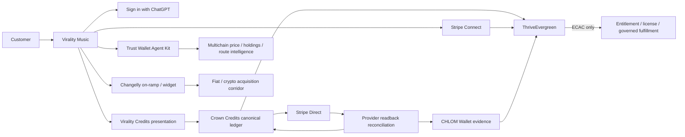

# Production hybrid-commerce convergence

This record captures the public-safe production architecture established on August 23, 2026 for CrownThrive's hybrid commerce system, with Virality Music as the first integrated production surface.

Production state is recorded per capability. A component can be deployed and production-safe while a specific provider capability remains pending. Provider configuration, provider success, or a public product card does not manufacture CrownThrive economic authority.

## Current state

| Component | Institutional state | Effective capability |
| --- | --- | --- |
| Virality Music public surface | **ACTIVE / healthy / read verified** | Existing public catalog and authenticated checkout route preserved. Native Sites source mutation remains separately gated. |
| Virality hybrid-commerce control | **ACTIVE / production** | Public-safe manifest, rail status, denomination conversion, and governed remote-runtime binding. |
| Crown Credits | **ACTIVE / production** | Canonical closed-loop CrownThrive tender and Stripe-funded top-ups. |
| Virality Credits | **ACTIVE compatibility denomination** | Presentation unit over Crown Credits: **1 Virality Credit = 25 Crown Credits**. No automatic balance rewrite. |
| Stripe Direct | **ACTIVE / production** | First-party Checkout and Crown Credits funding. |
| Stripe Connect | **ACTIVE / production** | Connected-account commerce capability remains separate from first-party Crown Credits. |
| Stripe stablecoin/Crypto | **Dashboard enabled — provider propagation pending** | Founder-attested enabled/on; fresh live automatic-payment Checkout still did not offer Crypto. Automated readback reconciliation is scheduled. |
| CHLOM Wallet | **ACTIVE / production / non-custodial** | Economic evidence, provider provenance, policy, rights, and settlement lineage; no inferred token custody. |
| Trust Wallet Agent Kit hosted API | **ACTIVE / production / write verified** | HMAC-authenticated market data, multichain domains, providers, and swap quotes. |
| Trust Wallet signing/broadcast | **HOLD: wallet path pending** | Requires a durable local Agent Wallet or WalletConnect user-approval path. No private key is stored in the CHLOM system wallet. |
| Changelly widget | **ACTIVE / production configured** | Merchant widget/on-ramp presentation may be used where approved. |
| Changelly v2 authenticated API | **HOLD: RSA private key missing** | API key alone cannot produce the required RSA-SHA256 request signature. |
| ThriveEvergreen v2 | **ACTIVE / `production_write`** | Exact `ECAC | HOLD | DENY` economic authority; production never bypasses exact candidate gates. |

## Converged architecture



## Crown Credits are canonical

`ct.credit.store.v1` is the canonical CrownThrive closed-loop credit program.

Crown Credits remain:

- nontransferable;
- non-cash-redeemable;
- non-interest-bearing;
- `crypto_asset=false`;
- first-party only unless a separately governed program explicitly changes the rule;
- issued only after authoritative provider settlement reconciliation.

Stablecoin payment is a funding tender. It does not convert Crown Credits into cryptocurrency.

## Virality Credits denomination bridge

Virality Music's existing production site uses Virality Credits and prices them at an approximately twenty-five-cent presentation value. Canonical Crown Credits use a one-cent nominal funding basis.

A direct rename would therefore create a 25× purchasing-power error.

The production compatibility rule is:

```text
1 Virality Credit = 25 Crown Credits
```

Virality Credits are not a separate money ledger. They are a Virality Music presentation denomination over the canonical Crown Credits ledger.

Existing balances are **not** silently renamed or multiplied. Any historical-balance migration requires its own exact-version reconciliation.

## Stripe Direct and provider readback

Stripe is the first-party funding and Checkout provider for eligible CrownThrive commerce.

Crown Credits settlement uses live provider readback plus an idempotent internal ledger as authoritative economic truth. Browser redirects and provider events are evidence, not entitlement authority.

The Crown Credits reconciliation worker remains active on a ten-minute cadence.

## Stablecoin reconciliation

The founder has attested that Stripe Crypto/stablecoin payments are enabled and on by default in the Dashboard.

That administrative state is preserved separately from machine-effective Checkout state.

A fresh live Checkout Session was created with automatic payment methods against an active Crown Credits price and immediately expired without payment. Crypto was not included in the returned payment method set.

Current effective state:

```text
PROVIDER_PROPAGATION_PENDING
```

A scheduled no-charge reconciliation canary runs every six hours. It may promote the effective adapter to `AVAILABLE` only when live Checkout readback actually offers Crypto.

This prevents configuration intent from being misreported as customer-effective provider capability.

## CHLOM Wallet role

CHLOM Wallet is production-active and non-custodial.

Its commerce function is to preserve:

- provider receipt provenance;
- settlement and reversal evidence;
- asset/value classification;
- rights and entitlement lineage;
- policy decisions;
- exact-version relationships;
- append-only integrity evidence.

CHLOM Wallet does not infer that it owns or controls customer cryptocurrency merely because a provider processes a stablecoin payment.

## Trust Wallet Agent Kit

The Trust Wallet Agent Kit hosted API is production-wired through a CrownThrive server-side HMAC gateway. The credential values remain private and are never returned by the public control plane.

Verified canaries include:

- authenticated live token-price request;
- live routing/domain inventory with **32 current provider-routing domains**;
- live BNB-to-USDT quote with multiple provider routes, fees, price impact, and expiry;
- no signing or broadcast during certification.

The production adapter can support the broader Trust Wallet API/Agent Kit chain universe. Current live routing-domain evidence and the full documented chain catalog are distinct measures and must not be collapsed into one count.

### Production MCP surfaces

- `trustwallet.price.read`
- `trustwallet.trending.read`
- `trustwallet.domains.read`
- `trustwallet.providers.read`
- `trustwallet.swap.quote`
- `trustwallet.swap.step.build`

`trustwallet.swap.step.build` may build transaction material but cannot itself authorize signature or broadcast.

### Signing boundary

The CHLOM system wallet currently has no bound on-chain wallet account.

Transaction execution requires one of these governed paths:

1. **WalletConnect** — a user-controlled wallet approves the requested transaction; or
2. **Durable Trust Wallet Agent Wallet** — a persistent trusted runner stores the encrypted local Agent Wallet and applies CrownThrive policy before signing.

A transient Edge Function is not used as a private-key wallet.

## Changelly

The Changelly merchant widget is production-configured as an additional acquisition/on-ramp corridor.

The authenticated v2 API remains held because Changelly v2 requires both an API key and a matching RSA-SHA256 private-key signature. The public widget configuration does not imply authenticated v2 backend execution.

Current states:

```text
widget: configured
v2 signed API: HOLD_MISSING_RSA_PRIVATE_KEY
```

## ThriveEvergreen economic authority

ThriveEvergreen is in production-write mode with production effects enabled.

Constitutional rule:

> ThriveEvergreen may optimize within authority. It may never manufacture authority.

The runtime still evaluates exact product/candidate gates. Production deployment is not a blanket `ECAC`.

Provider success cannot directly create:

- a CrownThrive invoice truth;
- an entitlement;
- a license grant;
- a payout truth;
- a public performance claim;
- a rights transfer;
- an effective price publication;
- a sovereign approval.

## Virality Music production surface

The current public Virality Music site is healthy and provider-connected. Production evidence verifies:

- public product routes return successfully;
- the current site carries its existing governed product catalog;
- credit-purchase UI posts to `/api/checkout` with an idempotency key;
- unauthenticated checkout correctly returns a sign-in boundary rather than attempting a purchase;
- account access uses Sign in with ChatGPT;
- the public catalog is preserved while the institutional feed remains empty.

The backend hybrid-commerce service is therefore production-active without destructively replacing the existing site catalog.

### Native Sites mutation remains held

The existing Sites source-bootstrap lane still carries the prior controlled HOLD associated with concurrent provider state and a dirty/stale checkout. The provider write adapter is not certified for autonomous native-site source mutation.

Therefore:

```text
commerce backend: ACTIVE
public site: ACTIVE / read verified
remote commerce binding: ACTIVE
native Sites source mutation: HOLD
```

No documentation or control-plane record should claim that the public frontend has been rewritten by this convergence run until exact provider write/readback/rollback certification exists.

## Virality commerce production API/MCP

Production control endpoint:

```text
https://tzajnzshmtzjenqulehq.supabase.co/functions/v1/virality-commerce-control
```

Public-safe operations include:

- hybrid commerce health/status;
- production commerce manifest;
- deterministic Virality-Credits-to-Crown-Credits denomination conversion.

Production MCP contracts:

- `virality.commerce.status`
- `virality.commerce.manifest`
- `virality.credits.convert`

Conversion is arithmetic only and does not mutate balances.

## Automated schedules

| Schedule | Purpose |
| --- | --- |
| Every 10 minutes | Reconcile Crown Credits Stripe settlement/readback. |
| Every 6 hours | Re-run the no-charge Stripe stablecoin Checkout capability canary and update effective provider state. |

Trust Wallet's provider Free-tier request rate is separately respected at one authenticated request per second. CrownThrive's `-1` local request-budget value means unlimited local ceiling; it never overrides provider quotas, billing limits, or throttles.

## Security and custody boundaries

- Provider credentials are vaulted and never published in this documentation.
- No raw secret return is permitted from production control APIs.
- Trust Wallet signing is not enabled without a governed wallet path.
- Changelly v2 signing is not enabled without the matching RSA private key.
- Crown Credits remain closed-loop and non-crypto.
- Virality Credits remain a presentation denomination, not a second source of economic truth.
- Stripe stablecoin Dashboard enablement and live Checkout availability are tracked separately.
- CHLOM Wallet remains non-custodial.
- ThriveEvergreen remains the economic activation authority.
- Sites-native mutation remains independently gated.

## Convergence objective

The production architecture is intentionally hybrid:

```text
Virality Music experience
+ Crown Credits canonical value ledger
+ Virality Credits compatibility presentation
+ Stripe Direct
+ Stripe Connect
+ Stripe stablecoin tender when effective provider readback passes
+ Trust Wallet multichain intelligence and governed wallet execution path
+ Changelly acquisition/on-ramp corridor
+ CHLOM Wallet provenance and settlement evidence
+ ThriveEvergreen ECAC/HOLD/DENY authority
= CrownThrive hybrid commerce fabric
```

The remaining work is provider/wallet/site capability completion, not a redesign of the economic architecture.