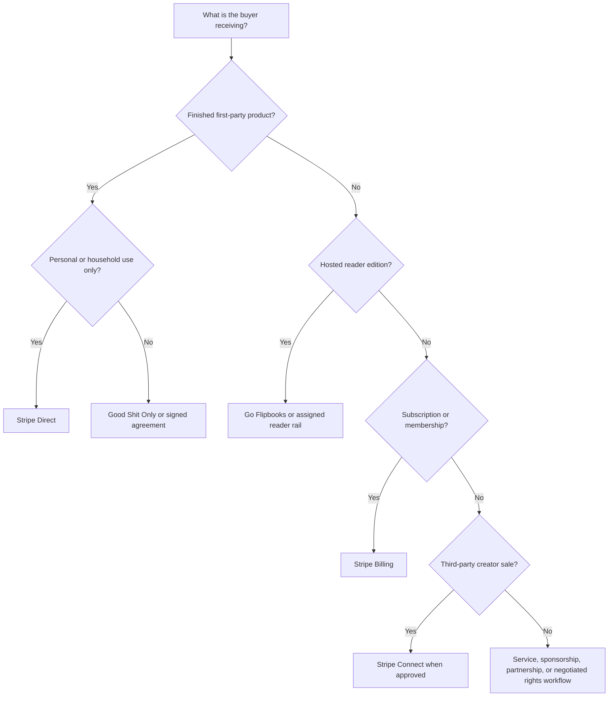

{/* pentadocs:audience-orientation:v2 */}
<Note>
  **Audience:** operators and administrators (`operator`).

  **This page:** Commerce Rails — How CrownThrive routes direct products, hosted readers, subscriptions, services, creator commerce, credits, and commercial rights.

  **Documentation state:** `unresolved` for page type `reference`. Documentation state is editorial posture only; it does not certify runtime, deployment, legal, rights, financial, provider, production, release, security, or operational status.

  **Unresolved reason:** no explicit page-level editorial acceptance state was declared in the migrated source.

  **Evidence needed:** an accepted governing source or accountable-owner attestation.

  **Review role:** PentaDocs governance.

  **Review trigger:** next material edit or source reconciliation.

  **Related guidance:** [Documentation source governance](/standards/documentation-source-of-truth-and-autonomous-governance) and [Institutional record standard](/standards/record-and-format-standard).
</Note>
{/* /pentadocs:audience-orientation:v2 */}

## Commerce rails

CrownThrive uses different commerce rails because a personal-use file, a hosted book, a subscription, a service engagement, a creator marketplace sale, and a commercial license are not the same transaction.

<Info>
  The current reader-facing architecture uses [PentaCredits](/commerce/pentacredits) for credits/value-unit state and [PentaGreen](/commerce/pentagreen) for commerce/economic authority. The dated machine-read architecture record remains [Production Hybrid Commerce Convergence — 2026-08-23](/commerce/production-hybrid-commerce-convergence-2026-08-23). The managed-wallet custody/signing boundary is documented in [Managed Agent Wallet](/commerce/chlom-managed-agent-wallet-base-usdc), with Trust Wallet Agent Kit retained as the multichain intelligence/routing plane. The embedded-wallet, funding and WalletConnect contract is documented in [MetaMask Embedded Wallets Funding & Dual Wallet Execution](/commerce/metamask-embedded-wallets-funding-and-dual-wallet).
</Info>

## Routing decision

## Stripe Direct

Stripe Direct is the first-party commerce rail for eligible CrownThrive-owned products and services.

Typical uses:

- personal-use printables
- downloadable workbooks and journals
- digital art sold for personal use
- selected books and bundles
- memberships and subscriptions
- approved one-time first-party services
- internal credit top-ups where implemented

Required controls:

- server-side product and price mapping
- Stripe-hosted or otherwise approved Checkout
- signed webhook verification
- idempotent fulfillment
- entitlement creation
- protected delivery
- download-limit enforcement where applicable
- refund and dispute reconciliation
- clear personal-use terms

A browser redirect does not prove payment and must not create an entitlement by itself.

## Good Shit Only

Good Shit Only is the governed commercial-rights and marketplace rail.

Use GSO or a signed rights workflow for:

- commercial reproduction
- synchronization and broadcast
- public performance
- institutional or multi-seat use
- source files, stems, isolated vocals, or project files
- remix, sampling, derivative, or training permissions
- character, voice, visual, merchandise, or adaptation rights
- enterprise use
- creator or partner listings requiring a governed rights class

Payment does not expand the license beyond the approved scope.

## Go Flipbooks

Go Flipbooks is the hosted-reader rail for editions assigned to it.

A hosted-reader state is separate from:

- downloadable-file status
- print status
- commercial-rights status
- source readiness
- canon approval

Do not invent a reader URL or mark a reader active until the actual hosted experience is verified.

## Stripe Billing

Stripe Billing or an approved subscription system handles recurring plans.

Required states include:

- trial where applicable
- active
- past due
- grace period
- canceled
- expired
- payment-recovery state

Entitlements must follow webhook-confirmed subscription state, not a client-side claim.

## Stripe Connect

Stripe Connect is reserved for approved third-party creator or seller commerce.

It is distinct from CrownThrive first-party sales.

The charge architecture must intentionally define:

- seller identity
- merchant-of-record responsibilities
- statement descriptors
- platform fees
- payout ownership
- refund and dispute responsibilities
- tax responsibilities
- connected-account requirements

Internal CrownThrive credits must not purchase third-party connected-account products.

## Services and partnerships

Services, commissions, sponsorships, development engagements, and partnerships may use:

- proposals
- statements of work
- signed agreements
- invoices
- approved deposits or milestones
- controlled checkout for clearly bounded offers

A service checkout must identify what is included, what is not included, the delivery conditions, revision limits, rights ownership, and escalation path.

## PentaCredits

Credits are a closed-loop internal value system for eligible CrownThrive-owned products.

Purchased credits should be:

- nontransferable
- non-cashable
- non-interest-bearing
- explicitly priced per product
- recorded through an append-only ledger

Promotional credits must be tracked separately and may have disclosed restrictions or expiration.

<Note>
  **Typed legacy/runtime denomination.** Preserve the exact compatibility expression `1 Virality Credit = 25 Crown Credits` wherever an existing balance, receipt, event, database object, or provider binding requires it. In this expression, **Crown Credits** is the legacy label for [PentaCredits](/commerce/pentacredits); new reader-facing records should use PentaCredits without silently renaming or multiplying prior balances. The preserved mapping does not by itself certify a current balance mutation, ledger, provider, or checkout path.
</Note>

## Commerce handoff rules

1. The product registry selects the rail; the browser does not.
2. The rights class determines what the buyer may do.
3. Fulfillment and licensing are separate records.
4. Refunds and disputes update access according to policy.
5. A listing is not active until every required downstream dependency is verified.
6. Cross-rail migrations require versioned mapping and regression testing.

<Warning>
  Never use a low-cost direct-download product to imply commercial, institutional, performance, adaptation, source-file, character, voice, or derivative rights.
</Warning>
