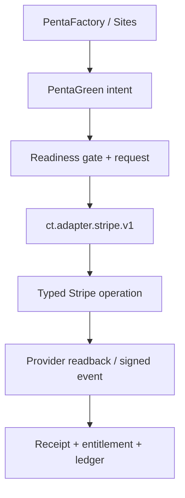

{/* pentadocs:audience-orientation:v2 */}
<Note>
  **Audience:** operators and administrators (`operator`).

  **This page:** Stripe OS Monetization Fabric — Current Stripe execution, mirror, capability-adoption, factory-readiness, webhook, credential-custody, and monetization holds under PentaGreen.

  **Documentation state:** `current_with_holds` for page type `reference`. Documentation state is editorial posture only; it does not certify runtime, deployment, legal, rights, financial, provider, production, release, security, or operational status.

  **Related guidance:** [Operating principles](/start-here/operating-principles) and [Permissions and approvals](/automation/permissions-and-approval-gates).
</Note>
{/* /pentadocs:audience-orientation:v2 */}

<Note>
  **Canonical economic authority:** [PentaGreen](/commerce/pentagreen). **External infrastructure provider:** Stripe. Stripe executes bounded provider operations; it does not replace CrownThrive SKU, price, rights, entitlement, settlement, or ledger authority. Public surfaces must not promote Stripe as a strategic partner without a governing relationship record that supports that claim.
</Note>

## Current production posture

The Stripe runtime contract has been repaired and narrowed to typed operations, but the PentaGreen Stripe factory is intentionally paused. Current readback is:

- mesh state: `RUNTIME_REPAIRED_FACTORY_PAUSED_GOVERNED_GATES`;
- canonical adapter: `ct.adapter.stripe.v1`, component version `2.0.0`;
- factory clock: inactive, with no live cron row;
- factory-ready profiles: **0 of 1,042**;
- product types enabled for sale: **0 of 17**;
- legally ready tax profiles: **0**;
- payout rail: `HOLD_DEFAULT_BANK_ERRORED`;
- capability-adoption rows: **30**, including **16** with the literal `d3_gated` autonomy state; the capability policy marks **22 of 30** as D3/human-gated;
- provider-write families: Product, Price, Payment Link, and Webhook only.

The typed adapter being available is not a monetization-ready claim. Founder/D3 authority does not replace product sale state, legal-tax evidence, rights, fulfillment, entitlement, signed webhook, or provider-readback evidence.

The controlling mesh is `ct.binding.pentagreen-stripe-mesh.v3`. The historical `ct.binding.thriveevergreen-stripe-live.v2` remains lineage, not current authority.

## Provider readback and mirror state

Observed provider state and CrownThrive mirrors remain distinct:

| Surface | Stripe provider readback | CrownThrive mirror | Current gap |
| --- | ---: | ---: | --- |
| Products | 459 total / 434 active | 456 | 131 active products lack a default Price; 8 active products have no list Price; 48 active duplicate-name groups |
| Prices | 484 total / 465 active | 478 | 384 active Prices lack a lookup key; 107 mirror Prices lack account scope; 7 active Prices belong to inactive Products |
| Payment Links | 48 total / 33 active | 48 | 15 inactive; duplicate configurations remain; 14 allow promotion codes while zero promotion codes exist |
| Webhook endpoints | 16 enabled | 15 endpoint records | Wildcard canary failure, redundant coverage, missing metadata/description, and API-version fragmentation |

Additional provider evidence includes:

- 216 active Products without metadata;
- 420 active Products without a product tax code;
- 257 recurring Prices, all licensed rather than metered;
- zero metered or meter-linked Prices;
- four Connect accounts observed through Accounts v2, three accessible and one inaccessible;
- one active tax registration, scoped to Virginia;
- one primary account read back with 22 active payment capabilities.

Account-level `charges_enabled` or `payouts_enabled` flags do not certify the payout rail. The default payout bank reports an errored state, so transfers/payouts remain held pending controlled repair and canary evidence.

## Architecture



PentaRoute selects an account and transport; PentaBridge normalizes provider semantics; PentaWire carries signed events; PentaReceipt/PentaReconcile preserve evidence; PentaGreen owns the economic decision.

## Canonical adapter and variants

| Adapter identity | Purpose | Current state |
| --- | --- | --- |
| `ct.adapter.stripe.v1` | Canonical provider adapter, version `2.0.0` | Active with holds |
| `ct.adapter.stripe.mcp.v1` | Operator discovery and governed MCP work | Active operator surface; not application runtime |
| `ct.adapter.stripe.runtime.v1` | Product, Price, and Payment Link operations | Typed route ready; factory paused |
| `ct.adapter.stripe.webhook.v3` | Signed webhook reconciliation | Degraded topology; factory paused |
| `ct.adapter.stripe.catalog-mirror.v2` | Provider mirrors | Active with reconciliation lag |

The variants are transports under the canonical adapter and do not create independent authority.

Stripe's official MCP endpoint is `https://mcp.stripe.com`. MCP authentication uses OAuth or a restricted key outside source. MCP must not bypass PentaGreen, the capability registry, D3 gates, product readiness, or the server-runtime contract.

## Typed executable boundary

| Family | CrownThrive route | Provider-write state |
| --- | --- | --- |
| Product | `integration_control.stripe_os_provider_operation_v2` | Typed; factory paused |
| Price | `integration_control.stripe_os_provider_operation_v2` | Typed; factory paused |
| Payment Link | `integration_control.stripe_os_provider_operation_v2` | Typed; factory paused |
| Webhook | `integration_control.stripe_webhook_provider_reconcile_v3` | Typed reconciliation; degraded and paused |

The low-level request function is private to the typed adapter. It is not a general service-role tunnel for arbitrary Stripe URLs, paths, query parameters, or bodies. The server route pins `Stripe-Version: 2026-07-29.dahlia` and appends sanitized evidence to `integration_control.stripe_os_provider_operation_receipts_v2`.

Checkout Sessions, customers, subscriptions, invoices, quotes, Connect mutations, application fees, coupons, promotion codes, billing meters, standalone PaymentIntents, Terminal, Identity, Financial Connections, Issuing, Treasury, and Radar do not have a certified generic factory executor. They remain read-only, planning-only, D3-gated, or `HOLD_SPECIALIZED_EXECUTOR_REQUIRED`.

Tax mutation is `held_legal_tax_gate`. Transfers, payouts, refunds, disputes, external-account changes, and other material money effects remain separately D3/human gated.

## Capability adoption

`integration_control.stripe_os_capability_adoption_v2` records provider availability, CrownThrive adoption, autonomy, write route, hold reason, and observed evidence independently.

| Adoption group | Current state |
| --- | --- |
| Products, Prices, Payment Links | Typed adapter ready; factory paused for zero governed candidates |
| Webhooks | Typed reconcile route; provider topology degraded and signed canary required |
| Account, reporting, portal, data exports | Read or configuration evidence only; no inherited write authority |
| Checkout, customers, subscriptions, invoices, quotes | Observed/available; specialized executor required |
| Tax | Configured only for the verified registration scope; legal/product gates hold writes |
| Connect and money effects | Partial readback or provider availability; D3 and specialized controls required |
| Promotions, meters, Terminal, Identity, financial products, Radar | Not normalized, not configured, not adopted, or D3 gated |

Thirty adoption rows exist. Sixteen use the literal `d3_gated` autonomy state, while the capability policy marks 22 of 30 as requiring a D3/human gate. Some of those 22 use a more specific legal-tax or specialized-executor hold label. Provider availability never creates CrownThrive authority.

## Account and credential routes

Runtime code uses account roles, not provider account IDs:

| Route | Intended scope | Evidence boundary |
| --- | --- | --- |
| `COMMERCE_PRIMARY` | First-party CrownThrive commerce | Audited account/capability readback; payout rail still held |
| `SECONDARY_COMMERCE_EXPANSION` | Platform/Connect/expansion work | Must be independently verified for the exact operation; no inherited certification |

Credentials follow:

```text
HOT -> WARM -> COLD -> EMERGENCY
```

- HOT is the current provider-verified route.
- WARM and COLD must be independently verified before failover.
- Same-material recovery aliases are not independent credentials.
- EMERGENCY never auto-promotes without same-account provider verification.
- Internal worker secrets do not become Stripe authority.

No route may expose raw credentials, silently replace founder-controlled material, or store MCP/API authorization in repository source, Drive prose, public docs, analytics, or client bundles.

## PentaFactory contract

Factories and sites submit one idempotent request to:

`integration_control.pentagreen_stripe_prepare_monetization_v1(...)`

The accepted request/output pairs are:

- `PRODUCT_PRICE` -> `product_price`;
- `PAYMENT_LINK` -> `payment_link`;
- `WEBHOOK_BINDING` -> `webhook_binding`;
- `CATALOG_SYNC` -> `catalog_sync`, for mirror/reconciliation work.

All other output types remain held for a specialized executor. In particular, Checkout, subscription, invoice, quote, and Connect plans are not accepted as generic provider execution merely because Stripe supports those products.

## Product eligibility

A product is not factory-ready until exact readback proves:

- its product type is enabled for sale;
- its tax profile has a provider-verified Stripe code;
- its legal taxability state is ready, verified, approved, certified, `taxable_verified`, or `not_taxable_verified`;
- `tax_behavior` is exactly `inclusive` or `exclusive`;
- rights, fulfillment, quality, route, custody, and documentation states are ready;
- `stripe_entitlement_handler_ref` exists;
- `stripe_webhook_binding_key` exists;
- the exact handler/event matrix is bound;
- a signed provider webhook canary passes.

The current 1,042 profiles do not satisfy that full conjunction. The clock stays paused until at least one profile does.

## One-product canary before re-enable

1. Select exactly one profile while the commerce clock remains paused.
2. Read back every sale, legal-tax, tax-behavior, rights, fulfillment, quality, route, custody, docs, entitlement, and webhook gate.
3. Reconcile existing Product, Price, Payment Link, endpoint, and account-scope aliases.
4. Submit one supported idempotent request.
5. Execute one bounded Commerce Binder item through the typed route.
6. Read the Stripe object back and prove that no duplicate provider object, request, or queue row was created.
7. Deliver a signed test or natural event through the exact webhook handler and prove entitlement/ledger reconciliation.
8. Append and read back the terminal receipt/DAIL evidence.
9. Obtain the required human authorization, enable exactly one desired job, and verify exactly one live job.
10. Pause on any drift, duplicate, failed canary, missing entitlement, tax/legal change, or money-movement crossover.

A rollback-only database canary proves runtime contract mechanics. It does not make a product sale-ready and does not authorize scheduler activation.

## Learning and optimization

The fabric may use reconciled evidence to recommend conversion routing, payment-method eligibility, recurring versus one-time structures, price bands, catalog deduplication, webhook coverage, recovery, and failed-payment workflows. Learning can act only inside an already-authorized capability. It cannot create tax, legal, rights, credential, privacy, money-movement, or D3 authority.

## Institutional references

- Mesh: `integration_control.pentagreen_stripe_mesh_v3`
- Runtime readiness: `integration_control.stripe_os_runtime_readiness_v2()`
- Accounts: `integration_control.stripe_os_accounts_v1`
- Capabilities: `integration_control.stripe_os_capabilities_v1`
- Adoption: `integration_control.stripe_os_capability_adoption_v2`
- Adapters: `integration_control.stripe_os_adapter_registry_v1`
- Credential routes: `integration_control.stripe_live_secret_lanes_v1`
- Requests: `integration_control.pentagreen_stripe_monetization_requests_v1`
- Provider receipts: `integration_control.stripe_os_provider_operation_receipts_v2`
- Partner relationship: `integration_control.crownthrive_partner_registry_v1`

<Warning>
  Never embed Stripe secret keys, Connect access tokens, webhook signing secrets, customer payment data, bank details, unrestricted service credentials, or MCP authorization in source, docs, analytics, client bundles, Drive prose, or public metadata. Store governed references and fingerprints only.
</Warning>

## Related

- [PentaGreen](/commerce/pentagreen)
- [Commerce Rails](/commerce/rails)
- [Payment and Fulfillment](/commerce/payment-and-fulfillment)
- [Product State Model](/commerce/product-state-model)
