<Note>
  **Canonical economic authority:** [PentaGreen](/commerce/pentagreen). **Provider:** Stripe. Stripe executes bounded provider operations; it does not replace CrownThrive SKU, price, rights, entitlement, settlement, or ledger authority.
</Note>

## Current production posture

CrownThrive operates Stripe as a reusable commerce execution fabric rather than a collection of site-specific integrations.

Current institutional readback binds:

- two verified live CrownThrive Stripe account routes;
- `456` mirrored Stripe Product records;
- `478` mirrored Stripe Price records;
- `48` mirrored Payment Links;
- `4` active Stripe webhook lanes;
- `15` provider endpoint records;
- `18` provider capability families;
- `13` capability families eligible for PentaFactory/PentaGreen monetization writes;
- one HOT/WARM/COLD/EMERGENCY credential-custody policy with no raw-secret projection.

The controlling mesh is `ct.binding.pentagreen-stripe-mesh.v3`. The historical `ct.binding.thriveevergreen-stripe-live.v2` remains preserved as lineage and is not rewritten into current truth.

## Architecture

```mermaid
flowchart LR
  F[PentaFactory / Sites / Products] --> G[PentaGreen]
  G --> S[PentaSKU + PentaPrice + PentaCatalog]
  S --> Q[Stripe monetization request]
  Q --> B[PentaGreen Commerce Binder]
  B --> R[PentaBridge / PentaRoute]
  R --> A[Stripe MCP or server API adapter]
  A --> P[Stripe provider]
  P --> W[Signed webhooks / provider readback]
  W --> H[PentaHook + PentaWire]
  H --> C[PentaReceipt + PentaReconcile]
  C --> L[PentaLedger / Entitlements]
```



## Account routing

| Route | Purpose | Provider state |
| --- | --- | --- |
| `COMMERCE_PRIMARY` | First-party CrownThrive commerce, Checkout, Billing, subscriptions, invoices and general product monetization | Live verified; charges and payouts enabled |
| `SECONDARY_COMMERCE_EXPANSION` | Platform, Connect and expansion workloads; independent direct-provider route | Live verified; charges and payouts enabled |

Account identifiers, tokens and credential material remain in governed ThriveBase/Drive custody and are not projected into public documentation.

## Credential survival routes

Provider API credentials use a deterministic custody ladder:

```text
HOT -> WARM -> COLD -> EMERGENCY
```

- **HOT** is the current provider-verified authority route.
- **WARM** is the canonical independent standby. A same-material recovery alias does not count as an independent credential.
- **COLD** is a separately verified platform standby.
- **EMERGENCY** never auto-promotes before same-account provider verification.
- Internal worker secrets are explicitly excluded from provider API authority.

Canonical machine source: `integration_control.stripe_live_secret_lanes_v1`.

No route may expose raw credentials, silently replace a credential, or auto-delete/auto-rotate founder-controlled material.

## Provider capabilities exposed to CrownThrive OS

| Family | CrownThrive owner | Factory monetization | Additional human/D3 gate |
| --- | --- | --- | --- |
| Products | PentaCatalog / PentaFactory | Yes | No |
| Prices | PentaPrice / PentaFactory | Yes | No |
| Payment Links | PentaCheckout / PentaFactory | Yes | No |
| Checkout Sessions | PentaCheckout | Yes | No |
| Customers | PentaCatalog / CRM | Yes | No |
| Subscriptions / Billing | PentaInvoice | Yes | No |
| Invoices | PentaInvoice | Yes | No |
| Quotes | PentaPrice / PentaMarketer | Yes | No |
| Tax bindings | PentaPolicy / tax lane | Yes | No |
| Webhook bindings | PentaBridge / PentaHook | Yes | No, subject to endpoint topology/capacity |
| Connect onboarding/capabilities | PentaMarket / PentaBridge | Planning and bounded onboarding | Yes for consequential platform/money-routing effects |
| Application-fee bindings | PentaMarket / PentaLedger | Bounded configuration | Yes for consequential fee/routing effects |
| Transfers / payouts | PentaPayout | No autonomous factory execution | Yes |
| Refunds | PentaCompensate | No autonomous factory execution | Yes |
| Disputes | PentaHold / risk lane | No autonomous factory execution | Yes |
| Reporting / reconciliation | PentaLedger / analytics | Read/reconcile | No |

## PentaFactory plug-and-play contract

Factories and sites must not create ad hoc Stripe integrations. They submit one idempotent request to:

`integration_control.pentagreen_stripe_prepare_monetization_v1(...)`

Supported outputs include:

- Stripe Product \+ Price binding;
- Payment Link;
- Checkout binding;
- subscription plan;
- invoice offer;
- webhook binding;
- Connect plan;
- repricing through a new provider Price object;
- catalog synchronization.

The request reuses the existing PentaGreen work queue and the existing `Commerce Binder` role. Duplicate requests reuse the same idempotency identity rather than creating parallel work.

Reserved effects such as refunds, payouts, bank-account changes, transfers of funds, final rights grants or dispute disposition do not enter this generic factory path.

## Product and price identity

PentaSKU remains the exclusive CrownThrive SKU authority. A Stripe Product ID, Price ID, Payment Link ID, Checkout Session ID or connected-account ID is a **provider alias**, not the CrownThrive institutional identity.

Provider mirrors are reused directly:

- `integration_control.stripe_catalog_products_v2`
- `integration_control.stripe_catalog_prices_v2`
- `integration_control.stripe_payment_link_inventory_v4`
- `integration_control.pentagreen_stripe_catalog_bridge_v1`

Do not create a second Stripe catalog database for a site or factory.

## Webhooks and fulfillment

Stripe webhooks remain the provider event source of truth for fulfillment-sensitive state.

Current lanes include CrownThrive platform surfaces such as ticketing, ministry/digital-product commerce, local commerce and API-marketplace routing. Every lane must preserve:

- raw-body signature verification where required;
- idempotent event identity;
- bounded retries;
- provider endpoint readback;
- stable route identity;
- PentaWire transport;
- PentaReceipt/PentaReconcile institutionalization;
- no entitlement from a browser redirect alone.

See [Payment and Fulfillment](/commerce/payment-and-fulfillment).

## Adapter and MCP topology

CrownThrive maintains provider-neutral adapters rather than cloning Stripe's proprietary backend.

| Adapter | Purpose |
| --- | --- |
| `ct.adapter.stripe.mcp.v1` | Operator/API discovery and governed Stripe MCP execution |
| `ct.adapter.stripe.runtime.v1` | Server-side REST execution with idempotency and read-after-write |
| `ct.adapter.stripe.webhook.v3` | Signed event ingress and provider-event routing |
| `ct.adapter.stripe.catalog-mirror.v2` | Products, prices and Payment Link provider mirrors |

PentaRoute selects the provider route, PentaWire carries events, PentaBridge normalizes provider semantics, PentaGreen owns economic decisions, and PentaCredentials owns custody.

## Monetization autonomy

Founder monetization authority enables CrownThrive to autonomously prepare and execute bounded provider configuration required to sell already-governed products and services: catalog objects, prices, checkout bindings, subscription/invoice configuration, webhook bindings and related provider readback.

That authority does **not** mean every possible Stripe mutation is interchangeable. Money movement, refunds, bank changes, final legal/rights commitments, dispute disposition and other consequential reserved effects retain their specialized controls and no-self-approval boundaries.

## Learning and optimization

The Stripe fabric may learn from reconciled provider evidence to improve:

- conversion routing;
- payment-method eligibility;
- recurring versus one-time pricing recommendations;
- PentaPrice price-band proposals;
- invoice versus Checkout selection;
- marketplace versus first-party route selection;
- webhook coverage;
- recovery and failed-payment workflows;
- catalog deduplication;
- PentaGreen economic forecasts.

Learning may propose or execute only within the capability's recorded authority class. It cannot turn provider capability into new CrownThrive authority.

## Institutional references

- Mesh: `integration_control.pentagreen_stripe_mesh_v3`
- Accounts: `integration_control.stripe_os_accounts_v1`
- Capabilities: `integration_control.stripe_os_capabilities_v1`
- Adapters: `integration_control.stripe_os_adapter_registry_v1`
- Credential routes: `integration_control.stripe_live_secret_lanes_v1`
- Requests: `integration_control.pentagreen_stripe_monetization_requests_v1`
- Partner registry: `integration_control.crownthrive_partner_registry_v1`
- Status: `integration_control.stripe_os_mesh_status_v1()`

<Warning>
  Never embed Stripe secret keys, Connect access tokens, webhook signing secrets, customer payment data, bank details or unrestricted service credentials in source, docs, analytics, client bundles, Drive prose or public metadata. Store references and fingerprints only.
</Warning>

## Related

- [PentaGreen](/commerce/pentagreen)
- [Commerce Rails](/commerce/rails)
- [Payment and Fulfillment](/commerce/payment-and-fulfillment)
- [Product State Model](/commerce/product-state-model)
