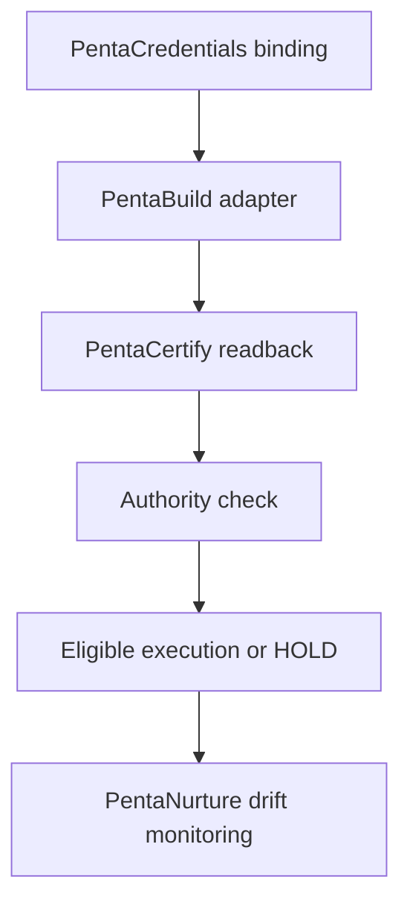

{/* pentadocs:audience-orientation:v2 */}
<Note>
  **Audience:** Sites developers, MCP implementers, release engineers, and provider reviewers. Use this boundary with the [Sites release workflow](/workflows/crownthrive-sites-release-and-agent-workflow) and [MCP/API governance standard](/standards/mcp-api-governance).

  **This page:** CrownThrive Sites API and MCP Boundary — Phase 3 public-safe API, MCP, provider-certification, data-classification, and authority boundaries for CrownThrive Sites™.

  **Documentation state:** `unresolved` for page type `developer`. Documentation state is editorial posture only; it does not certify runtime, deployment, legal, rights, financial, provider, production, release, security, or operational status.

  **Unresolved reason:** no explicit page-level editorial acceptance state was declared in the migrated source.

  **Evidence needed:** an accepted governing source or accountable-owner attestation.

  **Review role:** PentaDocs governance.

  **Review trigger:** next material edit or source reconciliation.
</Note>
{/* /pentadocs:audience-orientation:v2 */}

## CrownThrive Sites™ API and MCP boundary

CrownThrive Sites™ participates in the Phase 3 Penta operating fabric. The API/MCP contract is governed by the same rule as every provider-facing surface: **technical capability and credential presence do not manufacture CrownThrive authority**.

<Warning>
  **No current quickstart is published.** The only routes listed here are an August 21, 2026 historical read-only baseline, and this page does not provide the exact current host, response schemas, authentication contract, error envelope, or provider readback. Do not construct requests until current PentaCertify/provider evidence pins those details.
</Warning>

## Choose the applicable lane

<Tabs>
  <Tab title="Historical public reads">
    Use the route table only as dated discovery evidence. It records three read-only route shapes with Public data and no intended side effects; it does not prove current availability.
  </Tab>
  <Tab title="Candidate MCP reads">
    Catalog discovery, integration status, and release readiness are capability classes, not installed tool names or executable schemas. Each requires a certified server binding and data boundary.
  </Tab>
  <Tab title="Provider mutation">
    Every source, layout, deployment, customer, commerce, identity, or protected-delivery write requires an operation-specific contract, authority check, readback, and rollback/compensation path.
  </Tab>
</Tabs>

## Stable identities

| Field | Current record |
| --- | --- |
| Platform | `ct.platform.crownthrive-sites` |
| Public API family | `ct.api.crownthrive-sites.public` |
| API contract generation | `v1` historical baseline; current deployment requires fresh provider readback |
| MCP contract | `ct.mcp.crownthrive-sites` |
| MCP protocol family | current CrownThrive MCP/PentaFabric contract family |
| Public write authority | none inferred |
| Provider-write authority | operation-specific and fail-closed |

## Historical public-route baseline

The August 21, 2026 source packet recorded these public read-only routes on the then-observed hosted surface:

| Method | Route | Intended purpose | Data class | Side effects |
| --- | --- | --- | --- | --- |
| GET | `/api/health` | service availability metadata | Public | None |
| GET | `/api/v1/catalog` | public catalog candidates and declared lifecycle state | Public | None |
| GET | `/api/v1/integration-status` | public-safe integration-boundary state | Public | None |

Those records are preserved as **dated source evidence**, not perpetual deployment proof. Current provider availability, route parity, version identity, and deployment health must be established through current PentaCertify™/provider readback before being represented as live.

A catalog record is never, by itself, a price, offer, checkout state, fulfillment promise, rights clearance, entitlement, or customer contract.

## Penta provider-control binding

CrownThrive Sites provider operations follow the current sequence:

Missing credentials produce `HOLD_UNBOUND`. Bound credentials without successful live readback remain pending certification. A read-certified route does not imply write authority.

## Explicit non-capabilities

Neither the public API contract nor this documentation grants:

- customer, lead, account, payment, identity, or entitlement access;
- checkout, billing, refund, order, payout, product activation, or rights-grant authority;
- credential disclosure or private governance/evidence access;
- provider-wide write authority;
- automatic deployment authority;
- a new sovereign/governance role;
- D3 authority;
- authority to convert a candidate catalog item into a live commercial offer.

## MCP boundary

The CrownThrive Sites MCP family is subordinate to PentaFabric/PentaMesh governance. Read-only discovery tools may be exposed only after their current server binding and data boundary are certified.

Candidate read-only capability classes include:

| Capability | Purpose | Authority ceiling | Data class |
| --- | --- | --- | --- |
| catalog discovery | list public released/candidate catalog records | A0 / D0 | Public |
| integration status | return public-safe provider/integration state | A0 / D0 | Public summary |
| release readiness | return a governed readiness projection | A0 / D0 | Public summary |

Any side-effecting tool requires its **own** contract, authentication/authorization scope, data classification, exact-operation certification, failure model, logging/retention policy, rollback or compensation path, and current authority instrument.

## Release and execution coupling

A Sites change is not complete merely because source builds. The governed path requires:

<Steps>
  <Step title="Pin current source identity">
    Establish the exact repository/project and revision without overwriting concurrent provider work.
  </Step>
  <Step title="Build the bounded change">
    Produce PentaBuild or equivalent implementation evidence within the authorized operation scope.
  </Step>
  <Step title="Run exact-head checks">
    Complete the required CI, security, secret, documentation, and compatibility checks on the same revision.
  </Step>
  <Step title="Certify external behavior">
    Where provider/runtime behavior is claimed, perform the exact provider readback through PentaCertify's independent scope.
  </Step>
  <Step title="Reconcile documentation">
    Update PentaDocs current-state language without converting build or provider evidence into broader authority.
  </Step>
  <Step title="Read back and retain recovery evidence">
    Verify the final state independently and retain rollback/recovery evidence for material mutations.
  </Step>
</Steps>

PentaManagers may issue bounded contracts/task orders for implementation. PentaBuild may construct the artifact. PentaCertify independently certifies the applicable provider/interface scope. PentaNurture tracks drift. None may self-create authority that the governing instrument did not provide.

## Data and customer boundary

Write-capable customer, commerce, identity, CRM, submission, deployment, or protected-delivery interfaces remain separately governed. Public-route availability never establishes customer-data permission.

Where the exact current provider state cannot be read back, the correct state is `HOLD`, `unverified`, or `readback_required`—never assumed production.

**Record version:** 2.0.0  
**Institutional phase:** Phase 3 / Production + Convergence  
**Supersedes:** the Phase-2.99-era API/MCP transport in PR #205 without erasing its historical evidence.

## Errors, testing, and support

No error codes, rate limits, retries, idempotency mechanism, MCP request/response fields, or webhook events are specified here. Missing credentials produce the documented `HOLD_UNBOUND`; bound credentials without live readback remain pending; every other failure must follow the exact operation contract rather than an invented default.

Testing must distinguish source build, exact-head CI, historical route discovery, current public readback, provider mutation readback, rollback, and institutional certification. Use the [Sites release workflow](/workflows/crownthrive-sites-release-and-agent-workflow) for implementation/recovery and the [support request workflow](/workflows/support-request) when contract, provider, credential, data, or authority evidence is missing.
