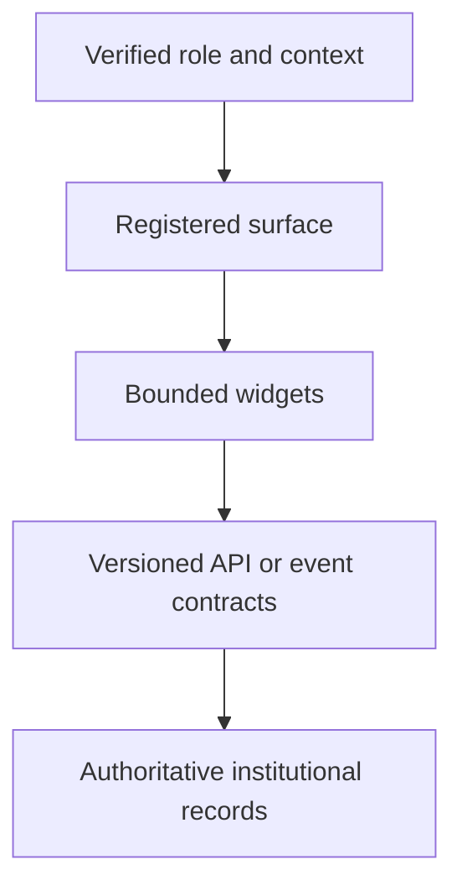

{/* pentadocs:audience-orientation:v2 */}
<Note>
  **Audience:** frontend developers, product architects, identity engineers, accessibility reviewers, and platform integrators. Use this registry model with [CrownThrive ID](/technology/crownthrive-id) and the [API integration standards](/technology/api-integration-standards).

  **This page:** Portals, Dashboards, Widgets and Role Surfaces — The canonical role-to-interface model for CrownThrive developer, operator, partner, creator, affiliate, administrator, reviewer, licensee, and institutional dashboards.

  **Documentation state:** `unresolved` for page type `developer`. Documentation state is editorial posture only; it does not certify runtime, deployment, legal, rights, financial, provider, production, release, security, or operational status.

  **Unresolved reason:** no explicit page-level editorial acceptance state was declared in the migrated source.

  **Evidence needed:** an accepted governing source or accountable-owner attestation.

  **Review role:** PentaDocs governance.

  **Review trigger:** next material edit or source reconciliation.
</Note>
{/* /pentadocs:audience-orientation:v2 */}

<Warning>
  **Architecture inventory, not deployed UI proof.** The role families and primitives below describe intended surfaces recovered from source material. They do not establish current routes, components, permissions, APIs, customer access, or production availability.
</Warning>

## Start a surface specification

<Steps>
  <Step title="Name one audience and purpose">
    Choose the stable role or audience and the decision or task the surface supports. Split incompatible roles instead of hiding authority differences in the client.
  </Step>
  <Step title="Register the surface boundary">
    Record `surface_id`, platform/pallet owner, lifecycle/version, public/private/restricted classification, and accessibility/responsive requirements.
  </Step>
  <Step title="Separate reads from writes">
    Enumerate each read and write capability, its API dependency, data class, scopes, approval requirements, and side effects. UI visibility is not authorization.
  </Step>
  <Step title="Compose governed primitives">
    Reuse identity, asset, evidence, status, approval, event, entitlement, case, payout, and integration-health components only when their source contracts exist.
  </Step>
  <Step title="Test by role and failure state">
    Verify denial, stale data, missing entitlement, suspended account, partial provider failure, keyboard/mobile behavior, and audit emission before production promotion.
  </Step>
</Steps>

## Surface architecture

Legacy CrownThrive/CHLOM materials describe hundreds of screens, dashboards, portals, widgets and operational views. Phase 2.95 preserves them as a **surface registry** rather than rebuilding each as an isolated application.

## Surface model

Every surface should be registered with:

- `surface_id`;
- platform/pallet owner;
- audience/role;
- purpose;
- read capabilities;
- write capabilities;
- approval requirements;
- data classes;
- widgets/components included;
- API dependencies;
- event subscriptions;
- responsive/accessibility requirements;
- lifecycle/version;
- public/private/restricted classification.

The browser renders a projection. It must not manufacture roles, entitlements, approvals, evidence, payment state, or rights authority.

## Institutional portal families

<Info>
  Each family below is a requirements lane. Feature nouns such as payments, licenses, scans, or payouts do not prove that the corresponding API, data, or authority is currently available.
</Info>

### Founder / Holdings / Portfolio

Portfolio health, platform state, domains, vendors, risks, rights, capital allocation, institutional decisions, incidents and Phase 3 service health.

### Super Admin / Operations

Tenant configuration, roles, feature controls, queues, integrations, provider health, logs, case escalation, data export and emergency actions.

### CHLOM Steward / Compliance Reviewer

Rights graph, DLA/license state, evidence, policy results, approvals, cases, appeals, holds, remedies, audit trail and source authority.

### Rights Holder / Licensor

Asset registration, ownership evidence, license templates, offers, territories, terms, royalties, usage records, disputes and statements.

### Licensee / Buyer / Operator

Licenses held, conditions, permitted uses, renewals, payments, compliance tasks, proof upload, support and dispute status.

### Developer

Applications, clients, scopes, API keys/references, sandbox, docs, webhooks, logs, usage, rate limits, changelog, incidents and support.

### Partner / Brand / Business

Integration health, campaigns, products, entitlements, referrals, support, permissions, billing and approved ecosystem capabilities.

### Crown Affiliate / Ambassador

Links, campaign assets, approved brands, conversions, commission status, education/certification, disclosure requirements, payout state and flywheel progression.

### Creator / Media Contributor

Works, rights, provenance, submissions, content state, campaign opportunities, licensing, royalties, audience signals and release workflows.

### Suite Pro / MM Suites Operator

Identity/credential state, suite/location permissions, booking, products, compliance tasks, local campaigns, payouts, training and support.

### Publisher / Advertiser / AdLuxe Partner

Properties, zones/inventory, creatives, targeting, budgets, campaigns, approvals, delivery quality, analytics, billing and rights status.

### Instructor / CrownThriveU

Courses, curriculum rights, learners, credentials, cohorts, reviews, payouts, support and compliance.

### CrownFluence Creator / Campaign Manager

Creator profile and verified scope, campaign discovery/applications, assignments, briefs, deliverables, rights/releases, disclosures, approvals, publication state, performance evidence, compensation, holds and disputes.

### ThrivePeer Mentor / Participant / Program Manager

Mentor/participant profile, verification scope, programs/cohorts, match requests/proposals, availability, sessions/check-ins, goals/resources, privacy/consent, safety cases, feedback and approved economics.

### ThriveGather Member / Host / Moderator / Sponsor

Workspaces/rooms, events, access tiers, memberships/entitlements, invites, capacity, host/moderator assignments, sponsor inventory, attendance, recording/replay state, embeds, regions/time zones, support and incidents. Private URLs/keys are never rendered in public surfaces.

### ThriveTickets Attendee / Organizer / Check-in Operator

Events, venues, schedules, ticket types/inventory/prices/fees, orders/tickets, QR/barcodes, transfers, waitlists, scans/admission, event changes, refunds/disputes, organizer statements, waivers and accessibility.

### Support / Moderator / Reviewer

Tickets, user context, permitted account actions, knowledge suggestions, escalations, abuse/case handoffs and audit history.

## Widget registry

Widgets are reusable bounded components, not miniature shadow platforms. Recovered source families include media widgets, MVP/TV ecosystem widgets, affiliate widgets, campaign/reporting widgets, booking and rewards widgets, status/analytics widgets, license/status widgets and dashboard scorecards.

Every widget should declare its API scopes, input/output schema, embedding rules, owner, version and rights/data boundary.

| Widget contract field | Builder question |
| --- | --- |
| Stable ID and owner | Which team and institutional record control this component? |
| Input/output schema | Which exact fields and versions may it consume and render? |
| Read/write scopes | Which operation is allowed for this role and environment? |
| Data classification | May the value appear on public, authenticated, private, or restricted surfaces? |
| Freshness and failure state | How does the widget show stale, unavailable, held, or conflicting data? |
| Embed and origin rules | Where may it render and how is the host verified? |
| Accessibility/responsiveness | Can the task be completed by keyboard, assistive technology, and narrow layouts? |
| Audit and support | Which consequential actions emit evidence and where do failures escalate? |

## Phase 3 implementation rule

Build shared primitives first—identity selector, asset card, evidence panel, status badge, approval panel, event timeline, entitlement card, case panel, payout statement, integration-health widget—then compose role-specific portals. This is materially more efficient than coding hundreds of unrelated dashboards.

## Authentication, errors, and testing boundary

This page defines no issuer, client, token, session, route, component package, API base URL, response schema, error code, rate limit, or deployment environment. Resolve those through the exact identity and platform contracts. A disabled button, hidden route, feature flag, or omitted navigation item is not a security control.

On an unknown role, entitlement, approval, data classification, or mutation outcome, fail closed and preserve a non-sensitive audit reference. Use the [support request workflow](/workflows/support-request) for access/state conflicts and the [endpoint discovery workflow](/developers/api-endpoint-discovery-and-adapter-registry) for missing backend contracts.
