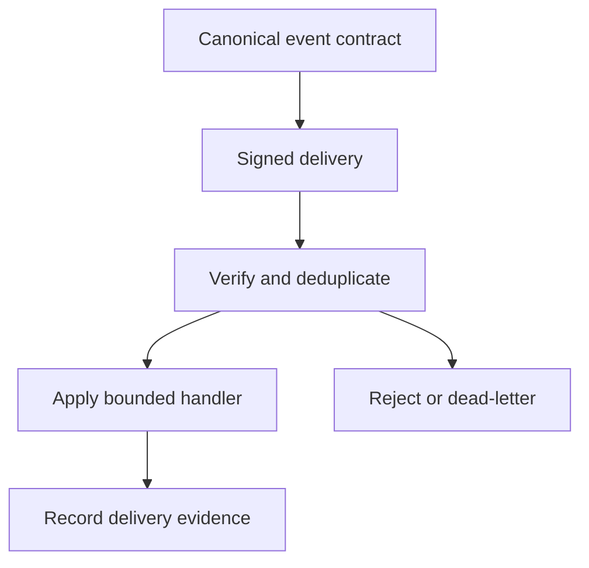

{/* pentadocs:audience-orientation:v2 */}
<Note>
  **Audience:** SDK authors, application developers, webhook consumers, and integration reviewers. Use this target model with the [Developer Platform](/developers/overview) and the [API integration standards](/technology/api-integration-standards); use the [CrownThrive IO API Sandbox](/developers/crownthrive-io-api-sandbox) when you need the currently documented synthetic contract.

  **This page:** SDKs, Sandbox, Webhooks and Test Keys — The CrownThrive developer-experience contract for generated SDKs, safe test environments, webhook events, test identities, fixtures, quotas, and integration certification.

  **Documentation state:** `unresolved` for page type `developer`. Documentation state is editorial posture only; it does not certify runtime, deployment, legal, rights, financial, provider, production, release, security, or operational status.

  **Unresolved reason:** no explicit page-level editorial acceptance state was declared in the migrated source.

  **Evidence needed:** an accepted governing source or accountable-owner attestation.

  **Review role:** PentaDocs governance.

  **Review trigger:** next material edit or source reconciliation.
</Note>
{/* /pentadocs:audience-orientation:v2 */}

<Warning>
  **Target contract, not a package catalog.** This page does not identify a published SDK package, install command, production base URL, credential issuer, webhook receiver URL, signing algorithm, payload schema, retry schedule, or production entitlement. Do not invent those details from the target families below.
</Warning>

## Choose a development lane

<Tabs>
  <Tab title="SDK client">
    Generate or maintain a typed client only from a pinned canonical API specification. The SDK version, supported runtime versions, transport behavior, and deprecation policy must trace to that contract.
  </Tab>
  <Tab title="Sandbox integration">
    Use non-production credentials, synthetic fixtures, resettable state, and mock providers. Sandbox behavior must not be represented as customer, payment, rights, or production proof.
  </Tab>
  <Tab title="Webhook consumer">
    Implement only after event names, versions, signing, replay protection, retry behavior, ordering assumptions, and delivery evidence are defined by the exact interface.
  </Tab>
  <Tab title="MCP or agent tool">
    Generate schemas from a governed operation contract and preserve its scope, data, approval, side-effect, and audit boundaries. Tool reachability does not grant execution authority.
  </Tab>
</Tabs>

## Development sequence

<Steps>
  <Step title="Pin the interface contract">
    Record the platform, environment, contract version, base URL, authentication, scopes, request/response schemas, errors, limits, and deprecation state.
  </Step>
  <Step title="Select synthetic fixtures">
    Use test organizations, users, assets, rights, licenses, payments, entitlements, campaigns, cases, and events that contain no customer or production secrets.
  </Step>
  <Step title="Build the smallest bounded client">
    Start with the minimum safe read or synthetic operation supported by the contract. Do not add undocumented fields, routes, retries, or fallbacks.
  </Step>
  <Step title="Exercise failures and delivery behavior">
    Test authentication failure, invalid input, quotas, retries, replay, idempotency, and partial outcomes only where the interface defines them.
  </Step>
  <Step title="Record certification scope">
    Separate contract conformance, sandbox verification, integration testing, production reads, production writes, and recertification on breaking changes.
  </Step>
</Steps>

## Source and current-state boundary

Recovered CHLOM and Help Center sources explicitly planned SDK quick-starts, REST/GraphQL interfaces, sandbox keys, rate limits, webhooks and developer guides. The current implementation should preserve that ambition while using modern contract-first tooling.

## SDK families

Initial target SDKs:

- JavaScript / TypeScript;
- Python;
- REST/OpenAPI generated clients;
- webhook verification helpers;
- MCP/agent tool schemas;
- Solidity/Web3 libraries only for CHLOM protocol stages that actually require chain integration.

SDKs should be generated from the canonical API specification where possible so documentation and implementation do not drift.

| Family | Source-backed target | Current publication detail on this page |
| --- | --- | --- |
| JavaScript / TypeScript | Initial target SDK | Package, registry, install command and supported versions not specified |
| Python | Initial target SDK | Package, registry, install command and supported versions not specified |
| REST/OpenAPI | Generated clients where a canonical specification exists | Generator and artifact location not specified |
| Webhook helpers | Signature-verification helpers | Algorithm, headers and package not specified |
| MCP/agent schemas | Tool schemas derived from governed operations | Server binding and tool versions interface-specific |
| Solidity/Web3 | Only where a CHLOM protocol stage requires chain integration | No current chain contract or package established here |

## Sandbox

The developer sandbox should provide:

- test organizations and users;
- synthetic rights/assets/licenses;
- mock checkout/payment states;
- test entitlement/download events;
- fake campaign/affiliate conversions;
- test CHLOM approvals and cases;
- webhook replay;
- non-sensitive fixture data;
- resettable environments;
- safe rate-limit simulation.

No production secrets or customer data belong in the sandbox.

## Event and webhook baseline

Canonical event families should include:

`identity.*`, `organization.*`, `role.*`, `asset.*`, `rights.*`, `license.*`, `approval.*`, `order.*`, `payment.*`, `entitlement.*`, `content.*`, `campaign.*`, `affiliate.*`, `reward.*`, `ticket.*`, `support.*`, `case.*`, `impact.*`, `platform.*`.

Every consequential webhook should support signature verification, event ID, event version, creation time, object reference, retry semantics, replay protection and delivery logs.

This diagram is the required target control flow. It does not define an event envelope, signature algorithm, delivery endpoint, or retry timing.

## Developer certification path

The progression is: register an application; choose platform capabilities; receive a sandbox client; build; run automated contract tests; complete security/rights review; pass acceptance testing; receive separately approved production credentials; monitor; and recertify on breaking changes.

## Rate and abuse controls

Rate policies must be explicit per client, platform and operation. Sensitive operations may have stricter quotas, approval requirements, or no external API exposure at all.

## Errors, compatibility, and support

| Missing or failed contract element | Builder response |
| --- | --- |
| Package name, base URL, auth flow, schema, or environment absent | Stop; keep the capability unresolved and use the interface registry |
| Webhook signature or replay behavior absent | Do not accept the event as an authoritative mutation trigger |
| Mutation outcome unknown | Do not replay blindly; reconcile through a safe read or incident/delta record |
| Sandbox differs from production | Record the compatibility gap; sandbox PASS does not promote production state |
| Breaking contract change | Pin the prior version, follow deprecation/migration rules, and recertify the affected scope |

Use the [endpoint discovery and adapter registry](/developers/api-endpoint-discovery-and-adapter-registry) to fill missing contract fields. Use the [support request workflow](/workflows/support-request) for blocked access, unclear authority, or contract/documentation conflicts.
