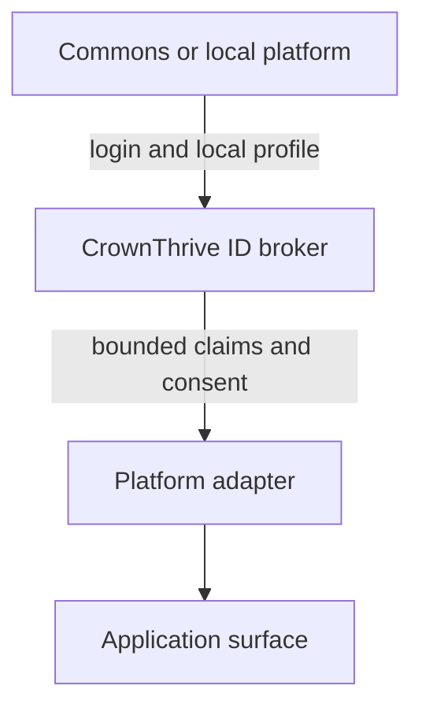

{/* pentadocs:audience-orientation:v2 */}
<Note>
  **Audience:** identity architects, application developers, security reviewers, and platform integrators. Use this boundary model with [CrownThrive ID](/technology/crownthrive-id) and the [security and privacy continuity standard](/technology/security-privacy-continuity).

  **This page:** SSO, CrownThrive ID and Social Identity Bridge — The development model for using CrownThrive Commons/social infrastructure as an identity entry point while CrownThrive ID remains the durable identity, role, consent, and SSO authority.

  **Documentation state:** `unresolved` for page type `developer`. Documentation state is editorial posture only; it does not certify runtime, deployment, legal, rights, financial, provider, production, release, security, or operational status.

  **Unresolved reason:** no explicit page-level editorial acceptance state was declared in the migrated source.

  **Evidence needed:** an accepted governing source or accountable-owner attestation.

  **Review role:** PentaDocs governance.

  **Review trigger:** next material edit or source reconciliation.
</Note>
{/* /pentadocs:audience-orientation:v2 */}

<Warning>
  **Target architecture.** No current issuer URL, authorization or token endpoint, client-registration process, redirect URI, claim schema, scope catalog, token lifetime, signing-key set, SDK, or production migration is established by this page. Do not configure OIDC/OAuth from the diagram alone.
</Warning>

## Integration starting point

<Steps>
  <Step title="Inventory the local identity">
    Record the platform account identifier, authentication provider, roles, recovery path, profile fields, consent data, and suspension state without treating them as CrownThrive-wide authority.
  </Step>
  <Step title="Create an explicit account link">
    Map the local account to a stable CrownThrive ID only through an approved, auditable linking flow. Preserve unlinking and recovery history.
  </Step>
  <Step title="Adopt brokered SSO where supported">
    Use standards-based OAuth 2.0/OIDC only after issuer, client, redirect, scope, claim, assurance, signing, and environment contracts are verified.
  </Step>
  <Step title="Consume bounded claims">
    A platform receives only the approved roles, consent, eligibility, and profile references required for its purpose; it does not read unrestricted institutional databases.
  </Step>
  <Step title="Test failure and recovery">
    Verify expired/revoked credentials, account-link conflict, suspension, re-authentication, MFA for privileged roles, consent withdrawal, and vendor-independent recovery before migration.
  </Step>
</Steps>

## Identity boundary

The source architecture explicitly allows the CrownThrive social/community platform—historically represented through **WoWonder / CrownThrive Commons**—to support gated community, social interaction and identity entry. It should **not** become the permanent institutional identity source of truth.

## Target relationship

The arrows represent the intended trust and data-minimization relationship, not a verified production token exchange.

<Tabs>
  <Tab title="CrownThrive ID authority">
    Owns durable person and organization identifiers, account links, role and authority references, consent, assurance, recovery state, service identities, and audit events for privileged changes.
  </Tab>
  <Tab title="Local/social authority">
    Owns its community experience, local profile, feeds, groups, relationships, moderation state, and optional onboarding entry for that platform.
  </Tab>
  <Tab title="Must stay separate">
    A local platform must not silently become the rights ledger, legal-identity record, master entitlement database, universal role authority, or sole account-recovery mechanism.
  </Tab>
</Tabs>

## CrownThrive ID owns

- canonical person and organization identifiers;
- account-link relationships;
- role and authority references;
- consent and communication preferences;
- program eligibility references;
- suspension/recovery state;
- authentication assurance level;
- portable profile references;
- service-account identity;
- audit events for account linking and privileged changes.

## Social platform owns

- social/community profile experience;
- feeds, groups, relationships and community interactions;
- optional onboarding entry;
- social-facing profile fields;
- community moderation state relevant to that platform.

It must not silently become the rights ledger, legal identity record, master entitlement database, or sole recovery authority.

## Integration stages

| Stage | Meaning | Evidence boundary |
| --- | --- | --- |
| External/heterogeneous auth | Current reality for many properties | Local provider behavior only |
| Account linking | Map local accounts to stable CrownThrive IDs | Requires explicit link schema, consent and audit evidence |
| Brokered SSO | OAuth 2.0/OIDC where supported | Requires exact issuer/client/claim/environment contract |
| Role and entitlement awareness | Consume approved claims/scopes | Does not grant raw database or universal role access |
| Portable profile and consent | Move selected user-controlled fields | Requires field-level purpose and consent rules |
| One Seat, Multiple Industries | Mature unified experience across modular stacks | Target outcome, not current deployment proof |

## Security rules

- least privilege per platform;
- no universal bearer credential shared across apps;
- short-lived tokens and rotation;
- separate service identities;
- re-authentication for sensitive actions;
- MFA for privileged roles;
- explicit consent for cross-platform data use;
- append-only account-link history;
- recovery path independent of one vendor.

## Phase 3 requirement

Sprint 0 should establish identity IDs, role vocabulary, auth assurance, account-link schema, provider registry and event contracts before any broad SSO migration.

## Error and support boundary

This page does not define protocol error codes or a recovery API. Until an exact identity contract exists, applications must fail closed on an unknown issuer, signature, audience, tenant, role, link, consent, assurance, or suspension state. They must not guess a user match from email alone or silently widen privileges during fallback.

Use the [permissions and approval gates](/automation/permissions-and-approval-gates) for authority decisions and the [support request workflow](/workflows/support-request) when account-link ownership, consent, recovery, or role state cannot be reconciled.
