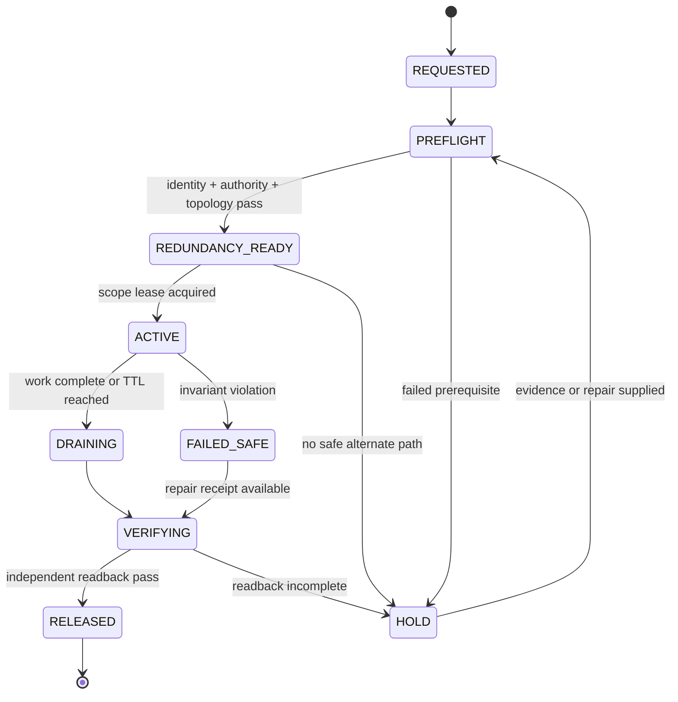
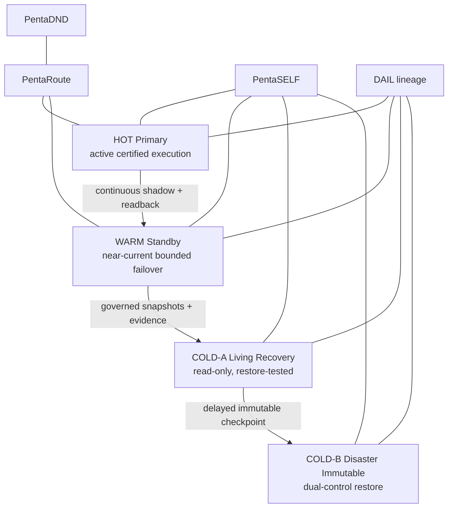
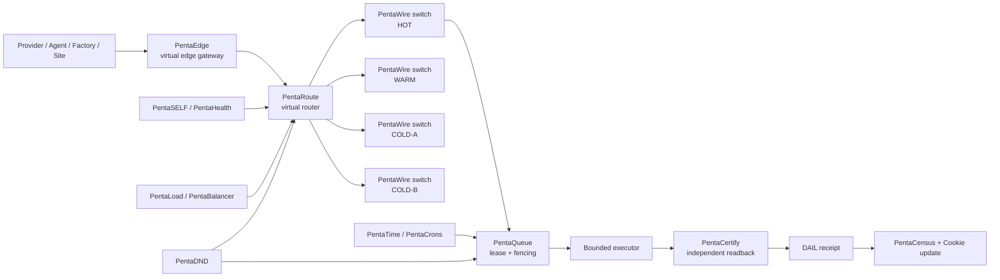
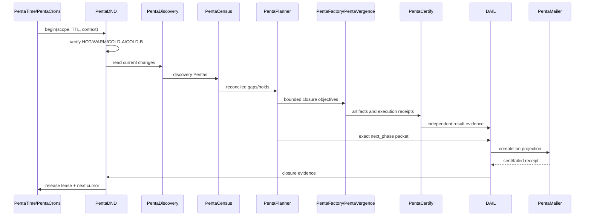

# PentaDND Architecture

## Human view

PentaDND protects one exact scope while the rest of COS keeps operating. It is a bounded maintenance lease, not a global silence switch.

```text
                         FOUNDER / GOVERNANCE
                                 |
                        CHLOM + PentaPolicy
                                 |
             +-------------------+-------------------+
             |                                       |
        PentaDND lease                         PentaSELF health
             |                                       |
             +-------------------+-------------------+
                                 |
                     PentaRoute / PentaWire
                                 |
          +----------------------+----------------------+
          |                      |                      |
      normal path          protected scope        critical path
          |                      |                      |
       execute             drain / defer /         never silenced
                             fail over
```

## Machine view



## Four-line resilience



All four lines resolve to one COS UUID graph, CHLOM identity lineage and DAIL history. A replica or backup cannot create authority merely by existing.

## 3×3 projection inside each line

```text
LINE
├── HUMAN
│   ├── C_CENTRALIZED
│   ├── D_DECENTRALIZED
│   └── B_BRIDGE
├── MACHINE
│   ├── C_CENTRALIZED
│   ├── D_DECENTRALIZED
│   └── B_BRIDGE
└── HYBRID
    ├── C_CENTRALIZED
    ├── D_DECENTRALIZED
    └── B_BRIDGE
```

The 3×3 projections are presentation and operating views of the same underlying entity, never nine competing records of authority.

## Virtual network model



## Hourly Sol Ultra pass



## Isolation boundary

The durable execution context is `ct.context.sol-ultra.pro-hourly.v1`. A user may work in a separate interactive Pro conversation, but the conversation itself is not the scheduler, queue, lock or source of truth. The context ID, DND lease, Pentas correlation chain and DAIL receipts preserve continuity across chat interruptions.

## Failure rules

- No ambiguous mutation is retried automatically.
- No DND lease suppresses P0 security, health, evidence-integrity or economic-finality alerts.
- No lease is accepted without a TTL and release/verification path.
- No failover line is promoted without current health, authority and readback evidence.
- No completed hourly run is valid without an exact next phase and email-outbox disposition.
- No historical record is silently rewritten or deleted.
