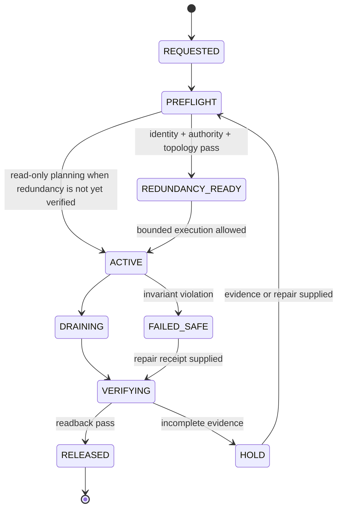
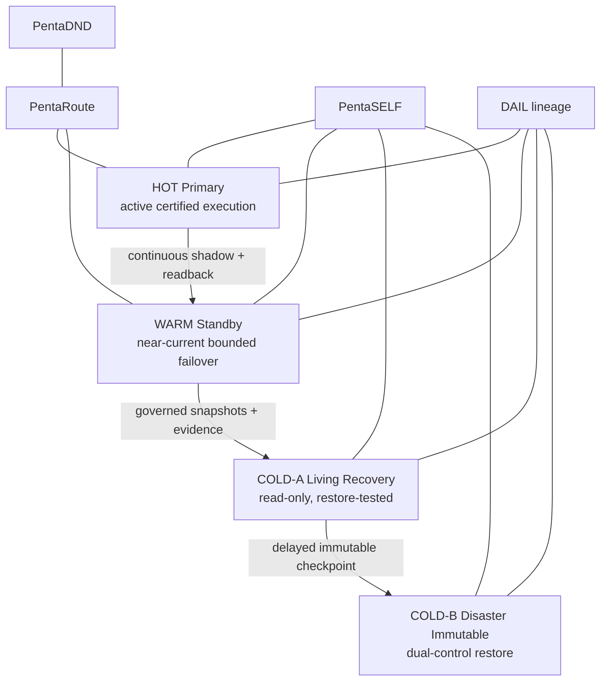
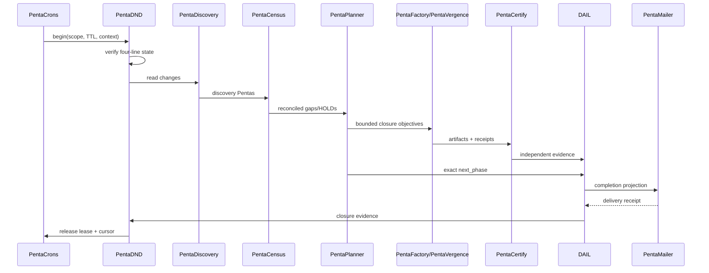

# PentaDND Architecture

## Scoped maintenance state



## Four-line resilience



## Virtual network


## Hourly convergence sequence



## 3×3 view inside every line

```text
LINE
├── HUMAN
│   ├── C_CENTRALIZED
│   ├── D_DECENTRALIZED
│   └── B_BRIDGE
├── MACHINE
│   ├── C_CENTRALIZED
│   ├── D_DECENTRALIZED
│   └── B_BRIDGE
└── HYBRID
    ├── C_CENTRALIZED
    ├── D_DECENTRALIZED
    └── B_BRIDGE
```

These are views of one stable entity and one DAIL lineage, not nine sources of authority.

## Failure rules

- No ambiguous mutation automatically retries.
- No ordinary DND lease suppresses P0 security, health, evidence-integrity or economic-finality alerts.
- No lease exists without TTL, fencing, rollback and release verification.
- No redundancy line is promoted without health, authority and readback evidence.
- No run completes without an exact next phase and email disposition.
- No historical record is silently deleted or rewritten.
