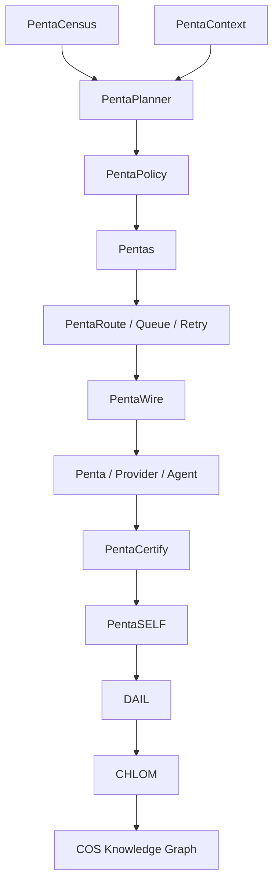
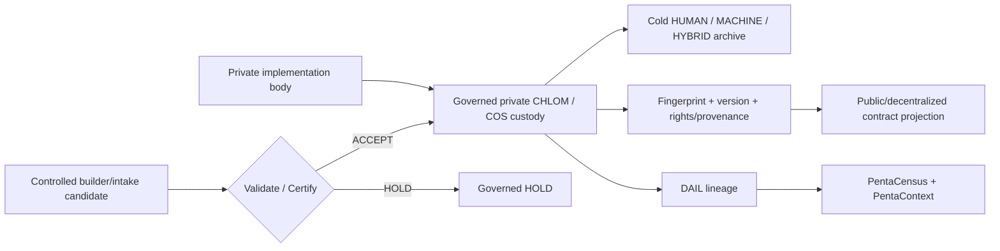

# CrownThrive COS V1 — Production Contract

**Contract:** `ct.cos.production-architecture.v1`  
**COS release train:** `1.0.0`  
**Projection class:** `PUBLIC_CONTRACT_RESTRICTED_IMPLEMENTATION`  
**Canonical private-body fingerprint:** `52b39491a6d3c47fb5d3fd5683cd6ef886ab0ed586c0c41bd6d65199b4559360`

> This repository projection intentionally excludes proprietary implementation bodies, credentials, private provider details, trade-secret diagrams, internal evidence payloads, and private custody references. Those remain behind CrownThrive's governed COS/CHLOM vault boundary.

## Constitutional invariant

Nothing CrownThrive can observe, own, operate, deploy, publish, execute, schedule, sell, meter, license, route, store, govern, repair, retire, or prove may remain unidentified, unauthorized, unobservable, or unreconciled by COS.

## COS kernel



Canonical semantics:

- **Pentas** — motion and signed work transport.
- **DAIL** — institutional history and evidentiary lineage.
- **CHLOM** — identity, rights, authority, and verifiable provenance.
- **PentaCookie** — bounded local state.
- **PentaCensus** — what exists.
- **PentaContext** — what matters now.
- **PentaWire** — capability resolution and governed connectivity.
- **PentaRoute** — how work moves.
- **PentaPlanner** — what should happen.
- **PentaSELF** — drift detection, repair, and reconciliation.
- **PentaFactory** — what must be built or repaired.
- **PentaCertify** — whether an execution can be proven to work.

## External operating-model benchmark set

COS V1 may absorb useful primitives from Palantir Foundry/AIP/Apollo, ServiceNow AI Platform/Action Fabric, Microsoft Agent 365, Salesforce Agentforce/MuleSoft, Linux Foundation A2A, Fetch.ai uAgents/Agentverse, and OriginTrail DKG. External systems are reference architectures only. They do not become CrownThrive's constitutional control plane.

The CrownThrive differentiator is the convergence of operational ontology, autonomous Pentas, governed provider actions, DAIL institutional memory, CHLOM identity/rights/provenance, a software factory, economic/commerce fabric, media/IP fabric, and continuous repair.

## Canonical 15-phase production program

| Phase | Program |
|---|---|
| 00 | Constitutional Baseline |
| 01 | Universal Census |
| 02 | Identity + Knowledge Graph |
| 03 | DAIL Trust V2 |
| 04 | Pentas COS Epoch |
| 05 | PentaWire / MCP / A2A Fabric |
| 06 | Routing + Temporal Fabric |
| 07 | Autonomous Operations |
| 08 | Software Factory |
| 09 | Repository + Deployment Fabric |
| 10 | Provider + Credential Fabric |
| 11 | Economic + Commerce Fabric |
| 12 | Experience + Growth Fabric |
| 13 | Continuity + Security |
| 14 | COS Command Center |
| 15 | Production Certification |

## Immutable phase protocol

```text
PRE-STATE
→ CENSUS + DEPENDENCY READ
→ R1 ROLLBACK POINT
→ BOUNDED IMPLEMENTATION
→ STATIC + UNIT TEST
→ CONTRACT TEST
→ INTEGRATION TEST
→ SECURITY TEST
→ FAILURE / RETRY TEST
→ CANARY
→ PROVIDER / PRODUCTION READBACK
→ INDEPENDENT CERTIFICATION
→ REGRESSION TEST
→ CLEANUP / RETIRE SUPERSEDED STATE
→ DAIL
→ PentaContext / Census
→ CHLOM where applicable
→ governed documentation projection
→ PHASE CERTIFICATE
→ STOP AT NEXT PHASE BOUNDARY
```

## Release train

`COS_RELEASE=1.0.0` is the synchronized institutional release train. Individual components retain independent semantic versions. Each governed component must resolve its COS release, component version, compatible COS range, source/build/production revision, schema/migration revision, DAIL checkpoint, CHLOM provenance, and certification identity.

## Model-agnostic inference

COS workflows request stable capabilities rather than model names:

```text
capability://reason
capability://plan
capability://code
capability://review
capability://research
capability://classify
capability://extract
capability://verify
```

PentaInference resolves those capabilities according to current certification, authority, privacy, quality, latency, cost, and availability policy.

## Proprietary asset boundary



All CrownThrive proprietary algorithms, protocols, metaprotocols, system designs, diagrams, code patterns, prompts, skills, datasets, economic models, identity/governance designs, proprietary media processes, and future novel assets are subject to registration, classification, fingerprinting, custody, lifecycle, evidence, and recovery controls.

Passwords, API keys, private keys, seed phrases, refresh tokens, and equivalent credentials are never documentation or public-repository assets.

## Production certification bar

COS V1 does not receive production PASS while a known release-blocking Critical/High defect, unknown institutional entity, unexplained state divergence, unidentified active scheduler, duplicate authoritative clock, unsigned consequential packet, missing origin identity, unresolved provider-contract drift, mutation without rollback/DAIL lineage, provider write without independent readback, source/production revision mismatch, unrecoverable migration, raw credential leakage, unauthorized D3 path, material public-truth drift, failed restoration drill, broken entitlement/payment reconciliation, release regression, or reactivatable superseded runtime remains.

Production qualification requires unit, property, contract, integration, browser/API E2E, migration, concurrency, queue-saturation, retry/idempotency, load, provider-outage, credential-failure, scheduler-collision, packet-tampering, network-partition, deployment-rollback, database-recovery, security, accessibility, and independent-readback testing as applicable.

## Completion target

```text
100% discovered
100% identified
100% classified
100% related
100% authority-bounded
100% capability-addressable
100% evidence-addressable
100% health-observable
100% repair-routable
100% lifecycle-managed
100% intentionally active / gated / retired
0% unknown institutional state
```

The private institutional record remains canonical for restricted implementation detail. This public contract exists for interoperability, review, implementation discipline, and release accountability without disclosing CrownThrive trade secrets.
