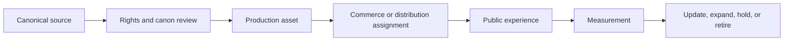
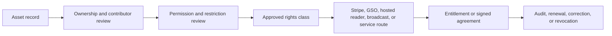

{/* pentadocs:audience-orientation:v2 */}
<Info>
  **Audience:** executive and governance readers (`executive`).

  **This page:** Flows and Handoffs — How assets, rights, audiences, data, events, and revenue move between CrownThrive platforms without collapsing ownership or accountability.

  **Documentation state:** `unresolved` for page type `reference`. Documentation state is editorial posture only; it does not certify runtime, deployment, legal, rights, financial, provider, production, release, security, or operational status.

  **Unresolved reason:** no explicit page-level editorial acceptance state was declared in the migrated source.

  **Evidence needed:** an accepted governing source or accountable-owner attestation.

  **Review role:** PentaDocs governance.

  **Review trigger:** next material edit or source reconciliation.

  **Related guidance:** [Documentation source governance](/standards/documentation-source-of-truth-and-autonomous-governance) and [Institutional record standard](/standards/record-and-format-standard).
</Info>
{/* /pentadocs:audience-orientation:v2 */}

## Flows and handoffs

Every cross-platform movement must define five things:

1. **Source** — where the asset, record, event, or request originates.
2. **Owner** — who is accountable for the source and the handoff.
3. **Payload** — the minimum approved information or asset being transferred.
4. **Destination** — which system receives it and for what purpose.
5. **Result** — the expected state change, evidence, and failure path.

## Asset flow



A source file never becomes public merely because a derivative is approved. Distribution receives the minimum approved derivative, not the entire source package.

## Rights flow



Key rule: **permission is not inferred from possession, payment, publication, or visibility.**

## Audience flow

A typical public journey may look like:

```text
Discover through search, community, Backroad FM, media, or referral
→ enter a relevant experience or world
→ listen, read, watch, or learn
→ save, join, purchase, inquire, or license
→ receive fulfillment or onboarding
→ return through ThrivePush, rewards, community, or related content
```

The audience should not need to understand the full CrownThrive architecture to complete one useful action.

## Revenue flow

Revenue must retain its transaction type and owner.

| Revenue type | Primary rail | Required evidence | Typical downstream records |
| --- | --- | --- | --- |
| First-party digital product | Stripe Direct | Paid Checkout Session, signed webhook, product mapping | Order, entitlement, delivery, refund/dispute state |
| Hosted-reader sale | Assigned hosted-reader rail | Verified order and access route | Order reference, reader access, support state |
| Commercial license | Good Shit Only or approved contract workflow | Rights record, approved scope, signed terms, payment | License, entitlement/key where applicable, expiration, reporting |
| Subscription or membership | Stripe Billing or approved billing rail | Subscription state and webhooks | Plan entitlement, renewal, cancellation, grace state |
| Service engagement | Proposal, contract, invoice, or approved checkout | Scope, price, acceptance, payment | Project, deliverables, change orders, completion |
| Sponsorship | Approved sponsorship agreement | Inventory, term, brand-safety review, payment | Placement schedule, proof, performance report |
| Creator marketplace sale | Stripe Connect where approved | Connected-account state, charge architecture, fee disclosure | Seller order, platform fee, payout, refund/dispute responsibility |
| Credits redemption | Internal closed-loop ledger | Available balance, explicit credit price, redemption event | Order, entitlement, ledger entries, reversals |

Revenue does not automatically determine ownership. A distributor, platform, affiliate, creator, or sponsor receives only the economics and permissions defined by the governing agreement.

## Data flow

CrownThrive applies minimum-necessary data movement.

### Public data

Examples:

- approved titles and descriptions
- public platform domains
- public product status
- published articles and media
- approved public metrics with dates

### Account and operational data

Examples:

- authentication state
- orders and entitlements
- download counts
- support records
- subscription status
- internal product and release states

Access is role-based and purpose-limited.

### Sensitive or protected data

Examples:

- payment and dispute records
- private customer information
- unreleased source assets
- protected identities and child-related records
- private rights, contracts, and partner terms
- credentials and security records

These records must not move into public documentation, public analytics, advertising systems, or unrelated agent contexts.

## Event handoff standard

Every automation event should contain:

```yaml
event_id: unique-id
event_type: product.approved
occurred_at: UTC timestamp
source_system: canonical-registry
subject_id: product-or-asset-id
actor: user-or-system-id
classification: internal
payload_version: 1
correlation_id: workflow-id
```

Events must be idempotent where retries are possible. Consumers should record success, failure, retry, and dead-letter states.

## Failure handling

A handoff must define:

- validation failure
- destination unavailable
- duplicate event
- partial completion
- unauthorized request
- stale version
- downstream rejection
- rollback or reconciliation owner

<Warning>
  Never update a public success state before the downstream system confirms the action that the success state describes.
</Warning>
