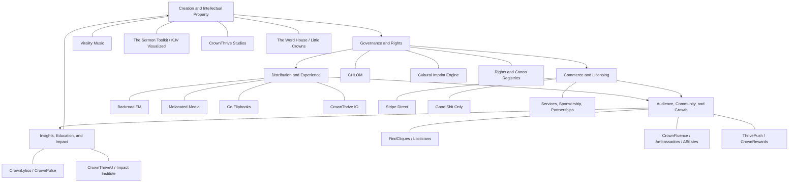

{/* pentadocs:audience-orientation:v2 */}
<Info>
  **Audience:** executive and governance readers (`executive`).

  **This page:** CrownThrive Ecosystem Map — The principal CrownThrive corridors and the controlled movement of culture, products, audiences, rights, data, and revenue between them.

  **Documentation state:** `unresolved` for page type `reference`. Documentation state is editorial posture only; it does not certify runtime, deployment, legal, rights, financial, provider, production, release, security, or operational status.

  **Unresolved reason:** no explicit page-level editorial acceptance state was declared in the migrated source.

  **Evidence needed:** an accepted governing source or accountable-owner attestation.

  **Review role:** PentaDocs governance.

  **Review trigger:** next material edit or source reconciliation.

  **Related guidance:** [Documentation source governance](/standards/documentation-source-of-truth-and-autonomous-governance) and [Institutional record standard](/standards/record-and-format-standard).
</Info>
{/* /pentadocs:audience-orientation:v2 */}

## CrownThrive ecosystem map

CrownThrive’s ecosystem is organized by **corridors and responsibilities**, not by a single monolithic application.

A corridor may create, govern, distribute, monetize, measure, educate, or support. It should not silently assume another corridor’s authority.

## Creation and intellectual-property corridors

### Virality Music

Creates and develops music, books, poems, characters, radio programming, story worlds, publishing products, services, and licensable transmedia intellectual property.

### The Sermon Toolkit and KJV Visualized

Creates KJV-centered visual Scripture experiences, sermon tools, devotionals, study resources, ministry products, printables, memberships, and church-facing systems.

### CrownThrive Studios

Supports approved audio, visual, screen, campaign, documentary, and adaptation production.

### The Word House, Little Crowns, and related publishing corridors

Develop poetry, spoken word, reflection products, performance materials, children’s and family publishing, illustrated stories, and educational companions.

## Governance and rights corridors

### CHLOM

Holds and governs ownership, rights, permissions, attribution, licensing boundaries, approved uses, and related intellectual-property controls.

### Cultural Imprint Engine

Protects cultural specificity, representation, context, continuity, meaning, and community alignment across products and platforms.

### Rights, canon, and source registries

Record the canonical source, edition, ownership, provenance, permissions, protected identities, version history, public status, and release gates for each asset.

## Distribution and experience corridors

### Backroad FM

Programs and activates music, Southern storytelling, audio-first properties, shows, requests, sponsored programming, and listener discovery.

### Melanated media corridors

Extend approved cultural properties into television, visual programming, interviews, documentary, screen, and platform-specific viewing experiences.

### Go Flipbooks

Provides verified hosted-reader access where an edition is assigned to that rail.

### CrownThrive IO

Provides digital-presence infrastructure including links, bio pages, QR codes, projects, analytics, custom domains, teams, and supported creator utilities.

## Commerce and licensing corridors

### Stripe Direct

Handles eligible first-party products, subscriptions, memberships, selected services, and protected digital delivery.

### Good Shit Only

Handles governed commercial rights, marketplace products, licensing, expanded use, performance rights, institutional use, source or derivative permissions, and other rights-bearing transactions.

### Services, sponsorship, and partnerships

Handle scoped production, consulting, commissions, campaigns, sponsorship inventory, adaptation development, and negotiated engagements.

## Audience, community, and growth corridors

- **FindCliques and Locticians** connect specialized audiences, professionals, and communities.
- **CrownFluence, Crown Ambassadors, Crown Affiliates, and collaboration systems** support trusted distribution and partnership activation.
- **ThrivePush and CrownRewards** re-engage audiences and support retention.
- **AdLuxe Network** provides appropriate advertising and sponsorship infrastructure on eligible public surfaces.

## Insights, education, and impact corridors

- **CrownLytics** measures performance, conversion, and operating results.
- **CrownPulse** identifies audience and market signals.
- **CrownThriveU and the CrownThrive Impact Institute** convert selected assets and learning into education, workforce, institutional, and legacy outcomes.

## Corridor rules

1. A platform may consume another platform’s approved output without inheriting its ownership authority.
2. A commercial transaction does not expand rights beyond the governing rights class.
3. A public metric must retain its evidence class and date.
4. A cross-platform release must reconcile every affected registry.
5. A platform must not expose another platform’s master credential.
6. A failed downstream action must not silently change the upstream asset’s status.
7. Every handoff requires an owner, trigger, payload, expected result, and failure path.

<Info>
  The ecosystem is designed to create interoperability without collapsing ownership, permissions, security, or accountability.
</Info>
