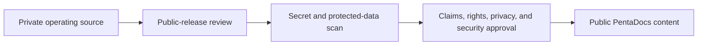

{/* pentadocs:audience-orientation:v2 */}
<Info>
  **Audience:** executive and governance readers (`executive`).

  **This page:** Public and Private Boundaries — What belongs in public PentaDocs, private operating repositories, controlled data rooms, and production secret stores.

  **Documentation state:** `unresolved` for page type `reference`. Documentation state is editorial posture only; it does not certify runtime, deployment, legal, rights, financial, provider, production, release, security, or operational status.

  **Unresolved reason:** no explicit page-level editorial acceptance state was declared in the migrated source.

  **Evidence needed:** an accepted governing source or accountable-owner attestation.

  **Review role:** PentaDocs governance.

  **Review trigger:** next material edit or source reconciliation.

  **Related guidance:** [Documentation source governance](/standards/documentation-source-of-truth-and-autonomous-governance) and [Institutional record standard](/standards/record-and-format-standard).
</Info>
{/* /pentadocs:audience-orientation:v2 */}

## Public and private boundaries

CrownThrive uses multiple documentation and storage layers because transparency does not require exposing protected machinery.

## Layer 1 — Public PentaDocs projection

PentaDocs is CrownThrive's institutional documentation and knowledge system. Mintlify is the current third-party rendering/search/hosting provider for this public projection.

Public documentation may include:

- ecosystem and platform descriptions
- public workflows and approval concepts
- public API guidance that does not expose secrets
- public product and release states
- public governance principles
- public support and help content
- approved public metrics with dates and evidence classes
- public changelogs and release notes
- public rights and licensing boundaries
- accessibility, privacy, and security commitments

Public documentation must not contain:

- Stripe secret keys or webhook signing secrets
- CrownThrive IO master credentials
- R2 or storage credentials
- database service keys
- private customer, creator, or employee records
- private financial records
- unreleased manuscripts, source masters, or protected project files
- protected identities, child records, or private family information
- proprietary unit economics or confidential partner terms
- security details that materially increase attack risk
- private CHLOM implementation logic

## Layer 2 — Private CrownThrive operating repository

The private operating repository is the machine-readable source for:

- platform and product registries
- agent definitions and permissions
- workflow definitions
- event schemas
- internal metrics definitions
- environment references
- approval rules
- runbooks with operational depth
- internal architecture decisions
- evaluation suites
- private change records

Secrets still do not belong directly in repository files. The repository stores references to approved secret-management locations.

## Layer 3 — Controlled data rooms

Qualified partners may receive controlled access to:

- confidential technical specifications
- build kits
- approved vendor information
- protected unit economics
- underwriting and financial models
- private partner terms
- detailed development plans
- selected rights packages
- diligence materials

Access should be qualified, time-bound where appropriate, logged, and governed by the relevant agreement.

## Layer 4 — Production secret and data stores

Production secret stores and protected databases hold:

- credentials and signing secrets
- encryption keys
- payment and entitlement records
- customer and account data
- private source assets
- confidential contracts
- security logs
- protected rights records
- private operational evidence

Agents and applications receive only the minimum scoped access required for the task.

## Publication pipeline

## Classification labels

Recommended classifications:

- `PUBLIC`
- `INTERNAL`
- `CONFIDENTIAL`
- `RESTRICTED`
- `SEALED`

Every generated document, agent output, workflow payload, and export should inherit or receive a classification before distribution.

## Agent rule

An agent may summarize a higher-classification source into a lower-classification document only when:

- the task explicitly permits it
- protected fields are removed
- claims remain supportable
- rights and privacy review pass
- the resulting document is approved for that audience

<Warning>
  Do not paste credentials, customer exports, private financial data, protected manuscripts, or confidential partner records into public PentaDocs pages or the Mintlify provider editor—even temporarily.
</Warning>
