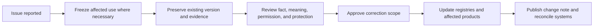

# Canon, corrections, and public claims

CrownThrive preserves the record without allowing old errors, incomplete context, or convenient marketing language to govern future products.

## Canon principles

### Identity before shorthand

Names, portraits, voices, roles, relationships, dates, and protected identities must map to a canonical record.

A nickname, aesthetic resemblance, repeated caption, or earlier publication is not sufficient identity proof.

### Sequence before interpretation

Chronology should distinguish:

- event
- discovery
- confrontation
- publication
- correction
- authorization
- distribution

Combining separate moments may create a compelling sentence while changing responsibility or meaning.

### Context before extraction

An excerpt, quote, image, statistic, or event must retain enough context to avoid creating a materially misleading public impression.

### Permission before expansion

A person or contributor may authorize one use without authorizing every future product, adaptation, platform, training use, or commercial derivative.

### Protection without erasure

Protected identities, children, descendants, private customers, and confidential partners may remain protected while the governing record acknowledges their place and impact.

## Canonical records

A canon or continuity record should identify:

- canonical entity ID
- names and governed variants
- universe and timeline
- role and relationships
- known facts
- disputed facts
- intentionally open questions
- protected facts
- approved portraits and voice records
- source citations or source IDs
- first publication
- corrections and version changes
- affected products

## Correction model

Corrections append; they do not silently overwrite.

A material correction should record:

- original claim or asset
- corrected claim or asset
- why the change was required
- evidence reviewed
- scope of correction
- products, pages, search results, media, licenses, and metadata affected
- whether prior copies remain valid, legacy, or recalled
- who approved the correction

## Evidence classes for public claims

Every numerical or factual claim should carry one of these classes:

### Verified publicly

Supported by an independently inspectable external source.

### First-party snapshot

Measured by CrownThrive or a controlled platform at a stated date and scope.

### Governed internal inventory

Counted from an internal registry with a defined inclusion rule.

### Development target

A planned output, capacity, or milestone that has not yet been completed.

### Projection or scenario

A modeled result based on stated assumptions, not a guaranteed outcome.

## Metrics registry

A metric record should contain:

- metric ID
- display name
- value
- unit
- evidence class
- source
- inclusion and exclusion rules
- as-of date
- owner
- public wording
- expiration or refresh schedule
- related platforms

Different pages should consume the same approved metric rather than hard-coding competing totals.

## Claim review triggers

Review or remove a claim when:

- source dates are missing
- two public pages disagree
- a development target is worded as completed
- a product card implies active checkout without a working transaction
- a partnership or client relationship lacks approval
- a metric is stale or its inclusion rule changed
- an identity or portrait is disputed
- a legal, licensing, security, or platform-policy change affects the wording

## Public wording rules

Prefer:

- “as of \[date\]”
- “currently cataloged”
- “governed internal inventory”
- “in development”
- “planned”
- “proposed”
- “starting at” with scope
- “available after verification”

Avoid:

- “active” without runtime evidence
- “licensed” without a governing license
- “verified” without defining the verification
- “official partner” without approval
- “sold” when the product is only listed
- “complete” when required release gates remain

## Rights and canon interaction

A factual correction does not automatically expand permission. A correct portrait still requires approved use. A corrected identity still requires licensing and privacy review. A public correction may preserve a private source.

<Warning>
  Accuracy is not achieved by replacing one simplified narrative with another. The record must preserve fact, meaning, permission, protection, and version history separately.
</Warning>