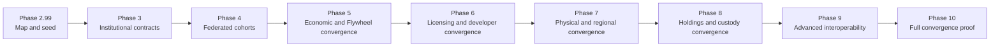

# Governance model

CrownThrive governance protects the ecosystem from four recurring failures:

1. valuable work entering commerce without defensible ownership or permission
2. cultural meaning being flattened, misrepresented, or detached from context
3. public claims exceeding the available evidence
4. automation moving faster than accountability

## Governance authorities

### Founder and governing owner

The founder sets mission, risk tolerance, irreversible business decisions, final strategic priorities, and approval thresholds.

### CHLOM

CHLOM governs ownership, permissions, contributor relationships, approved uses, restrictions, licensing, and related rights controls.

### Cultural Imprint Engine

The Cultural Imprint Engine governs cultural meaning, continuity, representation, context, community alignment, and the relationship between an asset and the wider CrownThrive legacy.

### Canon and source governance

Canon governance protects:

- identities and character continuity
- chronology and version history
- source attribution
- corrections and append-only change records
- protected facts and intentional unknowns
- edition relationships
- public versus private scope

### Privacy and security governance

Privacy and security governance protects:

- customer and account data
- payment and entitlement records
- protected identities and children
- confidential source assets
- credentials and infrastructure
- partner and contract records
- access controls and audit evidence

### Product and release governance

Product governance determines whether a work may become:

- a public page
- a direct digital product
- a hosted reader
- a print edition
- a subscription feature
- a commercial license
- a broadcast property
- a service or partnership offer

## Approval gates

### Source gate

Confirms that the canonical source, version, ownership context, and required components exist.

### Culture and canon gate

Confirms cultural alignment, continuity, identity, chronology, context, and protected boundaries.

### Rights and provenance gate

Confirms ownership, contributors, artwork, music, likenesses, AI assistance, commercial scope, and restrictions.

### Quality and accessibility gate

Confirms readability, file integrity, responsive behavior, accessibility, metadata, and product completeness.

### Privacy and security gate

Confirms data minimization, credential handling, protected identity treatment, storage, access control, and security implications.

### Commerce and fulfillment gate

Confirms price, rail, checkout, agreement, entitlement, delivery, refund, dispute, support, and operational reconciliation.

### Public-claims gate

Confirms that public copy, metrics, partnerships, availability, dates, status, and evidence classifications match reality.

## Phase 10 hard gate — full ecosystem convergence

`CT-P10-GATE-001 — FULL_ECOSYSTEM_CONVERGENCE` is a cumulative institutional hard gate owned by GitHub issue `#193`.

It begins during Phase 2.99 as a convergence registry and dependency-graph seed, then accumulates evidence through Phases 3–10. It does **not** require every provider to be operational before Phase 3 and does not waive any current Phase-2.99 gate.

Full convergence does not mean every CrownThrive property uses the same application, database or provider. It means every governed operating asset reaches the institutional spine through a proved native connection, a certified adapter, or an explicitly accepted isolation boundary.

Every asset must terminate in exactly one current convergence state by Phase-10 exit:

- `CONVERGED_NATIVE`
- `CONVERGED_ADAPTER`
- `GOVERNED_ISOLATED`
- `RETIRED_PRESERVED`
- `RESEARCH_NOT_OPERATIONAL`

`PARTIALLY_CONVERGED` is a milestone only. It cannot satisfy Phase-10 exit.

The gate is count-independent. Research does not enter the operating convergence denominator merely because a registry grows. A research asset enters only through deliberate promotion into the governed operating estate.

### Retroactive convergence ladder

Phase milestones are cumulative:

- **Phase 2.99:** stable convergence IDs, dependency graph, corridor/lifecycle/owner/custody crosswalk, dimension states, and Phase 3–10 milestone fields.
- **Phase 3:** accepted shared identity, authority, CHLOM rights/evidence, DAIL, schema/event, economic/entitlement, API/MCP and repository-federation contracts.
- **Phase 4:** every operating corridor has a validated connection to the shared spine and bounded cross-platform readback.
- **Phase 5:** applicable commercial corridors converge revenue, entitlement, support, rewards, Partner Circle/affiliate attribution, reversals, analytics and Flywheel routes.
- **Phase 6:** developer identities, SDK/API/MCP scopes, licensing, metering and remedies use the same institutional model and #131 disclosure boundaries.
- **Phase 7:** physical, phygital and regional systems converge on the applicable identity, rights, commerce, analytics, support, operator and continuity contracts.
- **Phase 8:** legal/entity/IP/domain/provider custody, portfolio lifecycle, capital allocation and risk authority converge on canonical Holdings records.
- **Phase 9:** advanced CHLOM or cryptographic mechanisms integrate behind accepted contracts and retain fallback/provider-exit paths.
- **Phase 10:** the then-current governed operating estate reaches 100% terminal disposition, with no unaccepted orphan active nodes, unresolved active identity collisions or unowned critical active dependencies; the active convergence graph is connected except accepted isolation boundaries; representative cross-corridor journeys and continuity/provider-exit drills pass; and exact-artifact independent/specialist/sovereign acceptance including Agent D is recorded.

### Required convergence dimensions

For every applicable active asset, the convergence registry must explicitly prove or disposition:

1. canonical identity and lifecycle
2. repository/runtime identity
3. CrownThrive ID and authority
4. CHLOM rights/governance
5. data/events/CrownLytics
6. API/MCP/webhook/federation
7. commerce/entitlements/value routing where applicable
8. support/knowledge/operations
9. security/privacy/resilience
10. domain/provider/vendor custody
11. backup/export/recovery
12. Thrive Flywheel relationship
13. observability/heartbeat
14. documentation/public truth

An active `UNKNOWN` cannot remain unresolved at Phase-10 exit. If an asset must remain separate, the institution must record a `GOVERNED_ISOLATED` disposition with owner, reason, risk, compensating controls, export/recovery path and reopening trigger.

<Warning>
  Phase 10 cannot exit and CrownThrive cannot claim full ecosystem convergence while `CT-P10-GATE-001` is not accepted against the exact current operating estate.
</Warning>

## Decision classes

### Reversible operating decisions

Examples:

- draft copy changes
- internal classifications
- non-production test configurations
- proposed metadata changes
- documentation improvements

These may be delegated within defined permissions.

### Controlled production decisions

Examples:

- production deployment
- public product activation
- live price changes
- campaign launch
- subscription entitlement change
- rights-listing activation

These require designated approvers and evidence.

### Irreversible or high-risk decisions

Examples:

- granting commercial rights
- signing contracts
- deleting source or customer records
- rotating production credentials
- changing super-admin permissions
- publishing protected identity information
- making material public claims
- issuing high-value refunds or transfers

These remain human-controlled.

## Separation of duties

Where practical, no single automated actor should both:

- create and approve a high-risk release
- set and activate a live price
- grant and fulfill a commercial license
- change a credential and certify the change
- issue and reconcile a high-value refund
- classify and publish protected material

## Governance evidence

Every approval should retain:

- decision ID
- subject and version
- requested action
- evidence reviewed
- approver
- decision
- conditions
- timestamp
- expiration or re-review date where relevant
- downstream systems affected

## Escalation triggers

Escalate when:

- rights are unclear or conflicting
- protected identities may be exposed
- an AI-generated output resembles protected work
- public metrics disagree
- a payment, entitlement, or license state conflicts
- an agent requests broader permissions
- a release requires irreversible migration
- a legal, safety, security, or reputational issue exceeds the operating threshold

<Info>
  Governance exists to make expansion durable. It is not a decorative review step applied after the product has already been announced.
</Info>