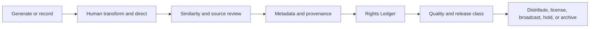

# Rights and AI provenance

CrownThrive treats AI-assisted work as governed intellectual property, not anonymous output.

The controlling question is not merely whether an AI tool was used. The record must show:

- what the human creator authored and controlled
- what the tool contributed
- which source assets were used
- what rights the tool account provided
- whether the output was transformed, edited, arranged, selected, or combined
- whether voice, likeness, lyrics, composition, samples, or protected material are implicated
- which commercial uses are defensible

## Rights Ledger fields

A music or AI-assisted creative asset should record, where applicable:

### Identity and ownership

- canonical asset ID
- title and version
- master owner
- composition owner
- writer or creator
- contributors and contribution shares
- work-for-hire, assignment, or license records
- universe, character, and project relationships

### AI and tool provenance

- generator or tool
- model and version
- generation date
- account and subscription tier at generation
- AI-origin indicator
- uploaded source material
- prompt or direction record where appropriate
- source audio or reference files
- output identifier or source file

### Human-authorship record

- human-authored lyrics
- human composition or melodic contribution
- arrangement decisions
- structure and sequencing
- editing and stem work
- production contribution
- selection and rejection record
- character, story-world, emotional, and visual direction
- final mastering and release decisions

### Voice and likeness

- voice provenance
- vocalist or voice owner
- synthetic vocal status
- consent status
- approved voice uses
- prohibited model-training or voice-cloning uses
- likeness and portrait permissions

### Clearance and release

- sample and interpolation status
- similarity-review status
- copyright-claim status
- PRO and publishing status
- ISRC or other identifiers
- distributor
- DSP AI-disclosure status
- master and stem archive
- commercial restrictions
- approved rights classes

## Virality Vault and Distribution Catalog

CrownThrive separates creation from external release.

### Virality Vault

The Vault is the complete governed creative inventory. Assets may remain vault-only because they are:

- developmental
- archival
- alternate versions
- internal scoring or production inventory
- awaiting rights review
- better suited to radio, books, screen, trailers, direct commerce, or licensing
- intentionally withheld from mass DSP distribution

### Virality Distribution Catalog

The Distribution Catalog contains assets deliberately selected for external release after the required provenance, rights, quality, metadata, and platform reviews.

Recommended states:

- `VAULT_ONLY`
- `DISTRIBUTION_CANDIDATE`
- `DISTRIBUTION_APPROVED`
- `DISTRIBUTED`
- `LICENSING_CANDIDATE`
- `RIGHTS_HOLD`
- `RETIRED`

## Release workflow

A tool’s internal screening is not treated as final legal clearance.

## Participatory Rights Framework

Flagship properties should eventually define:

- fan remix: permitted, prohibited, or licensed
- cover: permitted, prohibited, or licensed
- commercial remix
- noncommercial remix
- sampling
- stem access
- voice generation
- character use
- artwork use
- brand use
- synchronization
- public performance
- adaptation
- AI training
- AI voice modeling

Public participation must route through terms that preserve attribution, compensation, consent, canon, and protected boundaries.

## Rights classes

Example rights classes:

- personal noncommercial use
- household use
- educational use
- institutional use
- creator and podcast use
- synchronization
- broadcast
- performance
- commercial reproduction
- source or stem access
- remix or sampling
- merchandise
- character and visual use
- adaptation and development
- enterprise or negotiated

## Holds and corrections

Place an asset on hold when:

- ownership is disputed
- contributor information is incomplete
- AI or voice provenance is unclear
- a sample, interpolation, or similarity issue exists
- artwork or likeness permissions are incomplete
- the release class exceeds the known rights
- a correction affects identity, attribution, canon, or public products

Corrections should preserve the prior record, identify affected products and platforms, and append a claim-by-claim change log.

<Warning>
  A paid AI-tool subscription may provide commercial-use terms, but it does not by itself establish complete copyright protection, voice consent, sample clearance, source ownership, or chain of title.
</Warning>