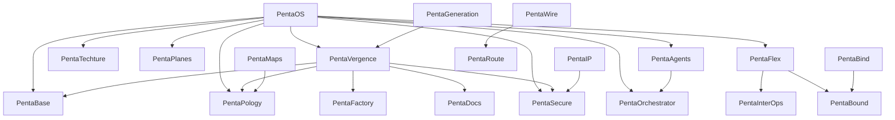

# PentaMap 001 — PentaOS Five-Axis System Projection

This is the source-controlled PentaMaps master projection. Mermaid is the deterministic source format; Canva, slide, infographic, dashboard and website renderers are downstream projections and must preserve the node/edge semantics.

## Five-axis legend

- **Truth:** PentaDocs, PentaTechture, PentaStars, PentaSets, PentaMaps.
- **Authority:** PentaSecure, PentaBound, PentaIP, PentaPlanes.
- **Execution:** PentaFactory, PentaAgents, PentaOrchestrator, PentaFlows, PentaSkills, PentaTools, PentaScripts, PentaMCL, PentaLLM, PentaRithms, PentaBoxes.
- **Interoperation:** PentaFlex, PentaInterOps, PentaWire, PentaBind, PentaRoute, PentaPology, PentaFederation/PentaFabric.
- **Continuity:** PentaVergence and PentaGeneration, with rollback/version lineage inherited by every component.

## Projection contract

A downstream Canva or infographic artifact must cite `ct.penta.maps.v1`, carry the registry version, identify the projection timestamp, and must not invent a node, state, edge, production claim, provider authority, or certification that is absent from PentaBase/PentaPology.