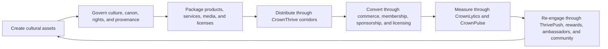

{/* pentadocs:audience-orientation:v2 */}
<Info>
  **Audience:** public and community readers (`public`).

  **This page:** How the Ecosystem Works — A practical explanation of the CrownThrive Thrive Flywheel and the movement of culture, intellectual property, audiences, data, and revenue.

  **Documentation state:** `unresolved` for page type `orientation`. Documentation state is editorial posture only; it does not certify runtime, deployment, legal, rights, financial, provider, production, release, security, or operational status.

  **Unresolved reason:** no explicit page-level editorial acceptance state was declared in the migrated source.

  **Evidence needed:** an accepted governing source or accountable-owner attestation.

  **Review role:** PentaDocs governance.

  **Review trigger:** next material edit or source reconciliation.

  **Related guidance:** [Documentation source governance](/standards/documentation-source-of-truth-and-autonomous-governance) and [Institutional record standard](/standards/record-and-format-standard).
</Info>
{/* /pentadocs:audience-orientation:v2 */}

## How the ecosystem works

CrownThrive is a **convergent ecosystem**: multiple specialized platforms operate as coordinated corridors rather than isolated brands.

The operating thesis is straightforward:

> CrownThrive creates culturally grounded assets, governs them, distributes them through the right channels, converts attention into sustainable value, measures the result, and reinvests the learning into the ecosystem.

## The Thrive Flywheel

## 1. Create

The ecosystem creates music, books, poems, sermons, visual assets, characters, directories, software, educational resources, media programming, community experiences, and commercial services.

Representative creation corridors include:

- **Virality Music** — music, books, poems, characters, radio, transmedia worlds, and licensing inventory
- **The Sermon Toolkit and KJV Visualized** — Scripture-centered visual, educational, devotional, ministry, and printable products
- **CrownThrive Studios** — approved audio, visual, screen, and campaign production
- **Little Crowns and related family corridors** — adult-managed children’s publishing and family experiences
- **The Word House** — poetry, spoken word, performance, reflection, and publishing

## 2. Govern

Creation does not enter commerce merely because a file exists.

The governance layer applies:

- Cultural Imprint Engine review
- CHLOM ownership and rights controls
- canon and continuity review
- source and version control
- AI provenance and human-authorship records
- privacy and protected-identity controls
- accessibility and child-safety review
- public-claim verification
- product and release gates

## 3. Package

Governed assets become clearly defined offers:

- finished personal-use digital products
- hosted-reader editions
- subscriptions and memberships
- services and commissioned work
- commercial licenses
- sponsorship inventory
- educational or institutional packages
- adaptation and development opportunities

Each offer receives a status, owner, price or inquiry state, rights class, delivery method, and approval history.

## 4. Distribute

Different corridors perform different functions:

- **Backroad FM** activates music, stories, shows, and audience discovery.
- **Good Shit Only** handles governed commercial-rights and marketplace opportunities.
- **Go Flipbooks** provides verified hosted-reader experiences where used.
- **Melanated media corridors** extend approved properties into video, television, and screen programming.
- **AdLuxe Network** supports suitable sponsorship, advertising, and campaign placements.
- **CrownThrive IO** supports links, digital presence, QR codes, analytics, projects, domains, and creator infrastructure.
- **FindCliques, Locticians, Crown Ambassadors, CrownFluence, and community corridors** support targeted reach and activation.

## 5. Convert

CrownThrive uses distinct commerce rails rather than forcing every offer through one checkout model.

<Columns cols={2}>
  <Card title="Stripe Direct" icon="bolt" href="/commerce/rails#stripe-direct">
    Finished first-party digital goods, subscriptions, and selected direct services.
  </Card>

  <Card title="Good Shit Only" icon="file-signature" href="/commerce/rails#good-shit-only">
    Commercial rights, licensing, marketplace, and permissioned use.
  </Card>

  <Card title="Go Flipbooks" icon="book-open" href="/commerce/rails#go-flipbooks">
    Verified hosted-reader editions and reading access.
  </Card>

  <Card title="Services and partnerships" icon="handshake" href="/commerce/rails#services-and-partnerships">
    Scoped work, sponsorship, commissioned production, and negotiated development.
  </Card>
</Columns>

## 6. Measure and learn

CrownLytics and CrownPulse convert activity into evidence:

- traffic and discovery
- content engagement
- product conversion
- revenue by corridor
- retention and repeat purchase
- audience signals
- support demand
- campaign response
- rights and release performance

A metric must identify whether it is publicly verified, first-party measured, governed internal inventory, a development target, or a projection.

## 7. Re-engage and reinvest

ThrivePush, CrownRewards, community systems, affiliates, ambassadors, and approved campaigns return audiences to relevant experiences.

The flywheel is complete only when revenue and learning return to creation, community impact, platform improvement, rights protection, and long-term cultural ownership.

## The operating rule

<Info>
  Create broadly. Govern rigorously. Commercialize deliberately. Measure honestly. Reinvest for legacy.
</Info>
