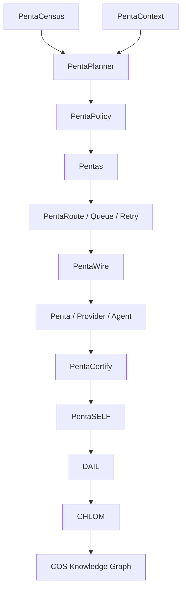
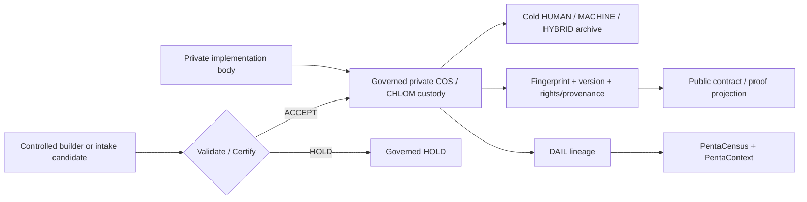

{/* pentadocs:audience-orientation:v2 */}

<Note>
  **Audience:** operators and administrators (`operator`).

  **This page:** Agentic Autonomy Operating Constitution — The control constitution for high-autonomy CrownThrive operations, separation of duties, self-healing workflows, approvals, watchdogs, agent factories and minimal-human-input execution.

  **Documentation state:** `unresolved` for page type `standard`. Documentation state is editorial posture only; it does not certify runtime, deployment, legal, rights, financial, provider, production, release, security, or operational status.

  **Unresolved reason:** no explicit page-level editorial acceptance state was declared in the migrated source.

  **Evidence needed:** an accepted governing source or accountable-owner attestation.

  **Review role:** PentaDocs governance.

  **Review trigger:** next material edit or source reconciliation.

  **Related guidance:** [Documentation source governance](/standards/documentation-source-of-truth-and-autonomous-governance) and [Institutional record standard](/standards/record-and-format-standard).
</Note>

{/* /pentadocs:audience-orientation:v2 */}

## Agentic Autonomy Operating Constitution

CrownThrive's target is extensive automation with minimal routine human intervention. The target is **not** unbounded machine authority. The institution should automate preparation, execution, verification, reconciliation, recovery and documentation while preserving human control over decisions that cannot safely be delegated.

## Operating thesis

```text
Founder objective or governed event
        ↓
Orchestrator creates a run packet
        ↓
Institutional records + source authority
        ↓
Rights / Rules / Roles / Risk evaluation
        ↓
Specialist agents operate in parallel
        ↓
Independent QA / security / claim review
        ↓
Approval only where required
        ↓
Execution through scoped tool or MCP
        ↓
Verification, rollback readiness and DAIL evidence
        ↓
Knowledge, registry, search and next-run baseline update
```

## Autonomy classes

- **A0 Observe** — read, inventory, monitor, compare, classify, test and report.
- **A1 Prepare** — draft, generate branches, previews, migrations, proposed records and execution plans.
- **A2 Reversible execute** — perform approved low-risk changes with automatic validation and rollback.
- **A3 Policy-controlled execute** — perform consequential actions only when machine-readable approvals and prerequisites are satisfied.
- **A4 Reserved decision** — founder, governance, counsel, finance, security or another named human authority must authorize; agents may prepare and verify.

## No self-approval

An agent or workflow that proposes a consequential action may not be the sole approver and sole verifier. Separate logical roles must exist for:

- planner;
- executor;
- reviewer;
- security/rights check;
- release verifier;
- incident/rollback controller.

These roles may be automated agents, but they require independent prompts/policies, scoped credentials and separate evidence.

## Agent factory

CrownThrive should maintain reusable agent templates rather than ad hoc personas. Each registered agent requires:

- stable agent ID and owner;
- mission and prohibited actions;
- intended audience;
- autonomy class;
- tools/MCPs and scope;
- data classes allowed;
- source authority required;
- model/provider/version;
- system/policy version;
- output contract;
- approval rules;
- evaluation suite;
- observability fields;
- failure/escalation behavior;
- rollback or compensation behavior;
- cost and rate limits;
- retirement/supersession state.

## Human operating model

Human work should concentrate on:

- founder vision and capital allocation;
- legal/economic commitments;
- exceptional rights conflicts;
- cultural stewardship;
- sensitive security incidents;
- irreversible actions;
- novel high-risk decisions;
- disputed source authority;
- succession and institutional ethics.

Routine validation, metadata, synchronization, reporting, sitemap generation, health checks, reconciliation, first-line support, content packaging and reversible deployments should be automated where controls are proven.

## Watchdogs

Persistent watchdog agents should monitor:

- failed jobs and dead-letter events;
- stale claims and platform state;
- API/schema/vendor drift;
- domain, SSL and DNS health;
- checkout, webhook and entitlement failures;
- secret age and credential anomalies;
- backup/restore status;
- broken links, robots and sitemap errors;
- unauthorized data exposure;
- rights/usage mismatches;
- suspicious affiliate/ad activity;
- model-quality and cost drift;
- policy and legal-review expiration.

## Self-healing boundaries

Self-healing automation may retry idempotent actions, switch to approved fallback providers, restore indexes, regenerate derived artifacts, quarantine bad records, roll back deployments and reopen known workflows. It may not silently alter ownership, legal terms, money destinations, licenses, evidence or public claims to make an error disappear.

## Emergency controls

Every consequential system needs:

- kill switch or pause state;
- credential revocation;
- queue isolation;
- feature flag;
- rollback target;
- read-only/degraded mode;
- human break-glass authority;
- after-action review;
- append-only incident evidence.

## Cost and resource governance

Automation must record provider/model/tool cost, runtime, tokens/requests, failures and output value. Cost controls may throttle, batch, cache, route to lower-cost models or defer non-urgent work, but may not weaken required legal, rights, safety or evidence review.

## Learning loop

Every run should produce reusable institutional improvement:

- new source/record;
- corrected state;
- test case;
- evaluation example;
- failure pattern;
- SOP/runbook update;
- agent-policy update;
- metric;
- next-run packet.

## Phase 3 gate

No high-autonomy production workflow should launch until the agent registry, authority matrix, DAIL envelope, evaluation baseline, independent verification and emergency controls are executable.

## COS V1 constitutional architecture

COS V1 is CrownThrive's governed convergence layer for operating the Penta estate as one evidence-addressable system. This section is a **public-safe architecture projection**. It does not expose proprietary implementation bodies, credentials, private provider details, restricted evidence payloads or private vault locations.



The constitutional semantics are intentionally distinct:

- **Pentas** is motion and governed work transport.
- **DAIL** is institutional history and evidentiary lineage.
- **CHLOM** is identity, rights, authority and verifiable provenance.
- **PentaCensus** answers what exists.
- **PentaContext** answers what matters now.
- **PentaWire** resolves governed capabilities.
- **PentaRoute** moves work.
- **PentaPlanner** determines what should happen within policy.
- **PentaSELF** detects drift and drives bounded repair.
- **PentaFactory** builds or repairs missing capability.
- **PentaCertify** proves whether the resulting state actually works.

### Phase 00 plus 15 execution phases

COS V1 uses **16 stages total**: the Phase 00 constitutional baseline followed by 15 execution phases.

| Phase | Program |
| --- | --- |
| 00 | Constitutional Baseline |
| 01 | Universal Census |
| 02 | Identity \+ Knowledge Graph |
| 03 | DAIL Trust V2 |
| 04 | Pentas COS Epoch |
| 05 | PentaWire / MCP / A2A Fabric |
| 06 | Routing \+ Temporal Fabric |
| 07 | Autonomous Operations |
| 08 | Software Factory |
| 09 | Repository \+ Deployment Fabric |
| 10 | Provider \+ Credential Fabric |
| 11 | Economic \+ Commerce Fabric |
| 12 | Experience \+ Growth Fabric |
| 13 | Continuity \+ Security |
| 14 | COS Command Center |
| 15 | Production Certification |

A later phase cannot hide an incomplete earlier phase. Each phase uses the same bounded execution contract:

```text
PRE-STATE
→ CENSUS + DEPENDENCY READ
→ R1 ROLLBACK POINT
→ BOUNDED IMPLEMENTATION
→ STATIC + UNIT TEST
→ CONTRACT TEST
→ INTEGRATION TEST
→ SECURITY TEST
→ FAILURE / RETRY TEST
→ CANARY
→ PROVIDER / PRODUCTION READBACK
→ INDEPENDENT CERTIFICATION
→ REGRESSION TEST
→ CLEANUP / RETIRE SUPERSEDED STATE
→ DAIL
→ PentaContext / Census
→ CHLOM where applicable
→ governed documentation projection
→ PHASE CERTIFICATE
```

### Model-agnostic inference

COS business logic requests capabilities rather than hardcoding a model or provider:

```text
capability://reason
capability://plan
capability://code
capability://review
capability://research
capability://classify
capability://extract
capability://verify
```

PentaInference resolves the currently certified provider/model under authority, privacy, quality, latency, cost and availability policy.

### Proprietary custody boundary



The public provenance binding for the private COS constitution is:

- CHLOM asset: `ct.package.cos-v1.production-constitution`
- public reference digest: `ctfp:v1:sha256:52b39491a6d3c47fb5d3fd5683cd6ef886ab0ed586c0c41bd6d65199b4559360`
- public implementation body: **not allowed**

Passwords, API keys, private keys, seed phrases, refresh tokens and equivalent credentials are never documentation assets.

### Live COS phase-control semantics

The architecture above is a program contract, not a declaration that COS V1 is already released. The current institutional release state must be resolved from the COS release registry, phase registry, the latest exact-source phase execution, direct source-control readback and applicable provider/deployment readback.

During Phase 00 convergence:

- `production_sha` and `released_at` remain null;
- no production release claim is made;
- scheduled execution may be intentionally quiesced under a governed maintenance event, and a paused clock is not equivalent to a healthy active production clock;
- if canonical `main` advances after a phase execution begins, the older execution is preserved as historical HOLD/superseded evidence and may not receive a stale PASS;
- a replacement execution must bind the new exact source revision and re-establish every source-sensitive gate;
- phase decisions, HOLDs, failures, rollback states and certification outcomes remain DAIL-bound rather than existing only as mutable status flags.

Phase 15 is the only COS V1 path that may bind `production_sha` and `released_at`. Its production release gate is human-reserved D3 and cannot be manufactured through the generic phase-receipt path. The final release requires current, unheld, exact-source founder authority for `cos.production_release` in addition to the independently satisfied technical gates.

### Production PASS invariant

COS V1 cannot receive production PASS while a known release-blocking Critical/High defect, unknown institutional entity, unexplained state divergence, unidentified active scheduler, duplicate authoritative clock, unsigned consequential packet, missing origin identity, unresolved provider-contract drift, mutation without rollback/DAIL lineage, provider write without independent readback, certified-versus-production revision mismatch, unrecoverable migration, credential leakage, unauthorized D3 path, material public-truth drift, failed restoration drill, broken entitlement/payment reconciliation, release regression or reactivatable superseded runtime remains.

```text
100% discovered
100% identified
100% classified
100% related
100% authority-bounded
100% capability-addressable
100% evidence-addressable
100% health-observable
100% repair-routable
100% lifecycle-managed
100% intentionally active / gated / retired
0% unknown institutional state
```

The private institutional record remains authoritative for restricted implementation detail. This public-safe section exists for interoperability, operating discipline and release accountability without disclosing CrownThrive trade secrets.
