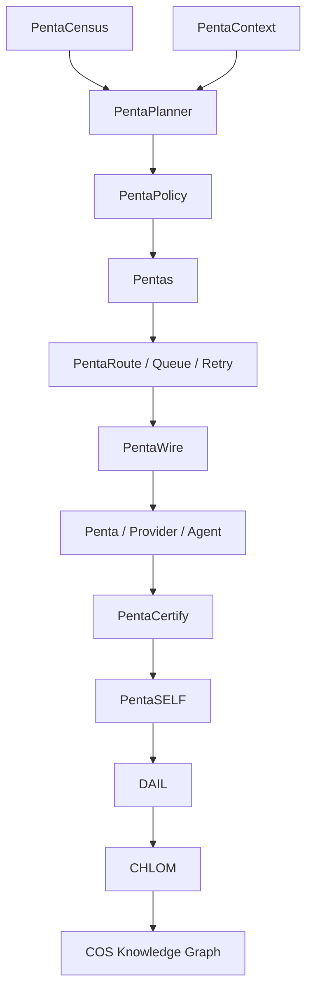
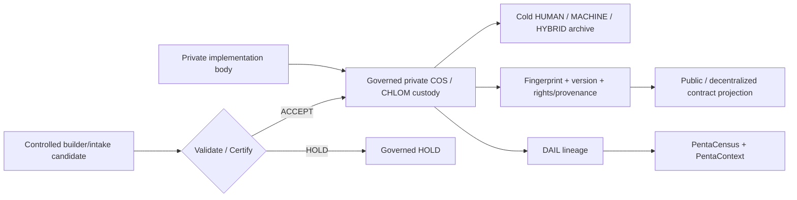

# COS V1 Production Contract

<Note>
  This page is a **public-safe contract projection**. Proprietary implementation bodies, credentials, private provider details, restricted evidence payloads, and private vault references are intentionally excluded.
</Note>

## The COS V1 kernel



- **Pentas** is motion and signed work transport.
- **DAIL** is institutional history and evidentiary lineage.
- **CHLOM** is identity, rights, authority, and verifiable provenance.
- **PentaCensus** answers what exists.
- **PentaContext** answers what matters now.
- **PentaWire** resolves governed capabilities.
- **PentaRoute** moves work.
- **PentaPlanner** decides what should happen within policy.
- **PentaSELF** detects drift and drives bounded repair.
- **PentaFactory** builds or repairs what is missing.
- **PentaCertify** proves whether the resulting state actually works.

## Operating-model benchmark absorption

COS V1 may absorb useful primitives from Palantir Foundry/AIP/Apollo, ServiceNow AI Platform/Action Fabric, Microsoft Agent 365, Salesforce Agentforce/MuleSoft, Linux Foundation A2A, Fetch.ai uAgents/Agentverse, and OriginTrail DKG.

These are reference architectures, not controlling dependencies. Their useful patterns are translated into CrownThrive-native capabilities and remain provider/model replaceable.

The COS differentiator is the convergence of operational ontology, autonomous Pentas, governed provider actions, DAIL institutional memory, CHLOM identity/rights/provenance, software production, economics/commerce, media/IP, and continuous autonomous repair.

## Canonical 15-phase production program

| Phase | Program |
| --- | --- |
| 00 | Constitutional Baseline |
| 01 | Universal Census |
| 02 | Identity \+ Knowledge Graph |
| 03 | DAIL Trust V2 |
| 04 | Pentas COS Epoch |
| 05 | PentaWire / MCP / A2A Fabric |
| 06 | Routing \+ Temporal Fabric |
| 07 | Autonomous Operations |
| 08 | Software Factory |
| 09 | Repository \+ Deployment Fabric |
| 10 | Provider \+ Credential Fabric |
| 11 | Economic \+ Commerce Fabric |
| 12 | Experience \+ Growth Fabric |
| 13 | Continuity \+ Security |
| 14 | COS Command Center |
| 15 | Production Certification |

## Immutable phase protocol

```text
PRE-STATE
→ CENSUS + DEPENDENCY READ
→ R1 ROLLBACK POINT
→ BOUNDED IMPLEMENTATION
→ STATIC + UNIT TEST
→ CONTRACT TEST
→ INTEGRATION TEST
→ SECURITY TEST
→ FAILURE / RETRY TEST
→ CANARY
→ PROVIDER / PRODUCTION READBACK
→ INDEPENDENT CERTIFICATION
→ REGRESSION TEST
→ CLEANUP / RETIRE SUPERSEDED STATE
→ DAIL
→ PentaContext / Census
→ CHLOM where applicable
→ governed documentation projection
→ PHASE CERTIFICATE
→ STOP AT NEXT PHASE BOUNDARY
```

A phase is not complete merely because code exists.

## Model-agnostic PentaInference

COS business logic requests capabilities rather than hardcoding model names:

```text
capability://reason
capability://plan
capability://code
capability://review
capability://research
capability://classify
capability://extract
capability://verify
```

PentaInference resolves the currently certified provider/model according to authority, privacy, quality, latency, cost, and availability policy.

## Proprietary asset boundary



All proprietary CrownThrive algorithms, protocols, metaprotocols, system designs, diagrams, code patterns, prompts, skills, datasets, economic models, identity/governance designs, proprietary media processes, and future novel assets are subject to classification, fingerprinting, custody, lifecycle, evidence, and recovery controls.

<Warning>
  Passwords, API keys, private keys, seed phrases, refresh tokens, and equivalent credentials are never documentation assets and must never be placed into public PentaDocs or public repositories.
</Warning>

## Production PASS gate

COS V1 cannot receive production PASS while a known release-blocking Critical/High defect, unknown institutional entity, unexplained state divergence, unidentified active scheduler, duplicate authoritative clock, unsigned consequential packet, missing origin identity, unresolved provider-contract drift, mutation without rollback/DAIL lineage, provider write without independent readback, certified-versus-production revision mismatch, unrecoverable migration, credential leakage, unauthorized D3 path, material public-truth drift, failed restoration drill, broken entitlement/payment reconciliation, release regression, or reactivatable superseded runtime remains.

## Completion invariant

```text
100% discovered
100% identified
100% classified
100% related
100% authority-bounded
100% capability-addressable
100% evidence-addressable
100% health-observable
100% repair-routable
100% lifecycle-managed
100% intentionally active / gated / retired
0% unknown institutional state
```

The private institutional record remains authoritative for restricted implementation detail. This page exists for interoperability, operating discipline, and release accountability without disclosing CrownThrive trade secrets.
