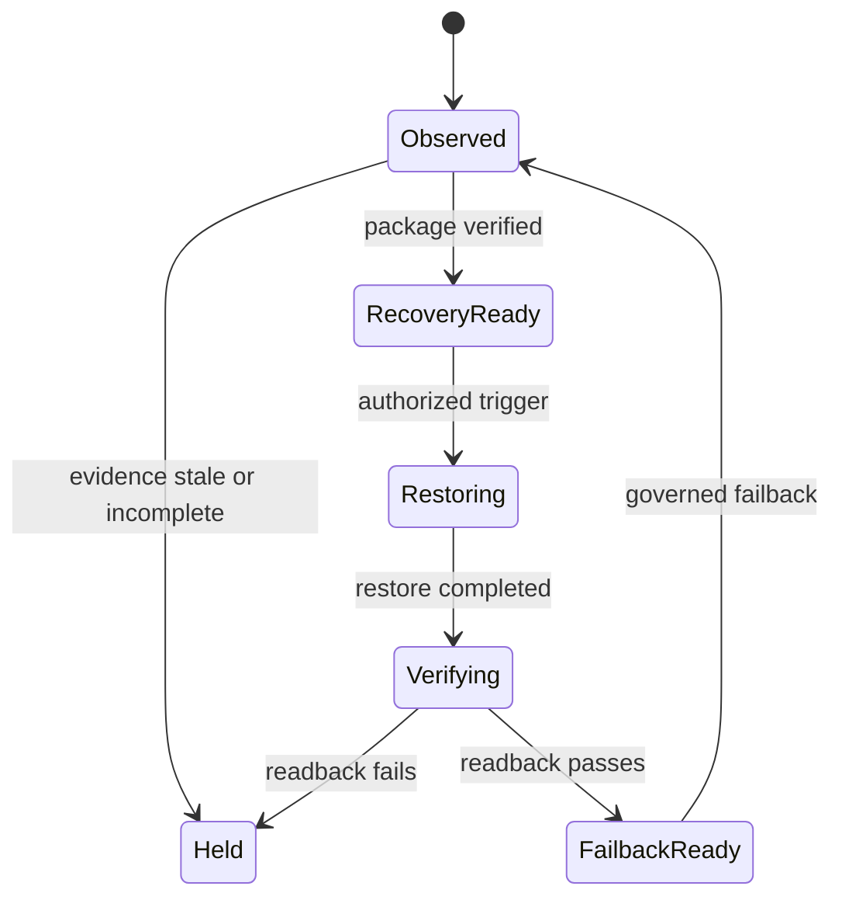

{/* pentadocs:audience-orientation:v2 */}
<Note>
  **Audience:** builders and integrators (`developer`).

  **This page:** Repository Resilience and Failover — Public-safe hot, cold-recovery, and silent-emergency resilience model for CrownThrive repositories, control contracts, evidence, and recovery.

  **Documentation state:** `unresolved` for page type `reference`. Documentation state is editorial posture only; it does not certify runtime, deployment, legal, rights, financial, provider, production, release, security, or operational status.

  **Unresolved reason:** no explicit page-level editorial acceptance state was declared in the migrated source.

  **Evidence needed:** an accepted governing source or accountable-owner attestation.

  **Review role:** PentaDocs governance.

  **Review trigger:** next material edit or source reconciliation.

  **Related guidance:** [Documentation source governance](/standards/documentation-source-of-truth-and-autonomous-governance) and [Institutional record standard](/standards/record-and-format-standard).
</Note>
{/* /pentadocs:audience-orientation:v2 */}

## Repository Resilience and Failover

CrownThrive repository resilience protects institutional source, version history, governance contracts, build capability, evidence, and recovery knowledge from a provider, account, workflow, node, or operator failure.

This model separates **readiness**, **recovery configuration**, **tested restoration**, and **certified live failover**. Those states are not interchangeable.

## Three resilience tiers

| Tier | Purpose | Public-safe boundary | Current state |
| --- | --- | --- | --- |
| `HOT_PRIMARY` | Normal governed source, build, review, and evidence path. | Public role and health may be projected; credentials and restricted observations may not. | Canonical source is available; live cross-repository Actions binding remains `HOLD` pending provider readback. |
| `COLD_RECOVERY` | Independent portable repository, registry, release, and continuity package capable of restoring the required contract and history. | Public docs may describe the recovery class and evidence state, not protected storage coordinates or recovery credentials. | Independently keyed, digest-sealed read-only snapshot selection is implemented and controlled-tested; infrastructure restoration/cutover certification remains `HOLD`. |
| `SILENT_EMERGENCY` | Restricted last-resort recovery route used only under its exact containment and authority contract. | Its address, topology, activation material, and detailed trigger are never published in PentaDocs. | No public live-activation claim; exact state remains restricted and infrastructure certification is `HOLD`/unknown without readback. |

<Warning>
  PentaOD `HOT`, `WARM`, or `SLEEP` readiness describes whether a component can respond inside authority already earned. It does not prove disaster-recovery replication, cold restoration, emergency cutover, or failback.
</Warning>

## Required recovery package

A repository recovery package should preserve:

- stable repository and component identities;
- accepted Git history, tags, releases, and attributable review lineage;
- required schemas, contracts, policies, and `AGENTS.md` controls;
- public-safe documentation, navigation, redirects, and version registry;
- checksums and artifact provenance;
- node roles, dependency/export inventory, and compatibility requirements;
- non-secret credential-recovery ownership and provider procedure;
- restore order, verification checks, RPO/RTO classification, and failback steps;
- unresolved holds, incidents, corrections, and supersession lineage.

Restricted source, secrets, provider recovery material, and private evidence remain in their approved custody systems rather than the public package.

## Failover state machine

`RecoveryReady` requires a reproducible package and a successful restore test. It is not infrastructure failover certification. Certification requires the exact authorized tier to restore, cut over, serve its required bounded function, preserve evidence, and fail back without authority expansion or data loss beyond the approved recovery objective.

## Brain and body integration

- PentaNerves receives sanitized node, workflow, storage, dependency, and recovery observations.
- PentaBrain distinguishes normal drift, degraded redundancy, broken continuity, and evidence-stale state.
- PentaSpine records ordered recovery events in an fsync JSONL hash chain and rejects corrupted replay; external storage replication remains separately governed.
- PentaBalancer may recommend capacity restoration or load shedding but cannot change infrastructure without authority.
- PentaBody projects sanitized tier state, evidence age, active HOLDs, and last verified recovery result to an authorized Command Center surface.

The current branch generates and controlled-tests deterministic resilience behavior. The live Command Center binding remains `HOLD` until deployment and independent readback.

## Fail-closed rules

- A missing or expired observation is `UNKNOWN`/`HOLD`, not healthy.
- A public URL fallback is not source, database, queue, provider, or infrastructure failover.
- A Git tag or archive is not a verified restore until it is restored and checked.
- Emergency routing cannot bypass identity, authorization, licensing, rights, security, or evidence requirements.
- Failover may reduce authority to preserve safety; it may not silently expand authority.
- A failed recovery attempt and its evidence remain visible.
- Return to the primary route requires readback and a governed failback receipt.

## Current certification boundary

Live cross-repository Actions credential binding, live Command Center deployment, and infrastructure-level failover remain `HOLD` or unknown until exact provider readback proves them. Public documentation must continue to state that boundary even when deterministic tests pass.

## Related controls

- [Repository Family and Federation](/technology/repository-family-and-federation)
- [Dependency, Backup and Recovery Architecture](/technology/dependency-backup-and-recovery)
- [Ecosystem Status and Resilience Control](/technology/ecosystem-status-resilience)
- [Repository Convergence, Failover, and Recovery Runbook](/runbooks/repository-convergence-failover-and-recovery)
- [Security, Privacy and Continuity](/technology/security-privacy-continuity)
