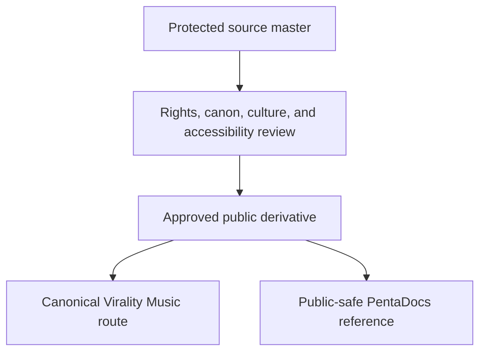

{/* pentadocs:audience-orientation:v2 */}
<Info>
  **Audience:** public and community readers (`public`).

  **This page:** Virality Music Assets &amp; Intellectual Property — Public-safe map of Virality Music images, covers, portraits, audio, books, products, marks, routes, metadata, code, and protected-source relationships.

  **Documentation state:** `unresolved` for page type `reference`. Documentation state is editorial posture only; it does not certify runtime, deployment, legal, rights, financial, provider, production, release, security, or operational status.

  **Unresolved reason:** no explicit page-level editorial acceptance state was declared in the migrated source.

  **Evidence needed:** an accepted governing source or accountable-owner attestation.

  **Review role:** PentaDocs governance.

  **Review trigger:** next material edit or source reconciliation.

  **Related guidance:** [Documentation source governance](/standards/documentation-source-of-truth-and-autonomous-governance) and [Institutional record standard](/standards/record-and-format-standard).
</Info>
{/* /pentadocs:audience-orientation:v2 */}

## Assets and intellectual property

The Virality Music website is itself an interconnected asset surface. It contains and points to images, marks, cover art, portraits, no-likeness records, illustrations, audio, release metadata, radio art, books, poems, dossier editions, product previews, video, interface design, route content, structured data, code, and related CrownThrive properties.

This page maps those classes so the CrownThrive system can reason about them without placing protected masters or restricted evidence in public documentation.

## Projection record

| Field | Value |
| --- | --- |
| Projection ID | `ct.docs.vm.portal.assets-ip.v1` |
| Parent platform | `ct.platform.virality-music` |
| Classification | `PUBLIC` public-safe asset map; source masters and rights evidence remain restricted |
| Source | live first-party route/asset presentation, current proof counts, public licensing notices, and institutional IP records |
| Observed as of | August 26, 2026 |
| Evidence label | public presentation and inventory mapping; not a complete chain-of-title opinion or registration audit |
| Publication rule | link to approved public routes or separately approved derivatives; do not mirror protected binaries into PentaDocs |

<Warning>
  Public display is not a license. A reachable image, audio file, PDF, preview, route, API response, metadata record, or source reference does not grant reproduction, commercial use, adaptation, redistribution, training, voice/likeness use, or access to the underlying master.
</Warning>

## Asset-class map

| Asset class | Public examples | Required institutional relationships | Public boundary |
| --- | --- | --- | --- |
| brands and marks | Virality Music, Backroad FM, universe and program names, logos, title treatments | owner/control, mark state, usage rules, version, territory | `™` is a source-identity claim, not proof of registration |
| website imagery | hero art, world art, room art, banners, textures, icons | asset ID, creator/source, rights profile, route, alt text, version | approved display does not authorize extraction or reuse |
| book assets | covers, illustrations, layouts, previews, PDFs, EPUBs, source documents | work ID, edition ID, creator/contributor, checksum, rights, canon, accessibility, custody | public catalog copy is separate from protected master files |
| character assets | dossiers, portraits, no-likeness records, relationship maps, timeline art | character ID, universe, canon version, likeness state, rights profile | no-likeness must propagate; do not invent missing faces |
| music assets | compositions, lyrics, masters, alternates, stems, artwork, metadata | work/recording IDs, contributors, provider terms, human/AI provenance, samples, voice/likeness, release state | a stream or release page is not a reuse license |
| radio assets | station identity, six signals, schedule/program records, player art, requests | station/program/episode IDs, source master, broadcast rights, sponsor inventory, provider evidence | public playback is not rebroadcast or venue permission |
| poetry/spoken word | poem text, collections, performances, audio, illustrations | work/edition/performance IDs, authorship, performer, rights, accessibility | reading access does not grant anthology, stage, audio, or training rights |
| video/screen | trailers, programs, interviews, visual albums, screen art | media ID, participants, releases, music rights, captions, provider route | viewing does not grant clip, rebroadcast, or derivative rights |
| product assets | previews, mockups, printable packages, templates, bundles | product/version, source asset, license class, price state, delivery/entitlement state | `SAFE_HOLD` means no paid redemption claim |
| route and content assets | pages, descriptions, SEO metadata, structured data, sitemaps | stable route ID, canonical relationship, owner, update state, evidence label | indexing does not grant corpus extraction or republication |
| software/design | components, interface patterns, schemas, integrations, code, design system | repository/package/version, dependency licenses, security, deployment evidence | public behavior does not expose or license private implementation |
| evidence and proof | dated counts, screenshots, hashes, release receipts, public proof pages | claim ID, definition, source, date, evidence class, owner, expiry | public summary may reference protected evidence without reproducing it |

## Current image-related inventory context

The August 26 XML sitemap observation contains **2,010 image occurrences** representing **529 unique image URLs** after deduplication. The 66-record top-level universe directory uses **42 unique public world-art URL references**. The public proof snapshot separately reports **176 portrait records** and **3 official no-likeness records** within **179 searchable character dossiers**. The publishing/evidence estate reports **87 Evidence Room editions**, **1,044 designed edition pages**, and **174 PDFs**.

These are different populations. A sitemap image may recur across routes; a unique image URL is not automatically one unique creative work; a portrait record is not necessarily one sitemap URL; and a PDF can contain many designed pages and embedded images. None of these counts proves that every image or file is downloadable, rights-cleared for every use, accessible, current, or part of an active product.

| Image census dimension | Count | Boundary |
| --- | ---: | --- |
| XML image occurrences | 2,010 | all image references observed across overlapping XML sitemap categories before URL deduplication |
| Unique sitemap image URLs | 529 | deduplicated public URLs; not unique-work, source-master, or rights counts |
| Unique top-level universe art URLs | 42 | public URL references used by the 66-record universe projection; bytes are not mirrored here |
| Portrait records | 176 | governed public portrait-state inventory |
| Official no-likeness records | 3 | intentional absence of an approved portrait |

## Minimum asset record

```yaml
asset_id: stable asset identity
asset_class: image | cover | portrait | audio | video | document | product | code | metadata
canonical_title: approved public title
aliases: []
work_id: parent creative work or null
edition_or_version_id: exact version
universe_id: governed world or null
creator_and_contributors: governed references
source_master_ref: restricted custody reference, never raw secret URL
public_derivative_ref: approved route or null
checksum: exact artifact digest where governed
rights_profile_id: exact rights record
rights_public_state: summary only
human_ai_provenance: material public disclosure state
voice_likeness_state: approved | no_likeness | restricted | not_applicable
audience: general | family | adult | 21_plus
alt_text: approved meaningful alternative or empty when decorative
commerce_state: free | safe_hold | inquiry_only | not_applicable
public_use_state: display_only | approved_download | restricted | unknown
last_verified_at: ISO-8601 timestamp
evidence_refs: governed references
```

## Image publication and accessibility gate

Before an image appears in the public portal or a product:

1. resolve the exact asset and version;
2. resolve creator, source, embedded material, license, and likeness state;
3. confirm the intended public route, audience, and cultural context;
4. confirm that the derivative—not the protected master—is approved for publication;
5. write meaningful alt text or mark truly decorative imagery with empty alt text;
6. avoid color-only meaning and verify contrast, text legibility, zoom, and responsive crop;
7. preserve credit/notice requirements;
8. bind the asset to its work, edition, character, world, product, and evidence records;
9. reopen the gate when the image, crop, text, context, model/provider, or use changes.

## Public and protected custody



PentaDocs records what an asset is, how it relates to the ecosystem, where its approved public projection lives, and what boundaries apply. It does not become a source-master repository, a public data room, or a license generator.

## Browse approved public projections

<Columns cols={2}>
  <Card title="World artwork" icon="images" href="https://vm.crownthrive.com/worlds">
    Browse approved world presentation and exact public routes.
  </Card>

  <Card title="Character portraits" icon="users" href="https://vm.crownthrive.com/characters">
    Open the public portrait and dossier directory.
  </Card>

  <Card title="Books and covers" icon="books" href="https://vm.crownthrive.com/books">
    Browse public work and edition presentation without exposing source masters.
  </Card>

  <Card title="Release artwork and music" icon="compact-disc" href="https://vm.crownthrive.com/official-releases">
    Enter the public official-release directory.
  </Card>

  <Card title="Public proof" icon="badge-check" href="https://vm.crownthrive.com/proof">
    Inspect dated first-party proof language and counts.
  </Card>

  <Card title="Request permission" icon="file-signature" href="https://vm.crownthrive.com/chlom-licensing">
    Start an exact-use inquiry; the form itself is not a grant.
  </Card>
</Columns>

## Institutional crosslinks

- [IP Protection, Chain of Title and Trade-Secret Standard](/standards/ip-protection-chain-of-title-and-trade-secret)
- [Virality Music Licensing and Rights Register](/platforms/virality-licensing-and-rights-register)
- [Public and Private Boundaries](/ecosystem/public-private-boundary)
- [AI-Assisted Content, Human Authorship and Disclosure](/standards/ai-assisted-generated-content-human-authorship-and-disclosure)
- [Licensing and IP Overview](/support/licensing-and-ip-overview)
- [Search, SEO, Metadata and Robots](/standards/search-seo-metadata-robots)

[Return to the Virality Music portal](/virality-music/index)
