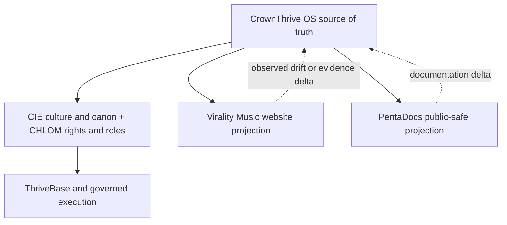

{/* pentadocs:audience-orientation:v2 */}
<Info>
  **Audience:** public and community readers (`public`).

  **This page:** Virality Music System Mesh — How the Virality Music website, PentaDocs, CrownThrive OS, CIE, CHLOM, ThriveBase, Penta systems, commerce, media, analytics, and distribution connect without collapsing authority.

  **Documentation state:** `unresolved` for page type `reference`. Documentation state is editorial posture only; it does not certify runtime, deployment, legal, rights, financial, provider, production, release, security, or operational status.

  **Unresolved reason:** no explicit page-level editorial acceptance state was declared in the migrated source.

  **Evidence needed:** an accepted governing source or accountable-owner attestation.

  **Review role:** PentaDocs governance.

  **Review trigger:** next material edit or source reconciliation.

  **Related guidance:** [Documentation source governance](/standards/documentation-source-of-truth-and-autonomous-governance) and [Institutional record standard](/standards/record-and-format-standard).
</Info>
{/* /pentadocs:audience-orientation:v2 */}

## Virality Music system mesh

Virality Music is a CrownThrive platform and IP institution, not an isolated website. Its public routes are connected to publishing, media, licensing, commerce, analytics, support, and continuity systems while CrownThrive OS preserves the authoritative identity, state, version, evidence, and correction record.

The public mesh is backed by dated machine records for the 2,389-route XML estate, 1,825-link rendered directory, 529 unique sitemap image URLs, 66 top-level universes, 355 product records, 16 supplied source-master metadata observations, and explicit system bindings. These registries make the estate discoverable without copying protected master bytes or turning observation into rights or commerce authority.

## Projection record

| Field | Value |
| --- | --- |
| Projection ID | `ct.docs.vm.portal.system-mesh.v1` |
| Platform ID | `ct.platform.virality-music` |
| Classification | `PUBLIC`; private topology, credentials, provider controls, and operational evidence excluded |
| Source | live Virality property relationships plus current CrownThrive OS, CHLOM, CIE, portfolio, commerce, and technology records |
| Observed as of | August 26, 2026 |
| Evidence label | public architecture projection; each runtime, provider write, API, MCP, and automation capability retains its own certification state |
| Authority boundary | a diagram or page does not activate an integration or create provider, economic, rights, or D3 authority |

## Authority and projection flow



The website and PentaDocs can reveal new public evidence or drift. They do not overwrite the OS by being newer, more visible, or easier to access.

## Core mesh roles

| System | Virality Music relationship | Boundary |
| --- | --- | --- |
| CrownThrive OS | stable platform/work/edition/asset identity, current state, version, evidence, corrections, and source precedence | public projections do not replace OS records |
| Cultural Imprint Engine (CIE) | cultural meaning, representation, canon, universe, audience, aesthetics, and responsible reuse | cultural authority does not manufacture ownership or legal rights |
| CHLOM | rights, rules, roles, revenue relationships, records, remedies, and exact license authority | public intake and technical capability do not manufacture a grant |
| ThriveBase | durable operational records, queues, relationships, evidence, scheduling, and reconciliation | public docs do not expose private rows, credentials, or mutation authority |
| PentaBooks | manuscript, edition, illustration, packaging, QA, canon, archive, and publishing workflow | a produced file does not self-release or self-license |
| PentaMedia | radio, screen, live, on-demand, syndication, schedule, playback, and monetization operations | provider capability and public playback remain separately verified |
| PentaGreen | commerce and economic activation gate | may optimize within authority; may never manufacture authority; current product state is `SAFE_HOLD` |
| CrownThrive Studios | approved audio, visual, screen, and campaign production | project scope and rights remain exact-work specific |
| Go Flipbooks | hosted reader/delivery provider where used | provider upload is not upstream publishing rights or commerce proof |
| CrownLytics and CrownPulse | measurement, analytics, signal, evidence, and public-claim inputs | metrics keep definitions, dates, sources, and privacy boundaries |
| ThrivePush | approved audience messaging and lifecycle communication | consent, purpose, frequency, and deliverability controls remain explicit |
| AdLuxe Network | labeled sponsorship and advertising inventory | advertising remains separate from editorial, canon, and rights authority |
| CrownRewards, Crown Affiliates, Crown Ambassadors, and CrownFluence | governed retention, referral, participation, and distribution | no entitlement, commission, endorsement, or data sharing is implied by adjacency |
| CrownThriveU and Impact Institute | education, creator capability, and public learning derivatives | source works, curriculum, classroom, and commercial rights remain separate |

## Related public property directory

These are the exact public relationships directly linked from the observed Virality Music estate. A link records discoverability—not ownership, account control, provider certification, commerce activation, or rights clearance.

| Public property or destination | Observed relationship | Boundary |
| --- | --- | --- |
| [CrownThrive](https://crownthrive.com) | parent ecosystem property | this registry does not adjudicate legal or contractual control |
| [KJV Sermon Toolkit](https://kjvsermontoolkit.crownthrive.com) | Gospel and faith workflow | source-work, ministry, education, and commercial rights remain separate |
| [Sermon Toolkit](https://sermontoolkit.crownthrive.com) | Gospel and faith workflow | a workflow link is not a content or reuse grant |
| [Melanated TV](https://melanatedtv.com) | screen/media distribution relationship | public viewing does not grant clip, rebroadcast, or adaptation rights |
| [Go Flipbooks reader property](https://go-flip.locticians.com) | hosted reader relationship | a reader route is not source-master custody, sale, or publication authority |
| [FlipLink reader property](https://go.fliplink.me) | reader-provider destination | third-party control and current availability remain separately verified |
| [Melanin Magic retail store](https://shopmelaninmagic.com/melanin-magic-retail-store) | beauty, ritual, and retail extension | adjacency does not merge product, brand, fulfillment, or customer authority |
| [Garden of Eden physical release](https://elasticstage.com/virality-music/releases/garden-of-eden-singleep) | ElasticStage physical-release provider link | provider inventory, territory, price, manufacturing, and fulfillment remain provider-state questions |
| [Official release destinations](https://vm.crownthrive.com/official-releases) | observed SoundCloud, Apple Music, Spotify, Deezer, iHeart, and YouTube links | destination presence does not prove account control, monetization, availability in every territory, or API authority |

The full route and XML indexes retain the exact source relationships seen on August 26, 2026 so later crawls can detect additions, removals, redirects, or provider drift.

## Asset-to-audience flow

```text
source idea or recovered asset
→ stable identity and custody
→ CIE canon/cultural/audience review
→ CHLOM rights/roles/rules review
→ PentaBooks or PentaMedia production
→ technical, security, accessibility, and provider tests
→ PentaGreen economic eligibility where applicable
→ exact route publication
→ audience discovery, reading, listening, or inquiry
→ CrownLytics/CrownPulse evidence
→ correction, reinvestment, new work, or archive
```

## Intervention directory

The public mesh exposes safe ways to ask for action without exposing privileged controls.

| Need | Public route | What happens next |
| --- | --- | --- |
| explore a world, book, track, character, or product record | [Virality Music](https://vm.crownthrive.com/) | public discovery only |
| report a broken page, wrong label, or support issue | [Contact](https://vm.crownthrive.com/contact) | intake and triage; no automatic mutation is promised |
| report an accessibility barrier | [Accessibility](https://vm.crownthrive.com/accessibility) | accessibility/support review and correction routing |
| request licensing or permissions | [CHLOM License Registry](https://vm.crownthrive.com/chlom-licensing) | rights-aware intake; no grant until approved terms exist |
| request services or a commission | [Services](https://vm.crownthrive.com/services) | scoped discovery and SOW/right-schedule routing |
| sponsor programming | [Advertisers](https://vm.crownthrive.com/advertisers) | inventory, suitability, creative, claims, and agreement review |
| explore screen/game/adaptation | [Film, TV & Gaming](https://vm.crownthrive.com/film-tv-gaming) | negotiated review only |
| verify public claims | [Proof Center](https://vm.crownthrive.com/proof) | dated public evidence; underlying claims retain their definitions |
| report a security/privacy issue | [CrownThrive security policy](https://github.com/crownthrive1/CrownThrive-OS/blob/main/SECURITY.md) | private disclosure process; never post secrets publicly |

## API, MCP, agent, and automation boundary

Virality Music's institutional records identify public-safe discovery and private operational domains for catalogs, worlds, characters, books, releases, radio, products, rights, inquiries, assets, proof, corrections, and events. This page does **not** claim that a named endpoint, MCP tool, webhook, adapter, or provider mutation is publicly deployed or write-certified.

Every consequential operation still needs:

- stable tool/service identity and version;
- authenticated actor, role, tenant, purpose, and environment;
- exact scope and data classification;
- authority and approval class;
- idempotency and concurrency controls where applicable;
- rate, cost, privacy, audience, and rights controls;
- readback, evidence, error, retry, rollback, and compensation behavior;
- independent certification for the exact provider write.

## Reconciliation rules

- A new live route opens a documentation and registry delta; it does not self-institutionalize.
- A docs page can explain a product hold; it cannot lift the hold.
- A successful provider response proves only the scoped event it records.
- Counts must keep their date, definition, source, population, and evidence class.
- Website, PentaDocs, API, MCP, provider, commerce, rights, and release states remain separate dimensions.
- Corrections append and link forward; historical evidence is preserved rather than silently rewritten.

## Institutional crosslinks

- [CrownThrive Ecosystem Map](/ecosystem/map)
- [How the Ecosystem Works](/quickstart)
- [Virality Music Institutional Registry](/platforms/virality-music-institutional-registry)
- [PentaMedia](/portfolio/pentamedia)
- [PentaGreen](/commerce/pentagreen)
- [MCP Topology and Tool Boundaries](/technology/mcp-topology-and-tool-boundaries)
- [Institutional Registry Architecture](/technology/institutional-registry-architecture)

[Return to the Virality Music portal](/virality-music/index)
