# Credit-Only Product Release Factory

This workflow specializes the canonical Product Release Workflow for **CrownThrive Launch**, **CrownThrive Ready** and **CrownThrive Procure**. It reuses the same evidence, rights, entitlement, rollback and publication principles used by CrownThrive's mature digital-product surfaces while keeping these three Sites on Crown Credits-only product checkout.

## Pipeline

```mermaid
flowchart LR
    A[Exact packaged asset] --> B[Rights package]
    B --> C[Pricing and tax package]
    C --> D[Private fulfillment package]
    D --> E[Credit checkout and event package]
    E --> F[Entitlement and license package]
    F --> G[Refund dispute rollback package]
    G --> H[Accessibility and device package]
    H --> I[DNS TLS route package]
    I --> J[Independent governed acceptance]
    J --> K{PASS?}
    K -- No --> L[HOLD / quarantine]
    K -- Yes --> M[Public-safe Sites feed]
    M --> N[Provider readback]
    N --> O{Exact parity?}
    O -- No --> P[Rollback / quarantine]
    O -- Yes --> Q[Published + monitored]
```



## Input contract

A factory run starts from an immutable asset-version record containing at minimum:

- SKU;
- exact semantic version;
- artifact SHA-256;
- package manifest;
- target platform and Sites surface;
- rollback version or deactivation path;
- initial rights state;
- source and provenance references.

The first cohort is the 30 `1.0.0-candidate.4` packages already produced for Launch, Ready and Procure.

## Gate compiler

The release factory creates one package row for each product and one independently reviewable gate row for each required dimension. Gate evidence is additive and exact-version bound.

A gate may be `PASS`, `HOLD`, `FAIL`, `UNKNOWN`, `STALE`, or `SUPERSEDED`. Only current independent `PASS` evidence counts toward governed acceptance. The originator cannot satisfy its own independent-review requirement.

### Gate 1 — Rights and provenance

Compile:

- CrownThrive ownership/control basis;
- source and contribution register;
- third-party terms and restrictions;
- AI/human provenance where applicable;
- trademark, likeness, music, image, code, dataset and template dependencies;
- approved license class and license version;
- CHLOM asset/version binding.

Unresolved chain of title, incompatible license, unattributed third-party material or unsupported customer-use scope is a hard HOLD.

### Gate 2 — Pricing and tax

Compile:

- Crown Credits price candidate;
- comparable-price ledger and evidence date;
- pricing-policy version;
- buyer/value segment;
- jurisdiction and product-type tax profile;
- tax classification state;
- professional review requirements.

The factory cannot create a price merely because a product needs one. Unknown pricing or tax authority remains HOLD.

### Gate 3 — Private fulfillment

Prove:

- immutable fulfillment asset exists outside the public website;
- object/file hash matches the approved asset version;
- delivery authorization is entitlement-bound;
- missing/expired/over-limit behavior is defined;
- support and recovery path exists;
- rollback/deactivation is testable;
- Drive recovery custody is not misrepresented as customer fulfillment.

### Gate 4 — Credit checkout and event handling

For credit-only products prove:

- authenticated wallet/customer subject;
- sufficient available Crown Credits;
- exact SKU/version/price binding;
- atomic debit or reservation behavior;
- idempotency and exact replay protection;
- event receipt integrity;
- recovery when the browser closes before the success route;
- duplicate-event behavior;
- explicit separation from Stripe per-product checkout.

Stripe may remain a separately governed funding rail for Crown Credits. It does not create the individual Launch/Ready/Procure product entitlement.

### Gate 5 — Entitlement and license

Prove:

- exact license class/version;
- acceptance/assent evidence when required;
- exact asset-version reference;
- entitlement scope and duration;
- grant/revoke/remedy state machine;
- retry idempotency;
- protected fulfillment binding;
- no entitlement inferred from payment evidence alone.

### Gate 6 — Refund, dispute and rollback

Prove:

- credit reversal/remedy path;
- append-only prior transaction evidence;
- entitlement consequence;
- future download/access cutoff when applicable;
- protected artifact remains immutable;
- support escalation path;
- duplicate reversal protection;
- provider/site rollback reference.

### Gate 7 — Accessibility and device

Test the actual release surface and downloadable artifact for relevant requirements including semantic structure, headings, labels, keyboard navigation, visible focus, contrast, text resizing, reflow, touch target behavior, mobile overflow, reduced motion, link purpose and accessible file structure.

Automated results are evidence, not a formal conformance statement. **CrownThrive Ready** additionally preserves its professional-authority firewall: a readiness score is not an audit opinion or certification.

### Gate 8 — DNS, TLS and route

Prove independently:

- desired hostname is in current domain inventory;
- authoritative DNS destination is known;
- provider target is exact;
- TLS certificate is valid for the hostname;
- HTTP→HTTPS/canonical behavior is intentional;
- route readback reaches the expected product surface;
- rollback is defined.

The ChatGPT Sites provider URL may remain the canonical production route while a preferred custom domain is unverified.

### Gate 9 — Governed acceptance and publication

Acceptance requires:

- exact content/version hash;
- current independent specialist reviews;
- required A/B/C/D/S disposition under the accepted policy;
- mandatory Agent D where required;
- no current negative/blocking disposition;
- certified destination adapter/route;
- rollback reference;
- read-after-write capability;
- sanitized public payload.

A green build does not manufacture governance acceptance.

## Publication engine

The default Sites publication model is **public-safe dynamic feed projection**. This avoids granting the originator unrestricted provider editing authority.

```text
governed release PASS
→ site_catalog_projection
→ certified Sites feed consumer
→ provider render/deployment
→ read-after-write
→ exact content/version parity
→ publication receipt
```

If the provider consumer is absent, stale, unverifiable or produces a non-matching public result, the job is quarantined and the release is not represented as published.

## Continuous operation

For future products the agent may automatically:

- discover newly packaged versions;
- create missing release-package rows;
- refresh deterministic evidence;
- route independent review requests;
- detect stale or superseded evidence;
- prepare governed release candidates;
- publish PASS releases through certified routes;
- perform readback and rollback canaries;
- create correction packets when production drifts.

It may not auto-resolve legal, rights, tax, credential/security, binding-contract, money-movement or D3 decisions.

## Redundant implementation paths

The release contract is provider-portable. The stable capability layer is represented through:

- THIVEBASE schemas and release records;
- GitHub machine manifest + deterministic validator;
- Mintlify institutional documentation;
- CHLOM rights/evidence/entitlement semantics;
- credential aliases rather than embedded secrets;
- provider adapters for Sites, DNS/TLS, fulfillment and credit rail;
- MCP candidates that remain disabled until independently certified;
- DAIL-style immutable evidence receipts and rollback references.

Provider-specific adapters may change without changing the institutional release state machine.
