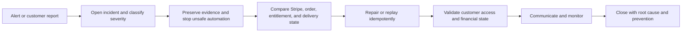

# Stripe and entitlement incident workflow

Use this workflow when payment, webhook, order, entitlement, protected delivery, refund, or dispute states disagree or fail.

## Severity

### P0 — Critical

Examples:

- unauthorized access to paid files
- payment captured without recoverable fulfillment across multiple customers
- entitlement created without valid payment
- webhook secret or payment credential exposure
- broad duplicate charges or duplicate entitlements

### P1 — Major

Examples:

- production webhook failures
- widespread checkout errors
- refund or dispute state not revoking access
- subscription entitlements materially out of sync

### P2 — Limited

Examples:

- one order mismatch
- one missing entitlement
- one download token or file problem
- one delayed payment not reconciled

## Step 1 — Open incident

Record:

- incident ID
- first detected time
- affected products and environments
- customer and revenue impact
- current public status
- last known good release
- initial owner
- severity

## Step 2 — Preserve evidence

Preserve only the necessary records:

- Stripe event and object IDs
- request and correlation IDs
- order and entitlement IDs
- product and version
- relevant logs
- deployment and configuration version
- customer support references

Do not copy complete sensitive payment payloads into public tickets, Mintlify, or unapproved logs.

## Step 3 — Contain

Containment may include:

- temporarily closing affected checkout buttons
- pausing automatic fulfillment
- disabling a compromised token or endpoint
- restricting a product or download route
- placing affected entitlements on review hold
- enabling a safe fallback

Do not disable the entire store when a narrow product or event type is affected unless broader containment is necessary.

## Step 4 — Reconcile state

Compare:

| System | Questions |
| --- | --- |
| Stripe | Did payment succeed, fail, refund, dispute, or expire? Which event is authoritative? |
| Product registry | Was the SKU and active version valid at purchase time? |
| Order | Was one order created for the payment? |
| Entitlement | Was the correct product, version, allowance, and status granted? |
| Delivery | Was the approved asset accessible through a valid token? |
| Customer account | Does the correct purchaser see the correct order and access state? |
| Public interface | Is the product’s availability and status still accurate? |

## Step 5 — Repair safely

Repairs must be idempotent and evidence-based.

Possible actions:

- replay a verified webhook event
- run a reconciliation job
- create a missing entitlement from an authoritative paid event
- revoke an invalid entitlement
- reissue an eligible link
- correct product-version mapping
- apply a verified refund or dispute state
- restore a known-good webhook or fulfillment release

Never create payment success to solve an entitlement problem.

## Step 6 — Validate

Test:

- current affected order
- duplicate event handling
- new checkout
- closed-browser fulfillment
- protected delivery
- download allowance
- refund and dispute behavior
- repurchase
- support visibility

## Step 7 — Communicate

Customer communication must distinguish:

- payment state
- access state
- action already completed
- action still pending
- refund or dispute state
- support contact

Do not promise processor timing that CrownThrive does not control.

## Step 8 — Root cause

Classify root cause:

- code defect
- configuration drift
- secret or endpoint mismatch
- processor event delay
- product registry mismatch
- duplicate or non-idempotent handling
- storage or delivery failure
- customer-account mismatch
- deployment regression
- policy or support ambiguity

## Step 9 — Prevention

Create one or more:

- automated reconciliation
- monitoring alert
- regression test
- runbook update
- product gate
- documentation update
- permission change
- agent evaluation
- deployment safeguard

## Closure criteria

The incident may close when:

- authoritative financial state is known
- customer access matches policy
- affected records are reconciled
- new transactions pass
- monitoring is stable
- customer communication is complete
- root cause and prevention are recorded

<Warning>
  Do not rotate a production webhook signing secret, recreate endpoints, or duplicate Stripe objects during an incident unless the current state has been verified and the migration is coordinated end to end.
</Warning>