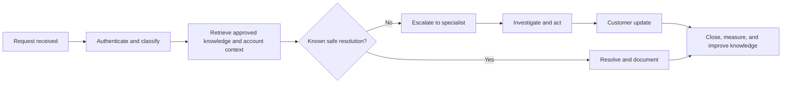

# Support request workflow

Support is an operational feedback loop. Each request should either resolve a customer need, reveal a system defect, clarify a policy, improve documentation, or trigger a governed escalation.

## Intake channels

Approved channels may include:

- support form
- authenticated account support
- email
- marketplace support
- product or reader support route
- partner or licensing inquiry
- monitored social escalation where policy permits

Do not request sensitive account, payment, identity, or security information through an unapproved public channel.

## Step 1 — Authenticate and classify

Classify the request by:

- customer, creator, partner, or public visitor
- product or platform
- issue type
- urgency
- data sensitivity
- rights or legal implications
- payment or entitlement impact
- child or protected-identity implications

Common categories:

- access or login
- order or entitlement
- download or file problem
- refund or duplicate charge
- subscription or billing
- hosted reader
- product defect
- rights or licensing
- creator commerce
- content correction
- privacy or data request
- security report
- accessibility
- general information

## Step 2 — Retrieve approved context

The Support Agent may retrieve only the information required to resolve the request, such as:

- approved Mintlify knowledge
- product and policy records
- authenticated order and entitlement state
- public platform status
- known incident or release notes
- approved troubleshooting procedures

Do not expose another customer’s records or unrestricted internal data.

## Step 3 — Resolve known safe issues

Examples:

- provide the correct public help article
- reissue an eligible expiring download link
- explain download allowances
- confirm an active product’s delivery method
- guide a user to billing or account management
- identify a hosted-reader route
- provide accessibility assistance
- explain the difference between personal-use purchase and commercial licensing

All actions must remain within the agent’s permissions.

## Step 4 — Escalate

Escalate immediately when the request involves:

- payment dispute or suspected fraud
- refund beyond delegated authority
- conflicting order and entitlement state
- rights, copyright, trademark, likeness, voice, performance, or adaptation request
- legal threat or subpoena
- security vulnerability or data exposure
- protected identity or child-related matter
- account takeover or privileged access
- public correction with material impact
- partner or enterprise contract

## Step 5 — Specialist investigation

The specialist records:

- issue and customer impact
- evidence reviewed
- action taken
- approvals
- systems changed
- customer-facing explanation
- prevention or remediation task

Do not mark the ticket resolved merely because it was handed to another team.

## Step 6 — Customer communication

Communications should be:

- accurate
- direct
- respectful
- specific about current state
- clear about next action and expected timing when known
- careful not to promise outcomes outside CrownThrive control

Do not claim that a refund, entitlement, release, license, or technical repair is complete until the governing system confirms it.

## Step 7 — Closure

A support case closes when:

- the customer received a resolution or final supported answer
- the action is reflected in the governing system
- necessary evidence and approvals are recorded
- related incidents or engineering tasks are linked
- follow-up ownership is clear

## Knowledge improvement

Repeated questions or failures should produce:

- new or updated Mintlify documentation
- interface improvements
- clearer product copy
- policy clarification
- engineering issue
- workflow or runbook revision
- agent evaluation case

## Support metrics

Track with evidence classes:

- volume by category
- first response
- time to resolution
- reopen rate
- escalation rate
- entitlement and payment mismatch rate
- top documentation gaps
- recurring defects
- customer satisfaction where legitimately measured

<Warning>
  The Support Agent may explain approved policy and execute scoped operational actions. It may not improvise legal rights, reveal private records, or override payment, security, or governance controls.
</Warning>