# Website patch workflow

Use this workflow for defects, content corrections, UX improvements, integrations, performance changes, and production patches.

```mermaid
flowchart LR
    A[Issue detected] --> B[Reproduce and classify]
    B --> C[Create governed issue]
    C --> D[Assign specialist and Codex]
    D --> E[Create isolated branch]
    E --> F[Implement scoped change]
    F --> G[Test and review]
    G --> H[Human approval]
    H --> I[Deploy]
    I --> J[Smoke test and reconcile]
    J --> K[Changelog and monitoring]
```

## Step 1 — Detect and classify

Sources may include:

- customer report
- automated monitoring
- broken-link scan
- checkout failure
- accessibility audit
- analytics anomaly
- rights or canon correction
- operator observation
- security finding

Classify severity:

- `P0` — critical security, payment, data, or production outage
- `P1` — major customer or commerce failure
- `P2` — important functional or content defect
- `P3` — normal improvement or low-risk correction

## Step 2 — Reproduce

Record:

- affected domain and route
- environment
- browser or device where relevant
- expected result
- actual result
- screenshots, logs, or error identifiers
- customer and revenue impact
- first known occurrence
- related release or commit

Do not begin a broad redesign when a narrow reproducible defect exists.

## Step 3 — Create the governed issue

The GitHub issue or equivalent work item should include:

- issue ID
- severity
- owner
- affected platform
- reproduction steps
- acceptance criteria
- required tests
- rights, privacy, security, or data implications
- rollback expectations
- linked incident or product records

## Step 4 — Assign specialist and Codex

The Website and Release Agent prepares a scoped engineering task for Codex.

Codex receives:

- repository and branch instructions
- relevant `AGENTS.md`
- issue scope
- files or systems likely affected
- commands and tests
- prohibited changes
- definition of done

## Step 5 — Isolated branch

Use one branch per governed issue or tightly related patch set.

Avoid mixing:

- unrelated features
- broad refactors
- data migrations
- content batches
- security changes

unless the issue explicitly requires them.

## Step 6 — Implement

Preserve working infrastructure. Reuse existing components and patterns where safe.

The implementation must not:

- expose secrets
- trust client-side prices or permissions
- bypass authentication or entitlements
- invent data or success states
- break unrelated routes
- silently change product, rights, or canon states

## Step 7 — Test and review

Required testing depends on the change, but may include:

- unit and integration tests
- type checking and linting
- route and API tests
- checkout and webhook tests
- auth and RBAC tests
- responsive layouts
- accessibility
- search and sitemap
- metadata and canonical tags
- regression across shared components
- security and secret scans

The QA and Security Agent independently reviews high-risk changes.

## Step 8 — Human approval

Human approval is required for production changes involving:

- payments
- authentication or roles
- protected data
- rights and licensing
- customer entitlements
- destructive migrations
- major public claims
- significant information architecture
- high-risk third-party integrations

## Step 9 — Deploy

The release record should identify:

- commit or build
- environment
- deployment operator
- time
- affected routes and services
- migrations
- feature flags
- rollback target

## Step 10 — Smoke test and reconcile

Test the actual production surface:

- primary route
- dependent routes
- forms and CTAs
- authentication
- checkout or access where relevant
- logs and monitoring
- mobile and desktop
- search and sitemap updates

Confirm that public status and registries match the deployed behavior.

## Step 11 — Document

Update:

- issue and pull request
- release notes
- architecture decision when applicable
- Mintlify changelog
- affected runbook
- known issues
- support knowledge

## Rollback conditions

Rollback or disable the change when:

- payment or entitlement integrity fails
- authentication or authorization weakens
- protected data is exposed
- critical routes regress
- the migration cannot reconcile
- monitoring shows material customer harm

<Warning>
  A deployment is not complete when the build succeeds. It is complete when production behavior, records, monitoring, and rollback readiness are verified.
</Warning>